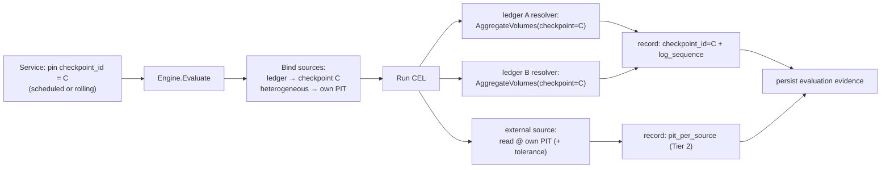

# ADR-002 — Consistency model: aligned checkpoint for same-cluster ledgers, per-source PIT for heterogeneous sources

**Status:** Accepted — **revised for the ledger-native migration** (see [RFC: Ledger-native storage](../drafts/rfc-ledger-native-storage.md) §4.5). Supersedes the V1 per-source-only model for same-cluster Ledger↔Ledger reconciliation; the per-source model is retained for heterogeneous sources. **The Tier-1 aligned-checkpoint model below is itself superseded by [ADR-003](./adr-003-checkpoint-anchor-and-crosscheck.md)**: reconciliation reads live and records an immutable `_recon` capture — query checkpoints are removed. §5's per-source + tolerance reasoning still holds for the cases that need a cut (multi-ledger); §6 (checkpoint interface flip), §7 (checkpoint period type) and the checkpoint lifecycle commitments (§10.3) are obsolete.

> **Tier-2 has no current implementation (ledger-only, 2026-07-09).** The Payments-pool resolver
> that motivated Tier-2 was removed — reconciliation is strictly **ledger↔ledger**. The Tier-2 model
> (per-source PIT/"latest" + tolerance) is retained here as the **design for future heterogeneous
> sources** (external GL, cross-vendor, cross-cluster ledgers per §11), not as shipped behaviour.
> Nothing in the codebase reads a non-ledger source today.

**Linked from:** [PRD §9](./README.md), [RFC §4.5](../drafts/rfc-ledger-native-storage.md)
**Last updated:** 2026-07-09

---

## 1. Decision in one sentence

Two tiers. When both sides are ledgers in the **same Formance cluster**, an evaluation is anchored on a single **query `checkpoint_id`** — a globally consistent cross-ledger snapshot. For **heterogeneous / non-ledger sources** (external GL, cross-vendor, legacy Payments pool during transition), the engine keeps the original **per-source PIT + tolerance** model.

---

## 2. What changed since the V1 baseline

V1 reconciled **Ledger v2** against a **Payments v3 pool** — two heterogeneous systems with no shared clock or log. A global snapshot was impossible, so V1 shipped **per-source PIT + tolerance**. That was the honest model, and it remains correct for heterogeneous sources (§5).

The ledger-native migration changes the premise: counterparty data now lives **inside ledgers** (via ledger-connect), so a reconciliation is increasingly **Ledger(A) ↔ Ledger(B)**, and both ledgers live in **one Raft group / one global log**. That unlocks precisely the "aligned PIT within a single stack" revisit condition the original ADR called out — so we take it.

---

## 3. What Ledger v3 actually guarantees

- **No arbitrary PIT.** The v2 `moves`-diff PIT was dropped (unbounded storage growth). Historical reads use **query checkpoints** instead.
- **A query checkpoint is a coordinated snapshot** of the main store *and* the read index at a committed log sequence, created through Raft (`CreateQueryCheckpoint`), addressed by a sequential `checkpoint_id`.
- **Single global log ⇒ a checkpoint is a cross-ledger consistent cut.** All ledgers share one store, so checkpoint *N* freezes A, B and `_recon` at the **same log sequence**, atomically.
- Every read RPC honours `checkpoint_id` (`GetAccount`, `ListAccounts`, `AggregateVolumes`, `GetLog`, …); `0` = live.

This is a *stronger* guarantee than V1 had: in V1 the two sides were different systems with no common instant; now Tier-1 sides share one.

---

## 4. The two-tier consistency model

| Case | Anchor | Guarantee |
|---|---|---|
| **Tier 1 — same-cluster ledger sources** (A↔B, A↔`_recon`) | one shared `checkpoint_id` | **True cross-source atomic snapshot.** No skew; `tolerance` optional (0 by default). |
| **Tier 2 — heterogeneous / non-ledger** (external GL, cross-vendor, legacy Payments pool during transition) | per-source PIT (or "latest") | Per-source consistency only; **`tolerance`** absorbs legitimate cross-system skew (the V1 model). |

The engine chooses the tier **per `Source`**: ledger sources in the target cluster align on the evaluation's checkpoint; any other source keeps its own PIT and contributes tolerance.

---

## 5. Why Tier 2 stays (we still don't pretend heterogeneous systems share a clock)

The three V1 reasons still hold — now scoped to the heterogeneous case:

1. **It's impossible across heterogeneous systems.** Ledger and an external GL don't share a clock or a log; pretending otherwise is a leaky abstraction.
2. **Real financial workflows model settlement lag.** T+1 / T+2 cycles → `tolerance` is the right vocabulary.
3. **The customer story stays honest.** *PIT-consistent + tolerance-bounded* across heterogeneous sources; *atomic + reproducible* across same-cluster ledgers.

The change is only that Tier 1 (same-cluster ledgers) is **no longer heterogeneous**, so aligning it is correct rather than a foot-gun.

---

## 6. How it flows through the engine

**Implementation notes**

- The service pins **one `checkpoint_id`** at evaluation start; Tier-1 resolvers read A and B at that checkpoint → cross-consistent evidence.
- **Interface change:** `LedgerResolver.AggregateBalance(ctx, ledger, query, pit time.Time)` → `(…, checkpointID uint64)` (`0` = live); same for `ListAccounts`. Tier-2 resolvers keep their PIT/"latest" semantics.
- The evaluation records **`checkpoint_id` + log sequence** (Tier 1) and/or **`pit_per_source`** (Tier 2) — the audit substrate that replaces the V1 PIT-only record.

---

## 7. Obtaining the checkpoint (by period type)

- **Periodic rules** (daily/weekly/monthly) → **scheduled checkpoints** (`query-checkpoint set-schedule`), one per period boundary, shared by all rules of that period type → `checkpoint_id` ↔ `period_id`.
- **Continuous rules** → a **rolling `recon-current` checkpoint** refreshed every *T* seconds (create new, delete previous), read by all continuous evaluations in the window.
- **Skew-tolerant / heterogeneous** → live read + `tolerance` (Tier 2).

**Lifecycle & cost.** Checkpoints are cheap to create (Pebble hard-links SSTs) but a long-lived one **pins old SSTs from compaction** (disk grows), and they are **not auto-cleaned**. Reconciliation owns their lifecycle: create → use → delete, or a bounded ring. Retention bounds how far back an exact snapshot can be re-opened.

---

## 8. Reproducibility & audit

`checkpoint_id` + log sequence in the evaluation makes Tier-1 evidence **re-derivable** — re-run the same read at the same checkpoint — while the checkpoint lives. The alert's stored `evidence` (the numbers at break time) is durable **regardless** of checkpoint retention, so "why did this open?" always survives; the checkpoint only enables re-drilling the full snapshot.

---

## 9. Upstream caveat

[formancehq/ledger#1416](https://github.com/formancehq/ledger/issues/1416) — `/aggregate/balances` with PIT + metadata returns empty under `ACCOUNT_METADATA_HISTORY: DISABLED`. Confirm the v3 gRPC checkpoint path behaves before relying on metadata-filtered aggregates at a checkpoint.

---

## 10. What this commits us to

1. **Evaluations record the anchor**: `checkpoint_id` (+ sequence) for Tier 1, `pit_per_source` for Tier 2.
2. **The engine offers an aligned-checkpoint mode** for same-cluster ledger sources and retains per-source PIT + tolerance for heterogeneous ones — chosen per `Source`.
3. **Reconciliation owns checkpoint lifecycle/retention** (create/use/delete, period-aligned).
4. **Customer language is precise**: *atomic, reproducible invariants across ledgers in a stack*; *PIT-consistent, tolerance-bounded invariants across heterogeneous sources*.

---

## 11. Conditions under which we'd revisit

- **Cross-cluster ledger reconciliation** (two separate Formance stacks, no shared log) → those sides fall back to Tier 2.
- **An external adapter gains a compatible snapshot primitive** → promote it toward Tier 1.
- **A use case where tolerance can't encode the drift** → expect a new template (e.g. "balance change over a window"), not a model change.

We would **not** revisit to pretend two heterogeneous systems share a clock — that remains the foot-gun this ADR exists to prevent. What changed is that same-cluster ledgers genuinely *do* share one.
