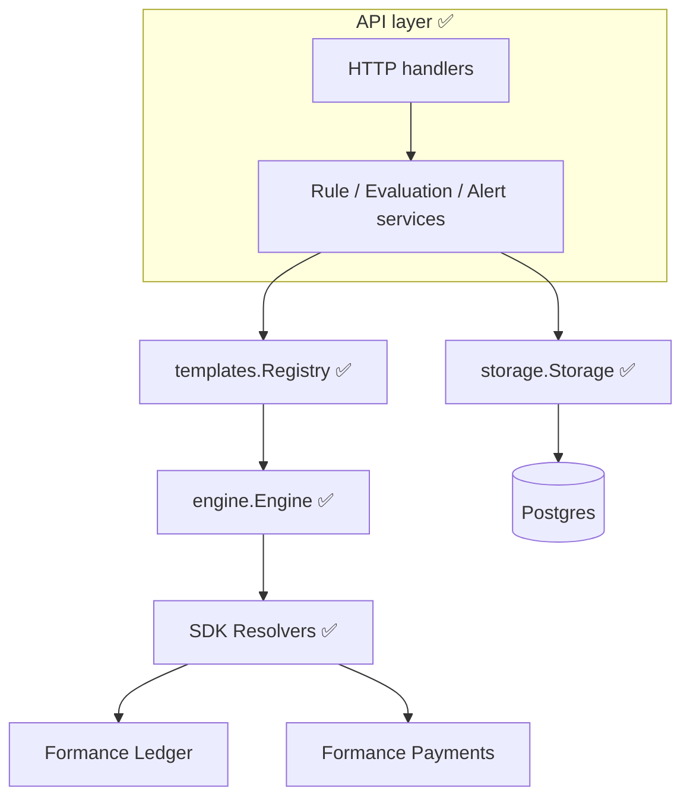
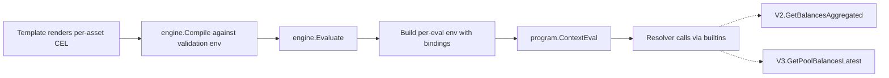
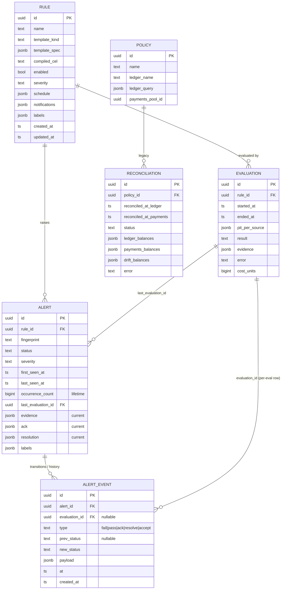

# Architecture

Where the pieces live and how they fit together. For the *why* behind the kernel choice, see [ADR-001](../prd/adr-001-cel-kernel.md); for PIT and cross-source consistency, [ADR-002](../prd/adr-002-pit-consistency.md).

---

## Package layout

```text
internal/
├── models/                 ✅ Go types — Rule, Evaluation, Alert, AlertEvent, Resolution
├── storage/                ✅ Postgres CRUD via bun
│   └── migrations/         ✅ Append-only Up migrations (v3.7.2 SDK)
├── engine/                 ✅ Internal CEL kernel
│   ├── types.go            Account, Balance, Posting
│   ├── source.go           Source opaque CEL type
│   ├── resolvers.go        LedgerResolver, PaymentsResolver interfaces
│   ├── builtins.go         CEL function declarations + per-eval bindings
│   ├── engine.go           Compile + Evaluate
│   ├── budget.go           Limits + budgetTracker
│   ├── errors.go           ErrCompile / ErrEvaluate translation
│   └── sdk_resolvers.go    SDK-backed resolver impls (V2.GetLedger, V2.GetBalancesAggregated, V3.GetPoolBalancesLatest)
├── templates/              ✅ V1 GA template catalog
│   ├── template.go         Evaluator interface, Outcome, Registry
│   ├── helpers.go          CEL string rendering, fingerprint, sorted-keys
│   ├── ledger_vs_pool_drift.go
│   ├── ledger_invariant.go
│   └── account_threshold.go
└── api/
    ├── service/            ✅ Rule / Evaluation / Alert orchestration (rule.go, evaluation.go, alert.go)
    ├── backend/            ✅ Backend interface + generated mock (now covers all V1 methods)
    ├── rule.go             ✅ V1 rule HTTP handlers + Evaluate
    ├── evaluation.go       ✅ V1 evaluation HTTP handlers
    ├── alert.go            ✅ V1 alert HTTP handlers (ack/resolve/accept + events timeline)
    └── router.go           ✅ Wires legacy /policies and V1 /rules /evaluations /alerts
```

---

## Layer responsibilities



| Layer | Responsibility | Key types |
|---|---|---|
| **HTTP** ✅ | OpenAPI-typed surface; auth scopes; cursor pagination | Handlers in [`internal/api/`](../../internal/api/); routes in [`router.go`](../../internal/api/router.go) |
| **Service** ✅ | Validation, state changes, alert dedup, resolution lifecycle, event log append | Methods on `Service` (rule.go / evaluation.go / alert.go) |
| **Templates** ✅ | Typed specs → CEL; per-fingerprint outcomes | `Evaluator`, `Outcome`, `Registry` |
| **Engine** ✅ | CEL evaluation, budget, PIT propagation, resolver dispatch | `Engine`, `Source`, `Resolvers`, `Limits` |
| **Resolvers** ✅ | SDK calls; feature-flag cache; data shaping | `SDKLedgerResolver`, `SDKPaymentsResolver` |
| **Storage** ✅ | bun CRUD; unique constraint per (rule, fingerprint); append-only `alert_event` log; cascade deletes | `Storage`, models |

---

## The kernel — one-paragraph view

A `Source` is an opaque CEL value that names a backend dataset (`LedgerSet(ledger, query)`, `PaymentsPool(id)`, `LedgerPostings(...)` — last one V1.1). Builtins like `balance(Source)` and `balances(Source)` consume sources and call the matching resolver. Each evaluation builds a fresh CEL env whose bindings close over the current context (ctx, resolvers, budget, PIT). The validation env at construction time has *declarations only* — used for type-checking at rule-create time without exercising resolvers.



See [engine/engine.go](../../internal/engine/engine.go) for the Compile/Evaluate flow, [engine/builtins.go](../../internal/engine/builtins.go) for the CEL function set, and [engine/sdk_resolvers.go](../../internal/engine/sdk_resolvers.go) for the SDK wiring.

---

## Templates layer — one-paragraph view

A template owns its own end-to-end evaluation. It scouts the asset universe by calling resolvers directly (e.g. union of ledger + pool balances for `ledger_vs_pool_drift`), then for each asset it renders a fresh CEL string, compiles + evaluates via the kernel, and emits an `Outcome` with a stable fingerprint. The service layer collects outcomes and opens/updates one alert per failing fingerprint (appending one `alert_event` row per outcome).

```mermaid
flowchart LR
    Spec[templateSpec] --> Scout[resolver.AggregateBalance / PoolBalanceLatest]
    Scout --> Universe[Union of assets]
    Universe --> ForEach[For each asset]
    ForEach --> CEL[Render asset-specific CEL]
    CEL --> Engine[engine.Compile + Evaluate]
    Engine --> Outcome[Outcome { fingerprint, passed, evidence }]
    ForEach --> Outcomes[List of Outcome]
```

Each template also performs a **kernel/template consistency check** — it runs the same per-asset comparison twice (direct big.Int math + via the kernel) and errors loudly on divergence. Catches kernel drift early.

---

## Storage shape



### Key invariants

- **`alert_unique_pair`** — UNIQUE constraint on `(rule_id, fingerprint)` in the `alert` table. Exactly one alert row per pair for the lifetime of the rule; concurrent failing evaluations either update or (on a true first-open race) retry as update.
- **`alert.occurrence_count`** is the **lifetime** count of FAIL events on the alert — it survives reopen cycles. Per-episode counts are derived by filtering `alert_event` between status transitions.
- **`alert_event` is append-only by convention** — no code path issues UPDATE or DELETE against it. A future migration can layer a per-alert `seq` + `prev_hash`/`hash` chain on top without breaking readers (mirrors the Ledger transaction log shape).
- **`ON DELETE CASCADE`** — deleting a `Rule` cleans up its evaluations, alerts, and alert events.
- **`touch_updated_at` trigger** — `updated_at` advances on every UPDATE for `rule` and `alert`. Verified in [migrations.go](../../internal/storage/migrations/migrations.go) and exercised in storage tests.

---

## Concurrency model

- **Engine** is concurrency-safe; a single instance is the long-lived dep injected at startup.
- **Per-eval CEL env** is built fresh per `Engine.Evaluate` call — no shared state between concurrent evaluations.
- **Budget tracker** uses `atomic.Int64` for `accountsScanned`.
- **Resolvers** cache feature flags but are otherwise stateless per call.
- **Alert dedup** relies on the UNIQUE constraint on `(rule_id, fingerprint)`, not application-level locking. Concurrent failing evaluations attempting to insert the same fingerprint will race; one succeeds, the loser retries and falls into the update path. See [storage/alert.go](../../internal/storage/alert.go) and the concurrency regression test in [alert_test.go](../../internal/storage/alert_test.go).
- **Alert event appends** happen in the same transaction as the alert UPDATE/INSERT — the log can never reflect a state the alert table doesn't.

---

## Dependencies

| Library | Pinned at | Why |
|---|---|---|
| `github.com/google/cel-go` | v0.28.1 | Kernel evaluator. See [ADR-001](../prd/adr-001-cel-kernel.md) §6. |
| `github.com/formancehq/formance-sdk-go/v3` | v3.7.2 | Has `V3.GetPoolBalancesLatest` — required to avoid the legacy PIT empty path. |
| `github.com/uptrace/bun` | (inherited via go-libs) | ORM; existing project convention. |
| `github.com/formancehq/go-libs/migrations` | inherited | Migration framework. |

---

## What's not in this diagram (yet)

- **Scheduler** (cron loop, advisory-lock leasing) — ⏳ task #8 V1 GA.
- **Webhook event publisher** — ⏳ task #8.
- **Email digest** — ⏳ task #8.
- **fctl wiring** — ⏳ task #8.
- **EE gating + usage metering** — ⏳ task #8.

The kernel + templates + storage are designed so each of these slot in without touching what's already shipped.
