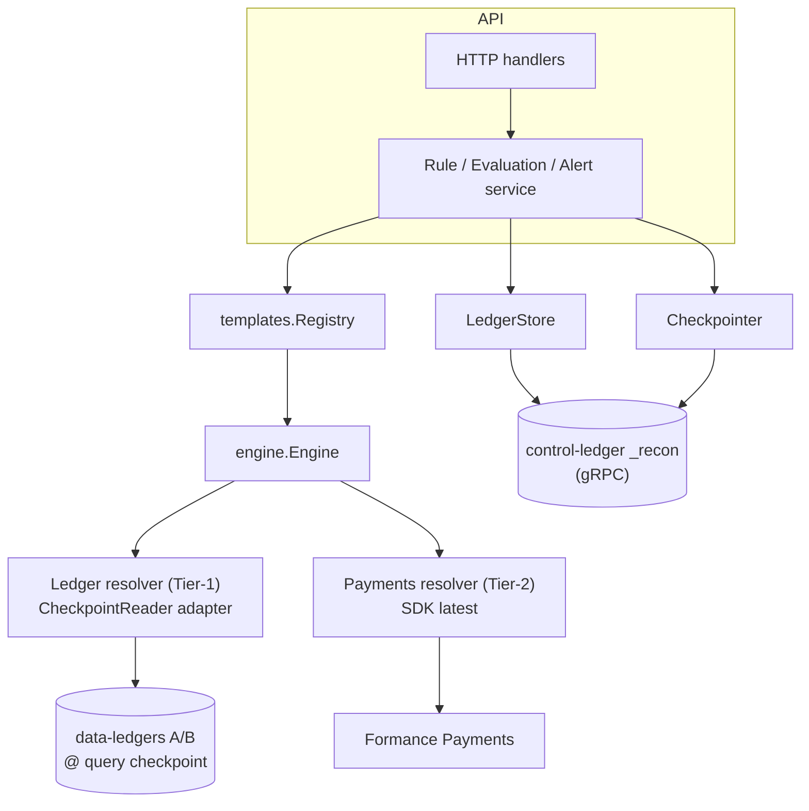
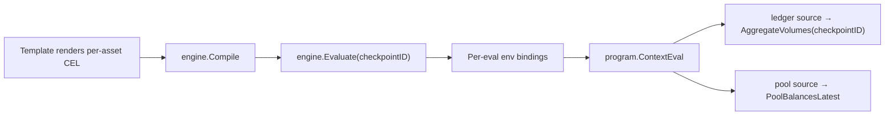
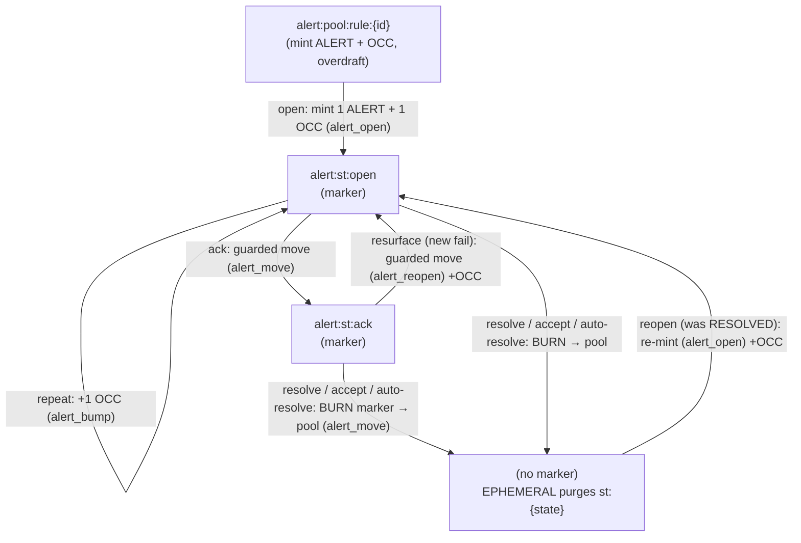

# Architecture

Where the pieces live and how they fit together, **after the ledger-native migration**.
Reconciliation is now **Postgres-free and stateless**: all its state lives on a Ledger v3
control-ledger (`_recon`), and it reads the ledgers it reconciles at globally-consistent
**query checkpoints**. For the *why* behind the kernel, see [ADR-001](../prd/adr-001-cel-kernel.md);
for the checkpoint consistency model, [ADR-002](../prd/adr-002-pit-consistency.md); for the
storage/event design and its rationale, the [ledger-native storage RFC](../drafts/rfc-ledger-native-storage.md).

---

## Package layout

```text
internal/
├── models/          Go types — Rule, Evaluation, Alert, AlertEvent, Resolution
├── store/           Storage-agnostic contract types + sentinels (leaf; no ORM) — the
│                    Store interface shape shared by the service and ledgerstore
├── ledgerpb/        Generated Ledger v3 gRPC protos (synced from ledger-connect)
├── ledger/          Ledger v3 gRPC client: transactions, metadata, account/log queries,
│                    query checkpoints (+ reaper), events sinks; CheckpointReader; provisioner
├── ledgerauth/      Ed25519 request signing + TLS; refuses insecure transport by default (F2)
├── ledgerschema/    Chart of accounts, metadata schema/indexes, address builders, numscript
│                    library, and the query translator (recon query → ledger filter)
├── ledgerstore/     LedgerStore — the sole service.Store, backed by the control-ledger `_recon`
├── ledgerresolver/  Adapter: ledger.CheckpointReader → engine.LedgerResolver (Tier-1)
├── engine/          Internal CEL kernel
│   ├── types.go / source.go / resolvers.go / builtins.go / engine.go / budget.go / errors.go
│   └── sdk_resolvers.go   SDKPaymentsResolver only (Tier-2 pool; the SDK ledger resolver is retired)
├── templates/       V1 GA template catalog (source.go, ledger_invariant, account_threshold, source_parity)
└── api/
    ├── service/     Rule / Evaluation / Alert orchestration; pins one checkpoint per evaluation
    ├── backend/     Backend interface + generated mock
    ├── rule.go / alert.go   HTTP handlers
    └── router.go
```

There is **no `storage/` package and no `internal/events`** — both were deleted with Postgres.
Shared contract types moved to the leaf `internal/store`.

---

## Layer responsibilities



| Layer | Responsibility | Key types |
|---|---|---|
| **HTTP** | OpenAPI-typed surface; auth scopes; cursor pagination | handlers in [`internal/api/`](../../internal/api/), routes in [`router.go`](../../internal/api/router.go) |
| **Service** | Validation, evaluation orchestration, **checkpoint acquisition**, alert dedup + lifecycle | `Service` (rule.go / evaluation.go / alert.go), `Checkpointer` |
| **Templates** | Typed specs → CEL; per-fingerprint outcomes; kernel cross-check | `Evaluator`, `Outcome`, `Registry` |
| **Engine** | CEL evaluation, budget, resolver dispatch (**anchored on `checkpointID`**) | `Engine`, `Source`, `Resolvers`, `Limits` |
| **Resolvers** | Tier-1 ledger reads at a checkpoint; Tier-2 pool reads "latest" | `ledgerresolver.Resolver` (over `CheckpointReader`), `engine.SDKPaymentsResolver` |
| **Storage** | Rules + alert lifecycle as Numscript batches + typed metadata on `_recon`; evaluations non-durable | `LedgerStore`, `ledger.Client`, `ledgerschema` |

---

## The kernel — checkpoint-anchored

A `Source` is an opaque CEL value naming a backend dataset (`ledgerSet(ledger, query)`,
`pool(id)`). Builtins (`balance`, `balances`, `sum`, `abs`) consume sources and call the
matching resolver. Each evaluation builds a fresh CEL env whose bindings close over the
per-eval context — crucially the **`checkpointID`** the service pinned (not a PIT). The
validation env at construction time has *declarations only*, for type-checking at rule-create
time without exercising resolvers.

Two resolver tiers (ADR-002):
- **Tier-1 — ledger sources** read at the evaluation's shared `checkpointID` (a globally
  consistent cross-ledger cut). Backed by `ledgerresolver.Resolver` over `ledger.CheckpointReader`.
- **Tier-2 — payments pool** reads "latest" via the SDK; cross-system skew is absorbed by the
  template's `tolerance`.



See [engine/engine.go](../../internal/engine/engine.go), [engine/builtins.go](../../internal/engine/builtins.go),
and the adapter [ledgerresolver/resolver.go](../../internal/ledgerresolver/resolver.go).

---

## The control-ledger data model

Reconciliation stores everything on `_recon` — there is no relational schema. The chart has
**4 account types** plus two precision-0 assets, `ALERT` (the lifecycle marker) and `OCC`
(occurrence counter). The data-ledgers being reconciled (A, B) are *external* and read-only to
recon; they are not part of this chart.

| Account | Type | Role |
|---|---|---|
| `rule:{id}` | NORMAL | the rule — typed metadata (spec, cadence, compiled CEL, notifications, labels) |
| `alert:item:rule:{id}:per:{p}:fp:{h}` | NORMAL | **canonical alert record** — metadata (`status` mirror, severity, evidence, resolution, ack, snooze, **`last_transition`**, labels) + `OCC` balance = occurrence count |
| `alert:st:{state}:rule:{id}:per:{p}:fp:{h}` | **EPHEMERAL** | the `ALERT` **marker** — source-of-truth for status; `state ∈ {open, ack}` |
| `alert:pool:rule:{id}` | NORMAL | mint source for `ALERT`+`OCC` (overdraft) and free gauges |
| `internal:checkpoints` | (undeclared, AUDIT) | reaper registry — one `cp:{id}` = timestamp key per live query checkpoint |

The **marker is the status source-of-truth**; the `status` metadata key is an LWW mirror for O(1)
point-reads. Both are written in **one atomic Numscript batch**, so they never diverge.

### Transition workflow

Four numscripts (library, pinned `v1.0.0`): `alert_open` (mint marker + OCC), `alert_bump`
(OCC only), `alert_move` (guarded marker move, no OCC), `alert_reopen` (guarded move + OCC).



- **Every transition is one guarded, idempotent transaction.** The numscript's *bare source*
  (the marker must hold the funds) acts as a **compare-and-swap**: an illegal transition fails
  the whole batch. The item's status mirror + descriptive metadata + `last_transition` envelope
  are set in the same batch.
- **Burn-on-close.** Resolving drains the marker back to the pool → `alert:st:{state}` hits zero →
  **EPHEMERAL purges it** → a closed alert has *no* marker (no accumulation). Reopen re-mints.
- **Free gauges.** `−balance(pool, ALERT)` = active (open+ack) alerts; `−balance(pool, OCC)` =
  total occurrences.
- **Snooze / unsnooze** are metadata-only (no marker move), status-neutral.
- **Idempotency.** Each batch carries a deterministic key over `(action, rule, fingerprint,
  period, evaluationID)` — a gRPC retransmit is deduplicated by the ledger (see **F17** in the
  migration log for the content-sensitive caveat).

Addresses, assets, metadata keys, and the numscript library live in
[`internal/ledgerschema`](../../internal/ledgerschema/); the lifecycle writes in
[`internal/ledgerstore`](../../internal/ledgerstore/).

---

## Reads — query checkpoints

`EvaluateRule` **pins one query checkpoint per evaluation** (ADR-002): `AcquireCheckpoint` →
`Evaluate` → `Release` (released on a cancellation-surviving context so a cancelled eval still
frees the SST-pinning checkpoint). Every Tier-1 ledger source in the evaluation reads at that
checkpoint, so ledgers A and B are compared at one globally-consistent cut — no skew.

- A checkpoint's read index materializes **asynchronously** after creation, so `AcquireCheckpoint`
  probes until it is readable before returning (**F32**).
- Crash-orphaned checkpoints (a hard crash between acquire and release) are swept by an
  age-thresholded **reaper** at boot, using the `internal:checkpoints` registry (**F26**).

Evaluations are a **deterministic projection**, not a durable entity (RFC §4.4.2): the run
result is returned from `EvaluateRule`, the break `evidence` is durable on `alert:item`, and there
is no evaluation read surface.

---

## Event delivery

Reconciliation runs **no message bus**. On every transition the store stamps a self-describing
`last_transition` envelope (`reconciliation.alert.<type>`, subject, prev/new status,
correlationID, payload) into `alert:item` metadata, so each Ledger log entry for that write is
self-describing — `COMMITTED_TRANSACTION` for lifecycle moves, `SAVED_METADATA`/`DELETED_METADATA`
for snooze/unsnooze.

Delivery is the ledger's native **events sink**: when `--events-sink-url` is configured, recon
provisions an HTTP webhook sink at boot for `[COMMITTED_TRANSACTION, SAVED_METADATA,
DELETED_METADATA]`. The ledger delivers matching events to the webhook (e.g. the Webhooks
module); consumers filter on `event.ledger == _recon` (sink filtering is by event type, not
ledger — RFC §4.4). See [ledger/events_sink.go](../../internal/ledger/events_sink.go).

---

## Concurrency & consistency

- **Engine** is concurrency-safe; a single instance is injected at startup. Each `Evaluate`
  builds a fresh per-eval CEL env — no shared state. Budget uses `atomic.Int64`.
- **Alert dedup / transitions** rely on **ledger CAS** (the marker bare-source guard) +
  deterministic idempotency keys — *not* an application lock or a DB unique constraint. A losing
  concurrent transition fails its guard (see **F22**: a raw `FailedPrecondition` where Postgres
  yielded a clean no-op).
- **Marker ↔ status mirror** are written in one atomic batch, so the log never reflects a state
  the item doesn't.
- **Statelessness** — recon holds no local state; multiple replicas share `_recon`. The
  checkpoint reaper's age threshold (≫ the 30s eval budget) makes it safe across replicas.

---

## Dependencies

| Library | Why |
|---|---|
| `github.com/google/cel-go` | Kernel evaluator ([ADR-001](../prd/adr-001-cel-kernel.md) §6). |
| `google.golang.org/grpc` + `internal/ledgerpb` | Ledger v3 gRPC transport (control-ledger + data-ledger reads). |
| `github.com/go-jose/go-jose/v4` | Ed25519 request signing for the secure ledger transport (F2). |
| `github.com/formancehq/formance-sdk-go/v3` | `V3.GetPoolBalancesLatest` — the Tier-2 payments-pool read. |

`bun` and the migrations framework are **gone** with Postgres.

---

## What's not here yet

- **`ListAlertEvents` (paginated history)** — returns empty; a queryable history needs a
  downstream sink (ClickHouse/Databricks), since the ledger log has no per-account filter (RFC §10).
- **Semantic event types + replay API** — the future generic event-log; today's events are
  generic log-derived events carrying the `last_transition` envelope.
- **Checkpoint anchor persistence** for exact replay — needs retained/scheduled checkpoints (§7).
- **Scheduler multi-replica leasing** — the in-process cron loop is single-instance for now
  ([scheduler.md](./scheduler.md)).
