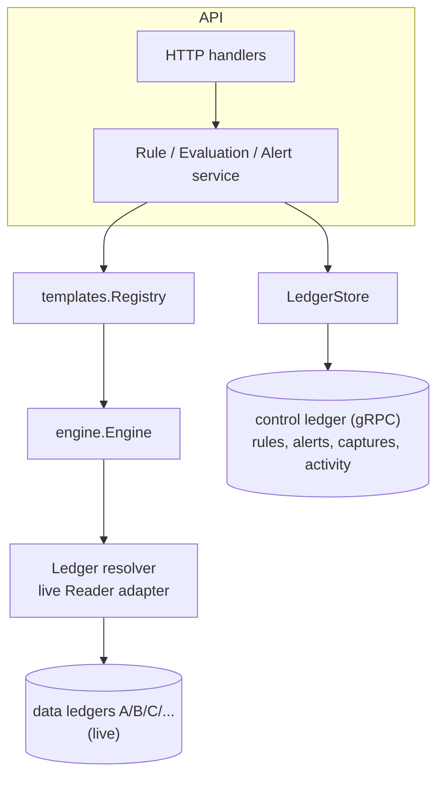
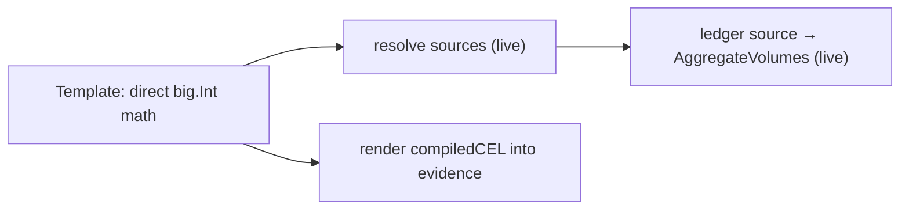
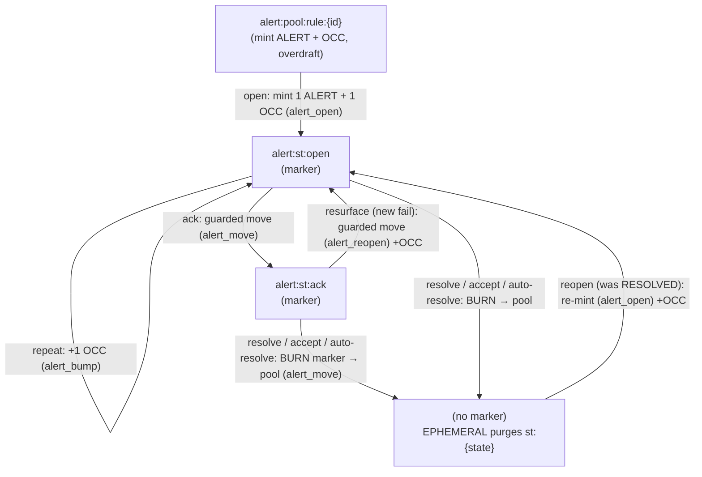

# Architecture

Where the pieces live and how they fit together, **after the ledger-native migration**.
Reconciliation is now **Postgres-free and stateless**: all its state lives on a Ledger v3
control ledger (default name `reconciliation`; `_recon` in design shorthand), it reads the ledgers
it reconciles **live**, and it records each evaluation as an immutable **capture** transaction. For
the *why* behind the kernel, see
[ADR-001](../prd/adr-001-cel-kernel.md); for the read/consistency model,
[ADR-003](../prd/adr-003-checkpoint-anchor-and-crosscheck.md) (which supersedes the checkpoint model
of [ADR-002](../prd/adr-002-pit-consistency.md)); for the storage/event design, the
[ledger-native storage RFC](../drafts/rfc-ledger-native-storage.md); and for V2 multi-source
semantics, [ADR-004](../prd/adr-004-multi-source-comparisons.md).

---

## Package layout

```text
internal/
├── models/          Go types — Rule, Evaluation, Alert, AlertEvent, Resolution, RuleActivity
├── store/           Storage-agnostic contract types + sentinels (leaf; no ORM) — the
│                    Store interface shape shared by the service and ledgerstore
├── ledgerpb/        Generated Ledger v3 gRPC protos (synced from Ledger release/v3.0)
├── ledger/          Ledger v3 gRPC client: transactions, metadata, account/log queries,
│                    events sinks; live Reader; provisioner
├── ledgerauth/      Ed25519 request signing + TLS; refuses insecure transport by default (F2)
├── ledgerschema/    Chart of accounts, metadata schema/indexes, address builders, numscript
│                    library, and the query translator (recon query → ledger filter)
├── ledgerstore/     LedgerStore — the sole service.Store, backed by the control-ledger `_recon`
├── ledgerresolver/  Adapter: ledger.Reader (live) → engine.LedgerResolver
├── engine/          Internal CEL kernel
│   └── types.go / source.go / resolvers.go / builtins.go / engine.go / budget.go / errors.go
├── templates/       Versioned template catalogs: V1 binary controls + V2 named-source controls
└── api/
    ├── service/     Rule / Evaluation / Alert orchestration; live reads + a capture per evaluation
    ├── backend/     Backend interface + generated mock
    ├── rule.go / alert.go   HTTP handlers
    └── router.go
```

There is **no `storage/` package and no `internal/events`** — both were deleted with Postgres.
Shared contract types moved to the leaf `internal/store`.

---

## Layer responsibilities



| Layer | Responsibility | Key types |
|---|---|---|
| **HTTP** | OpenAPI-typed surface; auth scopes; cursor pagination | handlers in [`internal/api/`](../../internal/api/), routes in [`router.go`](../../internal/api/router.go) |
| **Service** | Validation, evaluation orchestration, **capture recording**, alert dedup + lifecycle | `Service` (rule.go / evaluation.go / alert.go) |
| **Templates** | Versioned typed specs; per-fingerprint outcomes; V1 integer and V2 exact integer/rational semantics | `Evaluator`, `Outcome`, versioned registries |
| **Engine** | CEL type-check plus exact financial built-ins backed by `big.Int` / `big.Rat`; budget/resolver dispatch | `Engine`, `Source`, `Resolvers`, `Limits` |
| **Resolvers** | Ledger reads **live** (strictly ledger↔ledger) | `ledgerresolver.Resolver` (over `ledger.Reader`) |
| **Storage** | Rules + alert lifecycle + immutable evaluation **captures** and combined activity history as Numscript batches + typed metadata on the control ledger | `LedgerStore`, `ledger.Client`, `ledgerschema` |

---

## The kernel — typed financial evaluation

A `Source` is an opaque CEL value naming a backend dataset (`ledgerSet(ledger, query)`)
over builtins (`balance`, `balances`, `sum`, `abs`). At **rule-create** time the engine
type-checks the rule's CEL against a *declarations-only* env — no resolver is exercised. Built-in
**templates evaluate in typed Go** over a single live read per source (ADR-003); they render the
equivalent CEL into `evidence.compiledCEL` for explainability but do **not** run it (the golden test
`TestCrossCheck_*` guards that the two agree). `engine.Evaluate` (the CEL runtime) is reserved for
the post-GA raw-CEL power mode.

V2 retains `compiledCEL`, but introduces purpose-built financial built-ins whose implementations use
exact `big.Int` / `big.Rat` arithmetic. The typed template evaluator's direct math is authoritative;
the equivalent built-ins keep compiled CEL exact for explainability and cross-checking.
`balance_equation` evaluates a signed integer-coefficient sum; `source_consensus` evaluates the
symmetric max-minus-min spread; `exchange_rate_bounds` compares a quote/base ratio after accounting
for both asset precisions; and `coverage_ratio_bounds` compares two signed portfolio totals. The
ratio operations use exact rational arithmetic. No V2 path converts ledger values or decimal bounds
to binary floating point.

Resolvers (ADR-003): reconciliation is strictly **ledger↔ledger**.
- **Ledger sources** read **live** — a single `AggregateVolumes` is an internally consistent
  snapshot; cross-ledger skew is absorbed by the template's `tolerance`. Backed by
  `ledgerresolver.Resolver` over `ledger.Reader`.

Ledger v3 segregates balances by `(account, asset, color)`. Current reconciliation source
contracts remain asset-based: aggregate reads request `collapse_colors`, account reads sum all
returned color rows for the same asset, and control-ledger point reads request collapsed rows.
Consequently, an observed `USD/2` balance is the total of its uncolored and colored buckets. The
vendored protobuf contract preserves `color`, but selecting or comparing an individual color is
not exposed by V1 or V2 templates; that would require an explicit, versioned source selector.



See [engine/engine.go](../../internal/engine/engine.go), [engine/builtins.go](../../internal/engine/builtins.go),
and the adapter [ledgerresolver/resolver.go](../../internal/ledgerresolver/resolver.go).

## Contract-version isolation

One contract is live. The contract stamp still scopes resource visibility, so rules,
alerts, and captures persist an immutable integer `contract_version`. A missing marker on a legacy
record means V1. The unprefixed handlers scope every operation to version 1; `/v2` handlers scope to
version 2. Lists apply the version predicate before cursor construction, avoiding both data leakage
and pagination holes. Point lookups and mutations through the wrong route return not found.

The version boundary also selects the template registry: V1 accepts the existing catalog and wire
shapes; V2 accepts `balance_equation`, `exchange_rate_bounds`, `source_consensus`, and
`coverage_ratio_bounds`. A patch cannot move a rule between contracts. Both versions then feed the
same capture and alert orchestration, carrying their native evidence shape unchanged.

---

## The control-ledger data model

Reconciliation stores everything on its control ledger — there is no relational schema. The chart
has **8 account types** plus four precision-0 assets: `ALERT` (the lifecycle marker), `OCC`
(occurrence counter), `CAPTURE` (per-evaluation counter), and `ACTIVITY` (combined-history
counter). The data ledgers being reconciled (A, B, C, and beyond) are *external* and read-only to
recon; they are not part of this chart. The complete executable mapping is documented in
[ledger-v3-storage.md](./ledger-v3-storage.md).

| Account | Type | Role |
|---|---|---|
| `rule:{id}` | NORMAL | the rule — typed metadata (spec, periodType, compiled CEL, notifications, labels) |
| `alert:item:rule:{id}:per:{p}:fp:{h}` | NORMAL | **canonical alert record** — metadata (`status` mirror, severity, evidence, resolution, ack, snooze, **`last_transition`**, labels) + `OCC` balance = occurrence count |
| `alert:st:{state}:rule:{id}:per:{p}:fp:{h}` | **EPHEMERAL** | the `ALERT` **marker** — source-of-truth for status; `state ∈ {open, ack}` |
| `alert:pool:rule:{id}` | NORMAL | mint source for `ALERT`+`OCC` (overdraft) and free gauges |
| `capture:rule:{id}:per:{p}` | NORMAL | **evaluation capture bucket** (ADR-003) — one immutable capture tx per evaluation (snapshot in tx metadata); `−balance(·, CAPTURE)` = count |
| `capture:pool:rule:{id}` | NORMAL | mint source for `CAPTURE` (overdraft) |
| `activity:rule:{id}` | NORMAL | append-only transaction stream for the combined rule timeline |
| `activity:pool:rule:{id}` | NORMAL | mint source for `ACTIVITY` (overdraft) |

The **marker is the status source-of-truth**; the `status` metadata key is an LWW mirror for O(1)
point-reads. Both are written in **one atomic Numscript batch**, so they never diverge.

### Transition workflow

Six numscripts (library, pinned `v2.0.0`): `alert_open` (mint marker + OCC), `alert_bump`
(OCC only), `alert_move` (guarded marker move, no OCC), `alert_reopen` (guarded move + OCC),
`capture` (mint 1 `CAPTURE` → capture bucket), and `activity` (append a rule-scoped history item).
Every program also posts one `ACTIVITY` unit; rule changes and status-neutral alert interactions use
the generic `activity` program.



- **Every transition is one guarded, idempotent transaction.** The numscript's *bare source*
  (the marker must hold the funds) acts as a **compare-and-swap**: an illegal transition fails
  the whole batch. The item's status mirror + descriptive metadata + `last_transition` envelope
  are set in the same batch.
- **Burn-on-close.** Resolving drains the marker back to the pool → `alert:st:{state}` hits zero →
  **EPHEMERAL purges it** → a closed alert has *no* marker (no accumulation). Reopen re-mints.
- **Free gauges.** `−balance(pool, ALERT)` = active (open+ack) alerts; `−balance(pool, OCC)` =
  total occurrences.
- **Snooze / unsnooze** are status-neutral and do not move the marker. Their account metadata
  mutation and activity record now commit atomically in an `activity` transaction.
- **Idempotency.** Each batch carries a deterministic key over `(action, rule, fingerprint,
  period, evaluationID)` — a gRPC retransmit is deduplicated by the ledger (see **F17** in the
  migration log for the content-sensitive caveat).

Addresses, assets, metadata keys, and the numscript library live in
[`internal/ledgerschema`](../../internal/ledgerschema/); the lifecycle writes in
[`internal/ledgerstore`](../../internal/ledgerstore/).

---

## Reads — live + capture

`EvaluateRule` reads its data ledgers **live** (ADR-003): each `ledgerSet` source is one
`AggregateVolumes` — an internally consistent server-side snapshot — so a single-ledger universe is
skew-free. Cross-ledger rules read each side separately (per-source); the transient skew is absorbed
by the template's `tolerance` (a period close reconciles settled state; continuous monitoring
self-corrects on the next tick). A certifiable atomic multi-ledger read is a future ledger primitive
([EN-1480](https://formance-team.atlassian.net/browse/EN-1480)); `min_log_sequence` (a live-read
freshness floor) is available but unused.

Every evaluation is recorded as an **immutable capture transaction** on `_recon` (ADR-003): a
self-describing snapshot (`verdict`, `trigger`, `evidence`, …) on a `COMMITTED_TRANSACTION`, plus a
`CAPTURE` counter unit in the `capture:rule:{id}:per:{p}` bucket. Evidence retains every outcome,
including successful outcomes that do not mutate an alert. This is the durable "what reconciled and
when" — including the exact observed values that
cleared a prior break — receipt-signed and append-only, replacing a queryable evaluation table
(RFC §4.4.2). The run result is also returned from `EvaluateRule`.

Every externally meaningful mutation also posts one precision-zero `ACTIVITY`
unit to `activity:rule:{ruleID}`. Rule metadata changes use a generic activity
transaction; captures and alert transitions include the posting in their
existing transaction. State and history therefore commit atomically. Transaction
metadata carries a versioned semantic envelope, while Rule and Alert accounts
remain current-state projections; this is not full event sourcing.

For V2, N sources are still separate live reads. A multi-source equation therefore widens the
possible read-skew window; its minor-unit tolerance must reflect acceptable ingestion skew. An FX
bound must likewise be wide enough for the operational clocks of its base and quote records. The
capture freezes every source value, contribution or exact ratio component used by the verdict so
the decision remains reproducible after the ledgers move on.

---

## Event delivery

Reconciliation runs **no message bus**. On every transition the store stamps a self-describing
`last_transition` envelope (`reconciliation.alert.<type>`, subject, prev/new status,
correlationID, payload) into `alert:item` metadata, so each Ledger log entry for that write is
self-describing. Current lifecycle moves and snooze/unsnooze interactions are all
`COMMITTED_TRANSACTION` events because each write appends activity in a transaction.

Delivery is the ledger's native **events sink**: when `--events-sink-url` is configured, recon
provisions an HTTP webhook sink at boot for `[COMMITTED_TRANSACTION, SAVED_METADATA,
DELETED_METADATA]`. The metadata event types remain subscribed for compatibility with older or
direct metadata writers; current lifecycle activity is transaction-backed. The ledger delivers
matching events to the webhook (e.g. the Webhooks module); consumers filter on the configured
control-ledger name (sink filtering is by event type, not ledger — RFC §4.4). See
[ledger/events_sink.go](../../internal/ledger/events_sink.go).

---

## Concurrency & consistency

- **Engine** is concurrency-safe; a single instance is injected at startup. Each `Evaluate`
  builds a fresh per-eval CEL env — no shared state. Budget uses `atomic.Int64`.
- **Alert dedup / transitions** rely on **ledger CAS** (the marker bare-source guard) +
  deterministic idempotency keys — *not* an application lock or a DB unique constraint. A losing
  concurrent transition fails its guard (see **F22**: a raw `FailedPrecondition` where Postgres
  yielded a clean no-op).
- **Marker ↔ status mirror** are written in one atomic batch, so the log never reflects a state
  the item doesn't.
- **Statelessness** — recon holds no local state; multiple replicas share `_recon`. Reads are
  live and each write (alert transition, capture) is idempotent per (rule, period, evaluation), so
  concurrent replicas converge without coordination.
- **Rule configuration identity** is a content-derived SHA-256 revision. Captures
  retain it so an observation stays tied to the configuration evaluated.

---

## Dependencies

| Library | Why |
|---|---|
| `github.com/google/cel-go` | Kernel evaluator ([ADR-001](../prd/adr-001-cel-kernel.md) §6). |
| `google.golang.org/grpc` + `internal/ledgerpb` | Ledger v3 gRPC transport (control-ledger + data-ledger reads). |
| `github.com/go-jose/go-jose/v4` | Ed25519 request signing for the secure ledger transport (F2). |

`bun` and the migrations framework are **gone** with Postgres. The Formance SDK
(`formance-sdk-go`) is **gone** with the Tier-2 payments-pool resolver — reconciliation is
strictly ledger↔ledger and reads the data ledgers directly over gRPC.

---

## What's not here yet

- **Legacy history backfill** — the activity journal is complete only from its
  rollout. A future offline import may scan Ledger logs, but request handlers do
  not scan the global log.
- **Semantic event types + replay API** — the future generic event-log; today's events are
  generic log-derived events carrying the `last_transition` envelope.
- **Certifiable atomic multi-ledger read** for exact replay / provable simultaneity — a future
  ledger primitive ([EN-1480](https://formance-team.atlassian.net/browse/EN-1480)); today's capture
  records the observed numbers (durable evidence), not a re-queryable cut.
- **Scheduler multi-replica leasing** — the in-process cron loop is single-instance for now
  ([scheduler.md](./scheduler.md)).
