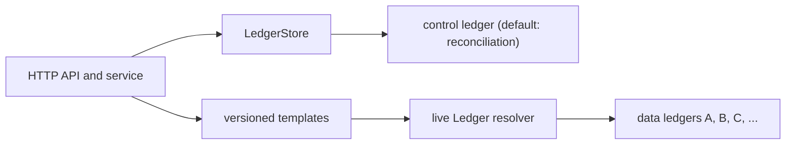

# Ledger v3 storage model

This document is the consolidated map of how Reconciliation uses Ledger v3. It describes the
current implementation, not an aspirational event-sourcing model.

Reconciliation is stateless and Postgres-free. It uses:

- one **control ledger** for its own rules, alerts, captures, and activity history; the default
  ledger name is `reconciliation` and can be changed with `--ledger-control-name`;
- one or more **data ledgers**, which are read live and never mutated by Reconciliation.

The `_recon` name used in older design documents is a conceptual shorthand for the control ledger,
not its configured default name.

## Executable sources of truth

The persisted model is defined by code. When this document and code disagree, these files are
authoritative:

| Concern | Definition |
|---|---|
| Ledger name, assets, and account address builders | [`internal/ledgerschema/addresses.go`](../../internal/ledgerschema/addresses.go) |
| Account types, typed metadata, and indexes | [`internal/ledgerschema/schema.go`](../../internal/ledgerschema/schema.go) |
| Stored Numscript programs and their pinned version | [`internal/ledgerschema/scripts.go`](../../internal/ledgerschema/scripts.go) |
| Query-filter construction and JSON-query translation | [`internal/ledgerschema/filters.go`](../../internal/ledgerschema/filters.go), [`internal/ledgerschema/query.go`](../../internal/ledgerschema/query.go), and [`internal/ledgerstore/filter.go`](../../internal/ledgerstore/filter.go) |
| Idempotent startup provisioning | [`internal/ledger/provisioner.go`](../../internal/ledger/provisioner.go) |
| Runtime wiring and enforcement mode | [`cmd/ledger.go`](../../cmd/ledger.go) |
| Persisted/read model mappings | [`internal/ledgerstore/`](../../internal/ledgerstore/) |

## Control-ledger chart

The chart contains eight account types. Pool accounts are declared overdraft sources used to mint
precision-zero markers and counters; they do not represent customer money.

| Address pattern | Persistence | Purpose |
|---|---|---|
| `rule:{ruleId}` | NORMAL | Current rule configuration as typed account metadata. |
| `alert:item:rule:{ruleId}:per:{period}:fp:{fpHash}` | NORMAL | Canonical alert record, occurrence count, and current-state metadata. |
| `alert:st:{open|ack}:rule:{ruleId}:per:{period}:fp:{fpHash}` | EPHEMERAL | The single `ALERT` lifecycle marker. It is drained and purged when the alert closes. |
| `alert:pool:rule:{ruleId}` | NORMAL | Per-rule overdraft source for `ALERT` and `OCC`. |
| `capture:rule:{ruleId}:per:{period}` | NORMAL | Address touched by every immutable evaluation-capture transaction. |
| `capture:pool:rule:{ruleId}` | NORMAL | Per-rule overdraft source for `CAPTURE`. |
| `activity:rule:{ruleId}` | NORMAL | Ordered transaction stream for the combined rule timeline. |
| `activity:pool:rule:{ruleId}` | NORMAL | Per-rule overdraft source for `ACTIVITY`. |

The four assets all have precision zero:

| Asset | Meaning |
|---|---|
| `ALERT` | Exactly one marker for each active alert. |
| `OCC` | One unit for each alert occurrence. |
| `CAPTURE` | One unit for each recorded evaluation. |
| `ACTIVITY` | One unit for each rule lifecycle, evaluation, or alert activity item. |

### Address conventions

Prefix aggregation only works along one segment ordering, so an address layout is a decision about
which questions stay cheap — and that decision is invisible from the addresses themselves. Four rules,
recorded so the next account type is not a coin flip:

1. **Namespace first, then discriminator** — `rule:`, `alert:item:`, `alert:st:`, `alert:pool:`,
   `capture:`, `activity:`. A top-level namespace is a prefix no other address falls under, which is
   why `RulePrefix()` (`rule:`) matches rule accounts only, even though `:rule:` appears inside almost
   every other pattern.
2. **Every variable segment is label-then-value** — `rule:{id}`, `per:{period}`, `fp:{hash}`. The
   label keeps a prefix unambiguous and an address readable in a ledger dump without a decoder.
3. **The segments you aggregate on go left.** Two deliberate choices follow: status is leftmost on
   marker accounts (`alert:st:{state}:rule:…`) so open markers aggregate across rules, and
   rule → per → fp on both item and marker accounts so a `(rule, period)` is a prefix — which is what
   the auto-resolve sweep scans.
4. **A segment whose value can contain `:` or `|` is hashed, not escaped.** The fingerprint is a
   16-hex-char SHA-256 prefix (`FingerprintHash`), with the raw value kept in metadata for
   readability. The period is deliberately *not* hashed: the account type constrains it to
   `^[0-9A-Za-z-]+$`, so it embeds raw — which is the constraint any new period type must satisfy.

**On abbreviation**: `st`, `per` and `fp` are abbreviated; `item`, `pool`, `rule`, `capture` and
`activity` are not. That is historical rather than principled — `alert:st:` saves four bytes where
`alert:item:` does not bother. Addresses are persisted and the chart is provisioned with typed
patterns, so renaming is a migration of every account and is not worth doing; new account types should
match the existing spelling rather than introduce a third style.

Two consequences worth knowing before designing a query:

- **There is no single prefix for "active".** `open` and `ack` are sibling values of the `{state}`
  segment, so an active-alert aggregation is two prefixes, never one. `group_by_prefixes` takes a
  list, which is how `CountAlertsByRule` gets both in one call.
- **Nothing period-scoped across rules is prefixable** — the period never leads an address. *"Is
  2026-03 green across every rule?"* and *"this fingerprint's history across periods"* are
  **metadata-index** queries (`period` and `fingerprint` are both declared and indexed), not address
  aggregations. The split is deliberate — the address answers per-rule questions, the index answers
  cross-rule ones — but it is not visible from the chart, and a period-status endpoint depends on it.

### Why there are three pools per rule

`alert:pool:`, `capture:pool:` and `activity:pool:` are three source accounts per rule where one could
mint all four assets: `alert:pool` already mints two (`ALERT` and `OCC`), because a balance is per
`(account, asset)` and the counters are independent.

The split is **namespace locality, not write contention.** Each namespace owns its mint source, so
`alert:*`, `capture:*` and `activity:*` stay self-contained and no prefix scan has to step around a
foreign account. `CaptureRulePrefix` depends on exactly that: `capture:rule:{id}:per:` excludes
`capture:pool:rule:{id}` by construction, so listing a rule's capture history cannot pick up its own
mint source. Folding the three into one `pool:rule:{id}` would add a fourth top-level namespace and
break that property to save two accounts per rule — against a chart whose size is set by alert items,
one per `(rule, fingerprint, period)`.

The reason that does **not** apply is worth stating, because it is the intuitive one: a shared
per-rule source would not serialize the capture path against the alert path any more than separate
ones do. The ledger consumes committed Raft entries sequentially in strict index order, single
threaded, one batch in flight, so every write to a ledger is totally ordered whatever accounts it
touches. Separate pools protect nothing there.

**Sign convention.** A pool is an overdraft source, so its balance is the negative of what it has
minted: `-balance(alert:pool:rule:{id}, ALERT)` is the rule's live alert count and `-balance(…, OCC)`
its total occurrences. Both are invariants of the mint/burn path rather than a read path — neither
separates open from acknowledged — so the rule list counts with the grouped aggregate above.

### The one EPHEMERAL type, and why EN-2036 does not affect it

`alert:st:{open|ack}:…` is the only `EPHEMERAL` account type in the chart. Ledger
[EN-2036](https://formance-team.atlassian.net/browse/EN-2036) changes what an `EPHEMERAL` purge
removes — today only the zeroed volume cell, afterwards the account row, its metadata and every
secondary-index entry, atomically with the transaction that zeroes the last volume. That does not
reach anything this module depends on, for four reasons.

Nothing reads a state account. Alert reads go through the `NORMAL` item account and its `status`
metadata mirror: both `ListActiveAlertFingerprints` and `ListAlerts` query the `alert:item:` prefix.
The three open-marker prefix builders in `internal/ledgerschema/addresses.go` have no non-test
caller.

No metadata is ever written to a state account. Every account-metadata write in
`internal/ledgerstore` targets the item account or `rule:{ruleId}`, so the purge's metadata deletion
and its "metadata-only writes cannot resurrect a zero-volume account" rule are both inert here.

The marker is a write-time compare-and-swap, not a read. `alert_move` and `alert_reopen` take the
current state account as a **bare** source, so an illegal transition fails on insufficient funds.
A purged account and a zero-balance account behave identically under that check, and re-minting on
reopen posts to `st_open` as a destination, which acceptance criterion 6 covers explicitly.

Point-in-time semantics do not apply. Acceptance criterion 7 governs pre-purge checkpoint reads, and
this module removed checkpoints (see [ADR-003](../prd/adr-003-checkpoint-anchor-and-crosscheck.md)).

The change is favourable rather than neutral: a drained marker currently leaves a ghost row and
append-only has-asset index membership that this module never queried but still paid for in account
scans.

Two caveats. This is a distinct question from the client-side analysis in
[stale-holds.md](stale-holds.md), which reaches the same conclusion about *client* hold accounts in a
*client* ledger — that finding does not by itself clear the control ledger, and this one does not
clear a client book. The clearance was first reasoned from the ticket's acceptance criteria, while
ledger PR [#2058](https://github.com/formancehq/ledger/pull/2058) was still open. It merged on
2026-09-25 (`38c6eef55` on `release/v3.0`), and the one behaviour the module relies on — **close →
purge → reopen**, a purged address accepting a fresh mint — is now tested on builds with and
without the purge: `TestIntegration_AlertTransitions` asserts that the drained marker has no
current state left before the reopen re-mints it
([EN-2345](https://formance-team.atlassian.net/browse/EN-2345)). Note that `GetAccount` never
answers `NotFound` for an address; a drained or purged account comes back empty.

One loose end this review surfaced: `PQOpenCount` (`AGGREGATE_VOLUMES(ALERT)` over the
`alert:st:open:` prefix) was registered at bootstrap with no non-test caller. It was removed with
the other unexecuted prepared query (EN-2241, `01965140`; see [No prepared queries, and
why](#no-prepared-queries-and-why)).

## Current state and immutable history

Rule and alert accounts are current-state projections. Typed account metadata supports direct reads
and filtering: rule fields include the template specification, contract version, revision, periodType,
schedule, and labels; alert fields include status, evidence, acknowledgement, resolution, snooze,
and the latest transition envelope.

Immutable history lives on transactions:

- a capture transaction stores the evaluation envelope, including verdict, trigger, evidence,
  contract version, rule revision, timings, result, and error;
- an activity transaction stores a versioned semantic envelope containing kind, rule, occurrence
  time, contract version, revision, correlation identifier, and payload;
- alert and capture programs post `ACTIVITY` in the same transaction as their state mutation;
- rule create, update, delete, snooze, and unsnooze use the generic activity program and apply
  account metadata atomically in that transaction.

The combined timeline therefore records rule lifecycle, evaluation/capture activity, alert
lifecycle, and manual alert interactions in one per-rule stream. It is complete from the activity
journal rollout onward. The API does not fabricate pre-rollout activity from current state.

Capture evidence retains every outcome, including successful outcomes that do not mutate an alert.
Each timeline evaluation item therefore points to a reproducible observation rather than only
proving that the run occurred.

## Numscript library and atomicity

The stored library is pinned at `2.0.0` and contains six programs:

| Program | Atomic effect |
|---|---|
| `alert_open` | Mint the active marker and first occurrence, then append activity. |
| `alert_bump` | Increment occurrences, then append activity. |
| `alert_reopen` | Guarded marker move to open, increment occurrences, then append activity. |
| `alert_move` | Guarded lifecycle marker move, then append activity. |
| `capture` | Append a capture counter and activity item. |
| `activity` | Append an activity item for rule changes or status-neutral alert interactions. |

Lifecycle moves use a bare source account as a compare-and-swap guard. Account metadata and
transaction metadata are supplied in the same Ledger transaction, so current state and history
commit together. Deterministic idempotency keys make a retransmitted write safe; callers must not
reuse a key for different content.

Snooze and unsnooze remain status-neutral and do not move the `ALERT` marker. They are no longer
metadata-only writes: the activity transaction applies the snooze metadata change and records the
manual interaction atomically.

## Queries and indexes

Typed metadata declarations and query indexes are separate concerns. Every account field used by
the list-filter translator has an explicit account-metadata index. Dynamic `label.*` keys are not
indexed.

The transaction address index is required by both capture history and the rule timeline. Without
it, Ledger rejects address-filtered transaction queries with `FailedPrecondition` and an
`index not found: address` detail. Index creation is asynchronous; immediately after provisioning,
reads can temporarily return `Unavailable` with `index is still building` even though the index is
already declared.

### No prepared queries, and why

The control ledger used to register two — `alerts-open-count` and `rules-enabled` — and executed
neither. Both were dropped (EN-2241) rather than wired up, because the trade does not hold once you
look at what the execute RPC offers:

- **It is strictly less expressive than a direct aggregate.** `ExecutePreparedQueryRequest` carries a
  name, parameters, paging and a mode — and no `group_by_prefixes`, `collapse_colors` or
  `use_max_precision`. The per-rule alert tally above is a *grouped* aggregate, so it cannot be
  expressed as a prepared query at all.
- **The one execution fast path does not apply.** `AGGREGATE_VOLUMES` skips index alignment, filter
  compilation and account enumeration only for an *exactly nil* filter. Every filter this module
  would store is non-nil.
- **The acceleration is not where it looks.** The bloom filter wired to prepared queries
  short-circuits looking up the *definition*; the iterator optimisations live in the shared filter
  compiler and help ad-hoc filters identically.

That leaves create-time validation of filters authored as Go literals — which this module's own tests
already cover — against a second, stored, Raft-replicated definition of queries it also builds at
runtime. Rule and alert filters, capture history, and activity history therefore use structured
`QueryFilter` values built at runtime, and the scheduler's enabled-rule scan pushes its predicate
down the same way.

If a future ledger release makes a *named* shape genuinely faster, `ledgerschema/schema.go` carries
the note and re-adding is a client wrapper plus a provisioner pass.

Multi-source data reads use the data-ledger aggregation/account APIs and are separate from these
control-ledger queries.

### Counting alerts: one grouped aggregate, not a scan

`GET /rules` carries each rule's live alert tally (`alerts.open` / `alerts.acknowledged`), and it is
read as an **aggregate of marker balances** rather than by listing alerts. A live alert holds exactly
one `ALERT` unit at `alert:st:{state}:rule:{id}:per:{period}:fp:{hash}`, so the balance of a
`(state, rule)` prefix *is* the number of alerts in that state. Resolved and accepted alerts have
burned their marker back to the pool, so they are excluded by construction rather than by a filter.

A page of rules is **one call**: every rule contributes two group prefixes to a single
`AggregateVolumes` with `group_by_prefixes` (`AggregateVolumesGrouped` in
[client.go](../../internal/ledger/client.go), `CountAlertsByRule` in
[alert_counts.go](../../internal/ledgerstore/alert_counts.go)). The filter scopes the server's scan
to `alert:st:`; the prefixes bucket what it iterates, first match wins, and an account matching none
is excluded. Two properties of that RPC are easy to trip over:

- the grouped response arrives on `AggregateResult.Groups`, and `Volumes` is left **empty** — a caller
  that reads `Volumes` gets nothing back and no error;
- a prefix that matched nothing is **absent** from the response, not zero, so the caller decides what
  absence means (here: a rule with no live alerts, reported as an explicit zero).

A period-scoped tally needs no new layout — `(rule, period)` nests under the by-rule prefix, so it is
one prefix string away — but there is no builder for it while nothing calls one.

The per-rule **pool gauges** (`-balance(alert:pool:rule:{id}, ALERT)` = live alerts,
`-balance(…, OCC)` = total occurrences) remain true — every mint and burn goes through the pool — but
they are an *invariant*, not the read path: they cannot separate open from acknowledged, which is what
an operator wants from a list. Use the grouped aggregate above.

## Provisioning and schema evolution

The provisioner runs at startup. It creates the control ledger when absent, then reconciles missing
account types and typed metadata fields, creates indexes, and saves every
Numscript version. Re-running it is idempotent.

Additive changes are applied to an existing ledger. Destructive changes—removing or retyping a
field, or changing an account type that already contains accounts—are not silently migrated and
need an explicit migration plan. The server currently provisions with chart enforcement `AUDIT`;
the code does not yet enable `STRICT` enforcement.

Contract evolution is independent from the chart. A missing persisted `contract_version` is read as
the live contract — it used to mean V1, which after retirement named a version with no template
catalogue, so such a record would have been filtered out of every list while still being fetched.
Records stamped V1 keep the shape they were written with; they are not rewritten.

## Verification

Storage changes should exercise:

- schema, query-filter, Numscript, provisioner, and LedgerStore unit tests with `just tests`;
- the serial `it`-tagged suite against a live Ledger v3 on `localhost:8888` with
  `just tests-integration`;
- a live create, evaluate, alert action, timeline read, and delete flow;
- restart provisioning against the same control ledger to verify additive idempotency and index
  readiness behavior.
