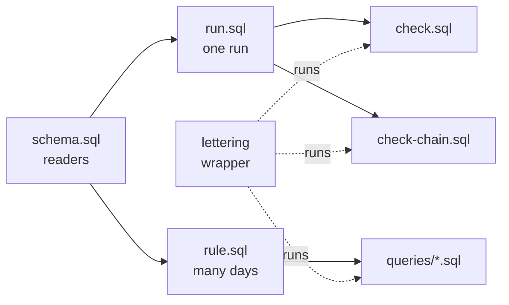

# Lettering DuckDB tool

`tools/lettering-duckdb` checks and queries the result files of a transaction-level (lettering)
rule, format `lettering/1`. This page explains how the tool is built and how to use it. The files
themselves, and every field, are specified in
[transaction-level-results.md](./transaction-level-results.md), the source of truth. When the tool
and that page disagree, the page wins and the tool is fixed.

🚧 Internal tool ([EN-2353](https://formance-team.atlassian.net/browse/EN-2353)). It runs today on
generated test data. Recon does not write these files yet: that is EN-2322.

## 1. What it is for

The team uses the tool for two jobs, during implementation, QA and support:

- **Validate the data.** Do a run's files keep every rule of the format? For example, do the
  counts match the files, does the bridge close, does the run chain onto the previous one?
- **Analyse the files.** Answer the reconciliation questions: which payments were reconciled on a
  day, why the day's net is not zero, what is left to act on, where an invoice stands.

It is not shipped to customers. They read the files with their own tools, and the results doc §9
gives them standalone examples. It is also not part of recon: the service asserts the format's
identities in its own Go tests, and recon's CI does not depend on DuckDB.

## 2. Quick start

The repository's Nix shell provides the DuckDB CLI (1.4.3). The tool also works with any DuckDB
1.4 or later, and needs a POSIX shell.

```bash
nix develop --impure
```

Check one run, then the link with the run before it:

```bash
tools/lettering-duckdb/lettering check tools/lettering-duckdb/testdata/rule=psp-vs-billing/day=2026-09-24/run=r-20260925T000004Z
```

```bash
tools/lettering-duckdb/lettering check-chain tools/lettering-duckdb/testdata/rule=psp-vs-billing/day=2026-09-23/run=r-20260924T000003Z tools/lettering-duckdb/testdata/rule=psp-vs-billing/day=2026-09-24/run=r-20260925T000004Z
```

Ask a question over every day of a rule:

```bash
tools/lettering-duckdb/lettering query open-breaks tools/lettering-duckdb/testdata/rule=psp-vs-billing
```

List the queries:

```bash
tools/lettering-duckdb/lettering queries
```

## 3. How it is built

### Why DuckDB

- **No loading step.** DuckDB reads the files where they are: gzipped NDJSON, the
  `rule=/day=/run=` layout as columns, and a local disk or object storage. There is no database
  and no service.
- **Exact amounts.** Amounts are integer minor units written as strings. DuckDB reads them as
  `HUGEINT`, so no figure goes through a float.
- **Plain SQL.** A check or a question is a SQL file anyone can read, rerun or pass to a colleague.
  The same files run from the CLI, Python or any other DuckDB client.

### Layout

```text
tools/lettering-duckdb/
  lettering            the shell wrapper: arguments, pre-checks, exit codes
  sql/schema.sql       readers, one table macro per file kind
  sql/run.sql          views over ONE run (variable `run`)
  sql/rule.sql         views over MANY days of a rule, current runs only (variable `rule`)
  check.sql            the rules one run's files can show
  check-chain.sql      the rules that tie a run to the previous one
  queries/*.sql        one reconciliation question per file
  test.sh              the test suite
  testdata/            three rules of result files, their expected query results, and generate.py
```

The SQL comes in layers. Each layer only uses the ones before it:



### Readers (`sql/schema.sql`)

There is one table macro per file kind: `flow_file(path, hive)`, `stock_file`, `breaks_file` and
`unclassified_file`. The carried file has the flow file's columns. Four choices make them reliable:

- **Declared columns.** Each column and its type is declared, never inferred. A complete run writes
  every data file, even with no row, and an empty file still has its columns. A key missing from a
  row reads as `NULL`, so a field added within `lettering/1` does not break a reader.
- **Compression stated.** The files are read as gzip without looking at their name. A pre-signed
  URL's query string hides the `.gz`, and so does a `?` in a local path.
- **Row position.** `WITH ORDINALITY` gives each row its position in the file. The order checks
  compare keys in that order, since DuckDB does not guarantee the order of rows it returns.
- **Path columns on demand.** The `hive` flag reads `rule`, `day` and `run` from the path. It is
  on for the multi-day views and off for one run, where those columns would be duplicated.

The file also holds `open_dir(balance, openSign)`, which reads a balance in the hold's open
direction, and the JSON shapes used to flatten the manifest's arrays.

### One run (`sql/run.sql`)

- **Variable.** `run` is the run's directory.
- **Data views.** `manifest`, `flow`, `carried`, `stock`, `breaks` and `unclassified`. Each data view
  adds `file` (the file's name) and `pos` (the row's position). `flow*` also matches a file in
  parts.
- **Manifest views.** The manifest, flattened: `m_run`, `m_files`, `m_cuts`, `m_statement`,
  `m_lines`, `m_carried_outside` and `m_books`.
- **Files served on their own.** A variable named after a file (`manifest`, `flow`, `carried`,
  `stock`, `breaks`, `unclassified`, `period`) overrides that file's path. This is how a check
  reads pre-signed URLs, which cannot be globbed.

### Many days (`sql/rule.sql`)

- **Variable.** `rule` is the rule's directory.
- **Runs.** `runs` reads every manifest under `day=*/run=*`.
- **Current runs.** `current_runs` keeps, per day, the latest run that is not incomplete. Run ids
  sort by start instant, and an incomplete run writes its manifest only, so this is the results
  doc's current run (§2), even when a failed run came last.
- **Day views.** `flow_days`, `carried_days`, `stock_days`, `breaks_days` and `unclassified_days`
  keep only the current runs' rows, with `day`, `run` and `rule` from the path.
- **Manifest views.** `statement_days`, `books_days` and `cuts_days` flatten the current runs'
  manifests. `cuts_days` gives each side's transaction window, which tells what the day itself
  booked.
- **Target day.** `lettering_target_day()` is the `day` variable, or else the latest day with a
  current run.
- **Guard.** The last statement fails when `day` names a day with no complete run. That day's
  activity is in the next complete run's window, so an empty answer would mislead.

### Checks (`check.sql`, `check-chain.sql`)

A check is a list of `INSERT INTO violations` statements, one per rule of the results doc, each
selecting the rows that break the rule with a rule name, a key and a detail. The final statement
prints the violations, then raises a DuckDB `error()` if there is any. So the SQL fails on a
violation in any client, and the wrapper turns that failure into exit status 1.

- **Independent computations.** A rule never trusts the figure it checks. The residual is
  recomputed from the applications booked in the product window (`cuts`), not read from the
  statement. The books are compared with the stock rows, and the verdict is derived from the files.
- **Rule names.** Every rule name contains an underscore (`bridge_net`, `triage_count`). The test
  suite uses this to find the rule names and to check that each one fires on at least one corrupted
  copy (§4).
- **What the files cannot show.** The checks read the files, not the ledgers. They cannot tell
  that a transaction is missing from both the flow and the books. Recon's continuity and residual
  checks cover that, when it computes the run (results doc §5).

`check-chain.sql` also reads the earlier run: its manifest, carried, stock and breaks files. It
checks that the later run picks up exactly where the earlier one stopped.

### Queries (`queries/*.sql`)

Each query starts with three comment lines, which the wrapper reads:

```sql
-- What must be done today? The open breaks that are not accepted, most urgent first.
-- Variables: rule, day (optional, default the latest day).
-- Columns: priority, class, lifecycle, asset, amount, ref, hold, opened_on, ...
```

- **First line.** The question, which `lettering queries` prints.
- **`Variables:` line.** The variables the query takes. The wrapper refuses any other variable,
  and a variable marked `(required` must be given.
- **`Columns:` line.** The output columns.

A query reads only the `*_days` views and `lettering_target_day()`. A query about one day, such as
the applications booked on that day, filters on `cuts_days`. A carried row's history would
otherwise count again on every day it is carried.

### The wrapper (`lettering`)

The wrapper is a POSIX `sh` script. It concatenates the SQL layers and pipes them into the DuckDB
CLI. It also handles what SQL cannot:

- **Directory checks.** Before running anything, it refuses a directory that is not a run's or a
  rule's, and it checks an incomplete run on its own: it must hold a manifest only.
- **Path escaping.** A trailing slash is removed, a quote is escaped, and the glob characters `[`,
  `*` and `?` are taken literally.
- **Init file.** It runs `LETTERING_INIT` first, for example an object-storage secret, and
  discards what it prints.
- **Exit status.** 0 for a sound run or an answered query, 1 for a violation, 2 for wrong
  arguments, 3 for an unreadable file or a SQL error.
- **CSV output.** `LETTERING_MODE=csv` goes through `COPY … TO '/dev/stdout'`. The CLI's own CSV
  mode drops the header of an empty result and writes `NULL` for a missing value.

### Test data and the reference engine

`testdata/generate.py` writes all the test data. It uses the Python standard library only, is
deterministic, and never calls DuckDB:

```bash
python3 tools/lettering-duckdb/testdata/generate.py
```

- **`rule=psp-vs-billing`** is the results doc's worked example (§10). Its NDJSON lines are the
  doc's, byte for byte. The run of 23 September holds only what `check-chain` reads.
- **`rule=qa-scenarios`** is seven days in two assets, one scripted story per case. It covers every
  flow and stock class, lookups on both ledgers, `fromLookups`, a split payment, a lapsed
  acceptance, a credit note, an unclassified transaction and refunds.
- **`rule=qa-verdicts`** is one week through every verdict, with an empty day, an incomplete run
  followed by a two-day window, a retry and the week's `period.json`.

The two qa rules come from a small reference engine in `generate.py` that follows the results doc.
It also writes `expected/`, the CSV each query must return, computed in Python. The Python engine
and the SQL are two independent readings of the doc, so a test passes only when they agree. A
disagreement found this way is fixed in the doc first, then in the side that was wrong. Once
EN-2322 writes result files from the same scenarios, they are compared with this data.

### Tests (`test.sh`)

```bash
just lettering-duckdb-tests
```

The suite checks four things:

1. **Soundness.** Every run passes `check`, and every run chains onto the run its manifest names.
2. **Answers.** Every query returns exactly the CSV in `expected/`.
3. **Every rule fires.** Each rule of `check.sql` and `check-chain.sql` fires on at least one
   corrupted copy of a run. The suite fails when a rule is never exercised, so a new rule needs a
   test.
4. **Variants and awkward inputs.**
   - Legitimate variants pass: a file in parts, a field unknown to `lettering/1`, an incomplete
     run, a triage cut at `topK`.
   - Awkward inputs are handled: odd paths, quotes in values, unknown or missing variables, a
     wrong directory, a bad or missing day, an unreadable file, an init file that prints, an empty
     CSV result.

The suite passes on DuckDB 1.4.3 and 1.5.5, under the macOS `sh` and under `dash`. It is not part
of `just tests`, and it needs only the DuckDB CLI, `gzip`, `sed`, `sort` and `comm`. It runs on
local files: object storage and pre-signed URLs are not covered.

## 4. Using it

### Validate a run

```bash
tools/lettering-duckdb/lettering check <run-dir>
```

A run directory is `…/rule=<id>/day=<YYYY-MM-DD>/run=<runId>`, local or `s3://`. A sound run prints
an empty violation table, then `ok: the run is sound`, and exits 0. A run of 200,000 payments (a
7 MB flow file) checks in about 2 seconds.

A violation prints one row per broken rule and key, then exits 1. Here the drift of a matched
payment was changed by hand from 0 to 1:

```text
rule            key                detail
carried_vs_flow PAY-42/EUR/2       flow row with drift 1 is not carried
file_sha256     flow.ndjson.gz     manifest de43852e…, file 5c32104a…
row_amounts     flow PAY-42/EUR/2  psp 100000 product 100000 drift 1, transactions give psp 100000 product 100000
row_drift       flow PAY-42/EUR/2  matched ok with drift 1
Invalid Input Error: 4 violation(s) of the lettering/1 rules
```

One fault usually breaks several rules. Read the rows by key: the rules named together point to
the fault, and `file_sha256` says whether the file was changed after the manifest was written.

- **Incomplete run.** `check` prints its reason (`short_log_range`, `residual`…) and checks only
  that it holds no data file. The data is in the day's current run, which `current-runs` names.
- **Missing file.** A data file that is absent is reported as `file_missing`: a complete run writes
  every data file, even empty.

### Validate the chain

```bash
tools/lettering-duckdb/lettering check-chain <earlier-run-dir> <run-dir>
```

The earlier run is the one the later manifest's `previousRun` names: the current run of the most
recent earlier day, which is not always the day before. The command checks:

- `previousRun` itself: run id, day and manifest SHA-256;
- that the window starts at the earlier run's cut;
- that every carried item shows up again, and its drift moves only by this window's impact;
- that `fromLookups` equals the drift of the rows not carried in;
- that the open items and the books pick up where the earlier run left them;
- the lifecycle of every break and hold: new, persisting, resolved or cleared, with `openedOn`,
  `previousClass` and the cleared balance.

It refuses an incomplete run on either side: an incomplete run is not a link in the chain.

### Answer a reconciliation question

```bash
tools/lettering-duckdb/lettering query <name> <rule-dir> [variable=value ...]
```

A query runs over every day of the rule and keeps each day's current run. `day` defaults to the
latest day with a current run. A day with no complete run is refused rather than answered with
nothing.

| Question | Query | Variables |
|---|---|---|
| Which run counts for each day, and why did an incomplete one conclude nothing? | `current-runs` | |
| Which payments were reconciled each day, and what else did the flow contain? | `daily-flow` (the `matched` rows are the reconciled payments) | |
| Why is the day's net difference what it is? | `bridge` | `day` |
| What must be done today? | `open-breaks` | `day` |
| What turns into a break soon, and on which day? | `pending` | `day` |
| Where does this invoice, refund or payment stand? | `business-id` | `id` (required) |
| How much is still unmatched, day after day? | `open-items` | |
| What is open on each ledger, day after day? | `books` | |
| How old is what waits for payment? | `stock-ageing` | |
| What was lettered outside matching (credit notes, write-offs)? | `lettered-other` | |
| Which applications were booked on the day? | `applications` | `day` |
| Which PSP events of the day take part in matching? | `psp-events` | `day` |

Results on the worked example, 24 September, printed with `LETTERING_MODE=markdown`:

`open-breaks`: what to do first.

| priority | class | lifecycle | amount | ref | hold | opened_on | days_open | detail |
|---:|---|---|---:|---|---|---|---:|---|
| 2 | under_applied | new | 5000 | PAY-44 | | 2026-09-24 | 0 | INV-11 |
| 3 | unapplied_payment | persisting | 50000 | PAY-39 | | 2026-09-21 | 3 | |
| 4 | stuck | persisting | 120000 | | main:hold:invoice:INV-3 | 2026-09-14 | 10 | 41 days old |
| 4 | wrong_sign | persisting | -10000 | | main:hold:invoice:INV-14 | 2026-09-21 | 3 | 6 days old |

`bridge`: the day's net, −150.00, explained line by line. PAY-40 was paid on the 23rd and applied
on the 24th, hence the `matched` line from an earlier day.

| class | outcome | earlier_day | amount | payments |
|---|---|---|---:|---:|
| unapplied_payment | pending | false | 80000 | 1 |
| under_applied | break | false | 5000 | 1 |
| applied_before_final | pending | false | -30000 | 1 |
| matched | ok | true | -70000 | 1 |

`business-id id=INV-11`: the invoice across files and days. It was open for 1,200.00 on the 23rd.
On the 24th, PAY-44 brought 1,200.00 but only 1,150.00 was applied to the invoice, which keeps
50.00 open: an `under_applied` break of 50.00.

| day | file | class | outcome | ref | hold | amount | detail |
|---|---|---|---|---|---|---:|---|
| 2026-09-23 | stock | open | ok | | main:hold:invoice:INV-11 | 120000 | persisting, 19 days old |
| 2026-09-24 | breaks | under_applied | break | PAY-44 | | 5000 | P2 new since 2026-09-24 |
| 2026-09-24 | flow | under_applied | break | PAY-44 | | 5000 | psp 120000, product 115000 |
| 2026-09-24 | stock | open | ok | | main:hold:invoice:INV-11 | 5000 | persisting, 20 days old |

`current-runs` on `rule=qa-verdicts`: on 6 October the first run was incomplete, and the retry is
the current run. On 9 October no run completed, so the 10th's window covers two days.

| day | run | verdict | current | reason |
|---|---|---|---:|---|
| 2026-10-06 | r-20261007T000003Z | incomplete | false | short_log_range |
| 2026-10-06 | r-20261007T001503Z | reconciled_with_pending | true | |
| 2026-10-09 | r-20261010T000004Z | incomplete | false | short_log_range |
| 2026-10-10 | r-20261011T000004Z | reconciled_with_warnings | true | |

Amounts are in minor units of their asset: `EUR/2` 5000 is 50.00 EUR.

### Export to a spreadsheet

`LETTERING_MODE=csv` writes a standard CSV. It has a header even when there is no row, and empty
fields for missing values.

```bash
LETTERING_MODE=csv tools/lettering-duckdb/lettering query applications ./rule=psp-vs-billing day=2026-09-24 > applications.csv
```

`LETTERING_MODE` also takes any output mode of the DuckDB CLI: `json`, `markdown`, `line`…

### Write your own query

Start a DuckDB session with the rule's views:

```bash
duckdb -cmd "SET VARIABLE rule = 'tools/lettering-duckdb/testdata/rule=qa-scenarios'" -cmd ".read tools/lettering-duckdb/sql/schema.sql" -cmd ".read tools/lettering-duckdb/sql/rule.sql"
```

Loading `rule.sql` prints one `lettering_day_check` row, empty: it is the guard on `day`. Then
query the views:

| View | One row per |
|---|---|
| `current_runs` (and `runs`, every run) | day: its current run, its verdict, and its manifest as JSON (`m`) |
| `flow_days`, `carried_days` | day, payment reference and asset |
| `stock_days` | day and hold, open or cleared since the previous run |
| `breaks_days` | day and break, open or resolved since the previous run |
| `unclassified_days` | day and unclassified transaction |
| `statement_days` | day and asset: the statement as JSON (`s`) |
| `books_days` | day, side, prefix and asset: the open books |
| `cuts_days` | day and side: the transaction window (`txFrom`, `txTo`] |

For example, the payments still unmatched after three days, all days together:

```sql
SELECT day, ref, class, drift, firstSeen
FROM carried_days
WHERE day = (SELECT max(day) FROM current_runs) AND day - firstSeen > 3
ORDER BY abs(drift) DESC;
```

Nested lists unfold with `unnest`. For example, `unnest(product)` in a flow row gives one row per
application, with its `holdId` and `amount`. Once a query is worth keeping, add it to `queries/`
(§5).

### Read from object storage

DuckDB loads its `httpfs` extension the first time it reads an `s3://` path. Credentials come from
a secret, in the file `LETTERING_INIT` names:

```sql
CREATE SECRET (TYPE s3, PROVIDER credential_chain);
```

```bash
LETTERING_INIT=s3.sql tools/lettering-duckdb/lettering query open-items s3://bucket/{bucketID}/reconciliation/rule=psp-vs-billing
```

- **Azure.** Azure storage works the same way, with DuckDB's `azure` extension and an `az://`
  path.
- **Pre-signed URLs.** Recon's API returns one pre-signed URL per file. A URL cannot be globbed,
  so give each file its own variable and run the SQL directly, without the wrapper:

  ```sql
  SET VARIABLE manifest = 'https://…/manifest.json?…';
  SET VARIABLE flow = 'https://…/flow.ndjson.gz?…';
  -- likewise carried, stock, breaks, unclassified and period
  .read tools/lettering-duckdb/sql/schema.sql
  .read tools/lettering-duckdb/sql/run.sql
  .read tools/lettering-duckdb/check.sql
  ```

- **When a directory is needed.** A file in parts and the multi-day queries need a directory:
  download the files first, keeping the `rule=/day=/run=` layout.

### Use the SQL from Python

The SQL files use no CLI dot-command, so any DuckDB client runs them: set the variables, then run
the layers in order.

```python
import duckdb

con = duckdb.connect()
con.execute("SET VARIABLE rule = 'tools/lettering-duckdb/testdata/rule=psp-vs-billing'")
for path in ["sql/schema.sql", "sql/rule.sql"]:
    con.execute(open(f"tools/lettering-duckdb/{path}").read())
print(con.sql(open("tools/lettering-duckdb/queries/open-breaks.sql").read()).df())
```

## 5. Maintaining it

- **A new rule.** Add an `INSERT INTO violations` to `check.sql` (or `chain_violations` to
  `check-chain.sql`), named with an underscore and citing the results doc section. Add a corrupted
  copy to `test.sh` that makes it fire; the suite fails until you do. Add the rule to the table in
  §6.
- **A new query.** Add `queries/<name>.sql` with its three header lines. Compute its expected
  result in `generate.py`, which writes `expected/<name>.csv` (or `<name>_<variable>=<value>.csv`),
  then regenerate the test data. Add the query to the table in §4.
- **A change to the format.** Change the results doc first. Then change the readers, the checks,
  `generate.py` and the expected results, in the same PR. A new optional field needs a column in
  the reader only if a check or a query uses it. A change of `schemaVersion` changes the whole
  pack.
- **A change in `generate.py`.** Regenerate and review the diff of `testdata/`: the worked example
  must stay byte for byte the results doc's.

## 6. Reference

### Commands

| Command | Effect |
|---|---|
| `lettering check <run-dir>` | Checks one run's files against the rules below |
| `lettering check-chain <earlier-run-dir> <run-dir>` | Checks that a run chains onto the earlier one |
| `lettering query <name> <rule-dir> [variable=value ...]` | Runs one query over every day of a rule |
| `lettering queries` | Lists the queries and their questions |

### Exit status

| Status | Meaning |
|---|---|
| 0 | The run is sound, or the query ran |
| 1 | A rule is violated |
| 2 | Wrong arguments: an unknown command, query or variable, a missing required variable, a wrong kind of directory |
| 3 | The files could not be read, or DuckDB failed (a day with no complete run, a value that is not a date…) |

### Environment

| Variable | Effect |
|---|---|
| `DUCKDB` | The DuckDB CLI to run (default: `duckdb` on `PATH`) |
| `LETTERING_INIT` | A SQL file run first, such as an object-storage secret. Its output is discarded |
| `LETTERING_MODE` | `csv` for a standard CSV, or any output mode of the DuckDB CLI |

### Rules of `check`

| Rule | What it checks |
|---|---|
| `schema_version` | The manifest's `schemaVersion` is `lettering/1` |
| `file_missing`, `file_unlisted`, `file_rows`, `file_sha256` | The manifest lists exactly the files present, with their row counts and SHA-256 |
| `counts_flow`, `counts_flow_outcome`, `counts_stock`, `counts_breaks`, `counts_unclassified` | The manifest's counts match the files |
| `bridge_net`, `bridge_totals`, `bridge_line`, `bridge_carried_outside`, `bridge_gross` | The net is `SUM(impact)` and `psp − product`; each line matches the flow rows; the carried lines, the gross and the offsetting flag match |
| `bridge_residual`, `bridge_product_vs_books` | The residual is 0, recomputed from the applications booked in the product window, and the product total equals the books' `lettered − letteredOther` |
| `statement_unclassified` | The statement's unclassified totals match the file |
| `carried_vs_flow`, `suspense_open`, `suspense_identity` | The carried file holds exactly the flow rows whose drift is not 0; the open items equal its sum and count, and `open = openPrev + net + fromLookups` |
| `books_continuity`, `books_vs_stock` | Each book closes, and equals its open stock rows in the open direction |
| `breaks_vs_rows`, `break_vs_row` | Every open break of the flow and stock files is in the breaks file, and back, with the same class and amount |
| `break_amount`, `break_outcome`, `break_priority` | A break's amount, outcome and priority follow its leg, lifecycle and class |
| `row_drift`, `row_break_on` | A pending or break row has a drift and a matched, in-progress or failed one has none; `breakOn` is `firstSeen` plus the lagging side's grace |
| `stock_age`, `books_buckets` | A hold's `ageDays` is counted in the rule's timezone, it is `stuck` exactly when older than its side's `maxAge`, and its bucket and each book's bucket counts follow from the rule's bounds |
| `row_amounts`, `row_impact`, `row_outcome` | A flow row's amounts follow from its transactions, a carried row has no `impact`, and each row's outcome (and a stock row's sign) follows from its class |
| `row_class` | A flow row's class follows from its net amounts: applications that sum to 0 count as none |
| `triage_break`, `triage_pending`, `triage_count` | The triage matches the breaks and the pending flow rows, and lists the first `topK` open breaks, pending rows and resolved breaks |
| `unique_key`, `row_order` | Each file's unique key and row order (results doc §8) |
| `verdict_mismatch` | The verdict follows from the files |

### Rules of `check-chain`

| Rule | What it checks |
|---|---|
| `previous_run` | `previousRun` names the earlier run: run id, day and manifest SHA-256 |
| `window_start` | Each side's window starts at the earlier run's cut |
| `carried_in`, `carried_drift` | Every carried item shows up again, and its drift moves only by this window's impact |
| `from_lookups` | `fromLookups` equals the drift of the rows not carried in |
| `suspense_open_prev`, `books_open_prev` | The open items and the books pick up where the earlier run left them |
| `break_lifecycle`, `stock_lifecycle` | Each break and hold is new, persisting, resolved or cleared as the earlier run implies, with `openedOn`, `previousClass` and the cleared balance |
