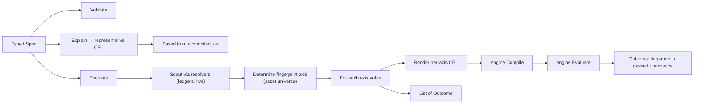

# V1 GA Template Catalog

Templates are the **entire public V1 GA surface** — raw CEL is internal-only (see [ADR-001](../prd/adr-001-cel-kernel.md)). Each template is a typed spec, a validator, an explainer (for the persisted `compiled_cel`), and an end-to-end evaluator that produces one `Outcome` per fingerprint axis (per-asset for V1 GA).

> Status: all three templates are ✅ shipped in [internal/templates/](../../internal/templates/), including `account_threshold` per-account mode.

---

## How templates work



Every template:

1. **Validates** the spec at rule-create time. Failures return `ErrInvalidSpec` (→ HTTP 400).
2. **Explains** itself — produces a representative CEL string for `rule.compiled_cel`. Not executed at runtime.
3. **Scouts** the asset universe at evaluation time (queries resolvers).
4. **Evaluates** per asset by rendering a fresh CEL string, compiling it via the kernel, and running it.
5. **Returns `[]Outcome`** — one per asset, with fingerprint, pass/fail, and evidence.

A **kernel/template consistency guard** in each template double-checks the kernel's verdict against direct big.Int math and errors loudly on divergence. Catches future kernel drift.

Balance reads are centralised in a shared **Source** primitive ([source.go](../../internal/templates/source.go)): a ledger account-set descriptor (`ledger` + `query`) that knows how to resolve to per-asset balances and render its `balance(ledgerSet…)` CEL term. `source_parity` composes sources through it, so there is one code path for "read a balance source".

**Scope.** A ledger source can be read in one of two scopes, a native capability of the Source primitive:
- **aggregate** (default): the matched account set is summed into one balance per asset. A query matching a single account is the degenerate single-account case — so "single account" and "set of accounts" are both aggregate, differing only in the query.
- **per_account**: the source fans out — each matched account is evaluated individually, producing one Outcome per (account, asset) with the account address as the fingerprint axis. The account address is the alignment key when two ledger sources are compared per account. Fan-out is bounded by the engine's `MaxAccountsScanned` budget.

**Query selector.** A source's `query` is translated to a ledger account filter by `dataLedgerLeaf` ([resolver.go](../../internal/ledger/resolver.go)). Leaf keys `address` and `metadata[<key>]` combine with `$and`/`$or`/`$not`:
- `address` — `$match` only: trailing-`*` prefix, else exact.
- `metadata[<key>]` — `$match` (string / bool / integer equality), `$gt`/`$gte`/`$lt`/`$lte` (numeric or datetime-micros comparison), `$exists` (bool). `$like`/`$in` are not supported.

A `metadata[<key>]` filter needs the target ledger to have declared that key's type **and** built its accounts index; the ledger enforces this at query time. So rule create validates every query against its ledger up front (`Reader.ValidateQuery`, dry-run probe) — a query on an unindexed / type-incompatible key is rejected as `400 VALIDATION` naming the key, rather than left to ERROR at evaluation. `address`-only queries need no index.

---

## Catalog

### 1. `ledger_invariant` (✅ shipped)

Buildr-style "sum of signed balances must net to zero (within tolerance)" check. Multiple terms over different ledger queries; each carries a `+1` or `-1` sign.

**Spec**

```jsonc
{
  "terms": [
    { "ledger": "buildr", "query": { "$match": { "metadata[trust]": "held" } },       "sign":  1 },
    { "ledger": "buildr", "query": { "$match": { "metadata[trust]": "obligation" } }, "sign": -1 }
  ],
  "tolerance": { "USD/2": 0, "EUR/2": 0 }       // required; asset universe = these keys
}
```

**Validation**

- `terms` must be non-empty; each term needs `ledger`, `query`, and `sign ∈ {+1, -1}`
- `tolerance` must be non-empty; values ≥ 0
- `query` must be non-null, non-empty JSON

**Asset universe**

`Tolerance` keys define the asset universe — assets present on terms but missing from `tolerance` are **not** checked. This is deliberate: opting in by listing an asset in `tolerance` keeps the rule's scope explicit.

**Per-asset CEL**

```cel
abs(balance(ledgerSet("buildr", "<held query>"), "USD/2")
  + -balance(ledgerSet("buildr", "<obligation query>"), "USD/2")) <= 0
```

(Negative-sign terms emit `-balance(...)`; positive terms emit `balance(...)`. Joined with `+`. Wrapped in `abs() <= TOL`.)

**Fingerprint** — `asset:<asset>`

**Evidence**

```jsonc
{
  "asset":      "USD/2",
  "signedSum":  "0",
  "absDrift":   "0",
  "tolerance":  0,
  "termValues": ["350", "-350"],
  "compiledCEL": "abs(balance(…, \"USD/2\") + -balance(…, \"USD/2\")) <= 0"
}
```

**Code**: [internal/templates/ledger_invariant.go](../../internal/templates/ledger_invariant.go)

---

### 2. `account_threshold` (✅ shipped — aggregate + per_account)

Per-asset min/max bounds on a ledger account set, either aggregated or per account.

**Spec**

```jsonc
{
  "ledger": "acme",
  "query":  { "$match": { "address": "treasury:operating:" } },
  "mode":   "aggregate",                          // "aggregate" (default) | "per_account"
  "bounds": {
    "USD/2": { "min": 100000, "max": 5000000 },
    "EUR/2": { "min": 50000 }                     // one-sided: only min
  }
}
```

**Validation**

- `ledger` and `query` required
- `mode` must be `"aggregate"` (default) or `"per_account"`
- `bounds` must be non-empty; each entry needs at least one of `min` or `max`; if both set, `min <= max`

**Scope (`mode`)** — see [the scope model](#how-templates-work):
- `aggregate`: bounds are checked against the summed balance of the matched set (one query matching one account is the degenerate single-account case). One Outcome per asset.
- `per_account`: bounds are checked against **each** matched account individually — one Outcome per (account, asset). Accounts are read via `ListAccounts` (volumes), bounded by the engine's `MaxAccountsScanned` budget (the resolver errors rather than truncating). No kernel cross-check in this mode (the value comes from `ListAccounts`, not a `balance(ledgerSet)` CEL call); the per-account CEL is still rendered into evidence.

**Asset universe**

`Bounds` keys define the asset universe.

**Per-asset CEL** (combines whichever bounds are set with `&&`)

```cel
balance(ledgerSet("acme", "<query>"), "USD/2") >= 100000
  && balance(ledgerSet("acme", "<query>"), "USD/2") <= 5000000
```

If only `min` is set: `balance(...) >= 100000`. If only `max` is set: `balance(...) <= 5000000`. In `per_account` mode the ledgerSet query is narrowed to a single account address.

**Fingerprint** — `asset:<asset>` (aggregate) · `asset:<asset>|account:<address>` (per_account)

**Evidence**

```jsonc
{
  "asset":       "USD/2",
  "balance":     "523500",
  "min":         100000,
  "max":         5000000,
  "compiledCEL": "balance(…, \"USD/2\") >= 100000 && balance(…, \"USD/2\") <= 5000000"
}
```

**Code**: [internal/templates/account_threshold.go](../../internal/templates/account_threshold.go)

---

### 3. `source_parity` (✅ shipped)

"Two independent records of the same money agree, per asset, within tolerance." Each side is a **Source** (a ledger account set, or a value synced into account metadata — see Source kinds below), so one template expresses any **ledger↔ledger** pairing (a sub-ledger reconciled against a control account on another ledger) or **ledger↔synced-metadata**, without a bespoke template per pairing.

**Spec**

```jsonc
{
  "left":      { "ledger": "main",    "query": { "$match": { "address": "stripe-clearing" } } },
  "right":     { "ledger": "control", "query": { "$match": { "address": "stripe-settlement" } } },
  "scope":     "aggregate",                  // "aggregate" (default) | "per_account"
  "tolerance": { "USD/2": 0, "EUR/2": 50 }   // optional; defaults to 0 per asset
}
```

**Source kinds.** A `SourceSpec` carries an optional `kind` discriminator (default `"ledger"`, the non-breaking seam ADR-001 §7 reserved):

- **`ledger`** (default) — `{ "ledger", "query" }`. The posting-derived aggregate balance of the matched account set, read **live** at the evaluation instant (a single aggregate is an internally consistent snapshot, ADR-003); cross-ledger skew is absorbed by `tolerance`.
- **`account_metadata`** — reads a balance **synced into account metadata** rather than posted (a "mirror" account whose balance an external connector writes as a metadata value, a base-10 integer in the asset's minor units), summed across the matched accounts (via `ListAccounts`, bounded by `MaxAccountsScanned`). This reconciles the **sync** against a ledger balance — it catches connector drift / missed events, and is the right tool when the external side gives a *number*, not a movement stream (if you get movements, post them and do ledger↔ledger). Note: reading a metadata *value* needs no index; only a metadata *filter* in `query` does. Two modes:
  - **single-asset** — `{ "kind": "account_metadata", "ledger", "query", "metadataKey", "asset" }`. The integer at `metadataKey` is keyed by the declared `asset`. A matched account missing the key, or holding a non-integer value, is an ERROR (a synced value that didn't populate is surfaced, not read as zero).
  - **per-asset** — `{ "kind": "account_metadata", "ledger", "query", "metadataKeyPrefix" }`. Keys of the form `<prefix><asset>` (e.g. `reported_balance.USDC`, `reported_balance.EURC`) become a **per-asset** map — one mirror account carries a reported balance per currency, and `source_parity`'s per-asset union checks each independently. Assets are discovered from the keys present; a bare `prefix` key (empty suffix) is skipped, a non-integer value is an ERROR. `metadataKey`/`asset` and `metadataKeyPrefix` are mutually exclusive.

```jsonc
// single-asset: reconcile one synced value against a ledger balance
{
  "left":      { "ledger": "book",   "query": { "$match": { "address": "cash:stripe" } } },
  "right":     { "kind": "account_metadata", "ledger": "book",
                 "query": { "$match": { "address": "mirror:stripe" } },
                 "metadataKey": "ext_balance", "asset": "USD/2" },
  "tolerance": { "USD/2": 0 }
}
// per-asset: reconcile a mirror account's per-currency reported balances
{
  "left":      { "ledger": "book",   "query": { "$match": { "address": "cash:custody" } } },
  "right":     { "kind": "account_metadata", "ledger": "book",
                 "query": { "$match": { "address": "mirror:custody" } },
                 "metadataKeyPrefix": "reported_balance." },   // reads reported_balance.USDC, reported_balance.EURC, …
  "tolerance": { "USDC": 0, "EURC": 0 }
}
```

**Scope** — `aggregate` (default) compares the two sources' summed balances. `per_account` compares them **account-by-account, aligned by address**, emitting one Outcome per (account, asset) — e.g. reconcile each merchant's balance on ledger A against ledger B; see [the scope model](#how-templates-work). An `account_metadata` source is aggregate-only (it has no per-account breakdown).

**Validation** — each side: `ledger` + `query` present, plus (for an `account_metadata` source) exactly one of `metadataKey`+`asset` or `metadataKeyPrefix`; `tolerance` values ≥ 0; `per_account` scope rejects an `account_metadata` source.

**Asset universe** — `union(leftBalances, rightBalances)`; every asset on either side is checked, missing-side defaults to 0.

**Per-asset CEL** (runtime form) — a ledger side renders `balance(ledgerSet(…), asset)`; an `account_metadata` side renders `metadataInt(ledgerSet(…), key)` (single-asset: a fixed key; per-asset: `"<prefix>" + asset`):

```cel
abs(balance(ledgerSet("main", "<query json>"), "USD/2") - balance(ledgerSet("control", "<query json>"), "USD/2")) <= 0
abs(balance(ledgerSet("book", "<query json>"), "USD/2") - metadataInt(ledgerSet("book", "<query json>"), "ext_balance")) <= 0
abs(balance(ledgerSet("book", "<query json>"), "USDC") - metadataInt(ledgerSet("book", "<query json>"), "reported_balance." + "USDC")) <= 0
```

**Fingerprint** — `asset:<asset>` (aggregate) · `asset:<asset>|account:<address>` (per_account)

**Evidence** — `{ asset, leftSource, leftBalance, rightSource, rightBalance, difference (abs), signedDiff, tolerance, compiledCEL }` (`leftSource`/`rightSource` are labels like `ledger:main` or `metadata:book[ext_balance]`; per_account also carries `account`).

**The equality primitive** — `source_parity` is the cross-source equality check (`abs(left − right) ≤ tol`), resolving and rendering both sides through the shared `Source` primitive ([source.go](../../internal/templates/source.go)) — one code path for "read a balance source". `account_metadata` is the first non-ledger source kind; an external bank/PSP-account kind slots in the same way once it has a resolver + kernel builtin.

**Code**: [internal/templates/source_parity.go](../../internal/templates/source_parity.go), [internal/templates/source.go](../../internal/templates/source.go)

---

## V1.1 carve-outs (❌ not in V1 GA)

The following templates are part of the spec roadmap but require kernel work that isn't shipped yet:

| Template | Needed kernel work |
|---|---|
| `account_inactivity`            | `ledgerPostings(...)` source + `lastActivity(source)` builtin + `now()` |
| `posting_rate`                  | `postings(source).count` builtin |
| `metadata_invariant`            | `accounts(source).all(a, has(a.metadata.X))` |
| `cross_account_ratio`           | Per-account iteration + multi-source comparison |

See [PRD §6.2](../prd/README.md#62-v11-fast-follow-catalog) for the V1.1 catalog plan.

---

## Adding a new template

Each template is ~150 LOC + ~80 LOC of tests. The minimal contract:

```go
type MyTemplate struct{}

func (*MyTemplate) Kind() models.TemplateKind { return "my_template" }

func (*MyTemplate) Validate(spec json.RawMessage) error {
    // Parse + check required fields. Return ErrInvalidSpec on failure.
}

func (*MyTemplate) Explain(spec json.RawMessage) (string, error) {
    // Return a representative CEL string for rule.compiled_cel.
}

func (*MyTemplate) Evaluate(ctx, spec, eng, resolvers, in) ([]Outcome, error) {
    // 1. Scout asset/account universe via resolvers.
    // 2. For each fingerprint axis value:
    //    a. Render per-axis CEL string.
    //    b. eng.Compile(expr).
    //    c. eng.Evaluate(compiled, in).
    //    d. (Optional) cross-check direct math vs kernel result.
    // 3. Return one Outcome per axis value.
}
```

Register it in `templates.DefaultRegistry()` ([internal/templates/template.go](../../internal/templates/template.go)) and add its `TemplateKind` constant in [internal/models/rule.go](../../internal/models/rule.go).

The test pattern is well-established — see [internal/templates/templates_test.go](../../internal/templates/templates_test.go) for the round-trip shape (fake resolvers, mustJSON helper, fingerprint assertions, validation table tests).
