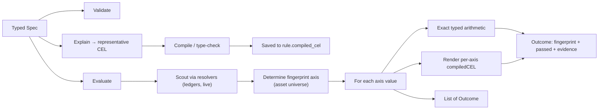

# Template Catalog

Templates are the public rule surface — raw CEL is internal-only (see
[ADR-001](../prd/adr-001-cel-kernel.md)). Each template is a typed spec, a validator, an explainer
(for the persisted `compiled_cel`), and an end-to-end evaluator that produces one `Outcome` per
fingerprint axis.

> Status: all three V1 templates and five additive V2 templates are ✅ implemented. V2 does not
> rename or reinterpret any V1 field or evidence key.

---

## How templates work



Every template:

1. **Validates** the spec at rule-create time. Failures return `ErrInvalidSpec` (→ HTTP 400).
2. **Explains** itself — produces a representative CEL string for `rule.compiled_cel`. Not executed at runtime.
3. **Scouts** the asset universe at evaluation time (queries resolvers).
4. **Evaluates** with exact typed arithmetic and renders the equivalent per-outcome `compiledCEL`.
5. **Returns `[]Outcome`** — one per asset, with fingerprint, pass/fail, and evidence.

A golden **kernel/template consistency guard** checks rendered CEL against the authoritative direct
math, catching future semantic drift without repeating live reads in production evaluation.

Balance reads are centralised in a shared **Source** primitive ([source.go](../../internal/templates/source.go)): a ledger account-set descriptor (`ledger` + `query`) that knows how to resolve to per-asset balances and render its `balance(ledgerSet…)` CEL term. `source_parity` composes sources through it, so there is one code path for "read a balance source".

V2 builds on the same resolver boundary but uses **named aggregate sources**. Every source has a
stable `id` and one declared `asset`; operations refer to IDs rather than positional left/right
fields. The V2 shape and arithmetic are fixed by
[ADR-004](../prd/adr-004-multi-source-comparisons.md).

**Scope.** A ledger source can be read in one of two scopes, a native capability of the Source primitive:
- **aggregate** (default): the matched account set is summed into one balance per asset. A query matching a single account is the degenerate single-account case — so "single account" and "set of accounts" are both aggregate, differing only in the query.
- **per_account**: the source fans out — each matched account is evaluated individually, producing one Outcome per (account, asset) with the account address as the fingerprint axis. The account address is the alignment key when two ledger sources are compared per account. Fan-out is bounded by the engine's `MaxAccountsScanned` budget.

**Query selector.** A source's `query` is translated to a ledger account filter by `dataLedgerLeaf` ([resolver.go](../../internal/ledger/resolver.go)). Leaf keys `address` and `metadata[<key>]` combine with `$and`/`$or`/`$not`:
- `address` — `$match` only: trailing-`*` prefix, else exact.
- `metadata[<key>]` — `$match` (string / bool / integer equality), `$gt`/`$gte`/`$lt`/`$lte` (numeric or datetime-micros comparison), `$exists` (bool). `$like`/`$in` are not supported.

A `metadata[<key>]` filter needs the target ledger to have declared that key's type **and** built its accounts index; the ledger enforces this at query time. So rule create validates every query against its ledger up front (`Reader.ValidateQuery`, dry-run probe) — a query on an unindexed / type-incompatible key is rejected as `400 VALIDATION` naming the key, rather than left to ERROR at evaluation. `address`-only queries need no index.

---

## Catalog

### 1. `ledger_invariant` (✅ shipped)

Buildr-style "sum of signed balances must net to zero (within tolerance)" check. Multiple terms over different ledger queries; each carries a `+1` or `-1` sign.

**Spec**

```jsonc
{
  "terms": [
    { "ledger": "buildr", "query": { "$match": { "metadata[trust]": "held" } },       "sign":  1 },
    { "ledger": "buildr", "query": { "$match": { "metadata[trust]": "obligation" } }, "sign": -1 }
  ],
  "tolerance": { "USD/2": 0, "EUR/2": 0 }       // required; asset universe = these keys
}
```

**Validation**

- `terms` must be non-empty; each term needs `ledger`, `query`, and `sign ∈ {+1, -1}`
- `tolerance` must be non-empty; values ≥ 0
- `query` must be non-null, non-empty JSON

**Asset universe**

`Tolerance` keys define the asset universe — assets present on terms but missing from `tolerance` are **not** checked. This is deliberate: opting in by listing an asset in `tolerance` keeps the rule's scope explicit.

**Per-asset CEL**

```cel
abs(balance(ledgerSet("buildr", "<held query>"), "USD/2")
  + -balance(ledgerSet("buildr", "<obligation query>"), "USD/2")) <= 0
```

(Negative-sign terms emit `-balance(...)`; positive terms emit `balance(...)`. Joined with `+`. Wrapped in `abs() <= TOL`.)

**Fingerprint** — `asset:<asset>`

**Evidence**

```jsonc
{
  "asset":      "USD/2",
  "signedSum":  "0",
  "absDrift":   "0",
  "tolerance":  0,
  "termValues": ["350", "-350"],
  "compiledCEL": "abs(balance(…, \"USD/2\") + -balance(…, \"USD/2\")) <= 0"
}
```

**Code**: [internal/templates/ledger_invariant.go](../../internal/templates/ledger_invariant.go)

---

### 2. `account_threshold` (✅ shipped — aggregate + per_account)

Per-asset min/max bounds on a ledger account set, either aggregated or per account.

**Spec**

```jsonc
{
  "ledger": "acme",
  "query":  { "$match": { "address": "treasury:operating:" } },
  "mode":   "aggregate",                          // "aggregate" (default) | "per_account"
  "bounds": {
    "USD/2": { "min": 100000, "max": 5000000 },
    "EUR/2": { "min": 50000 }                     // one-sided: only min
  }
}
```

**Validation**

- `ledger` and `query` required
- `mode` must be `"aggregate"` (default) or `"per_account"`
- `bounds` must be non-empty; each entry needs at least one of `min` or `max`; if both set, `min <= max`

**Scope (`mode`)** — see [the scope model](#how-templates-work):
- `aggregate`: bounds are checked against the summed balance of the matched set (one query matching one account is the degenerate single-account case). One Outcome per asset.
- `per_account`: bounds are checked against **each** matched account individually — one Outcome per (account, asset). Accounts are read via `ListAccounts` (volumes), bounded by the engine's `MaxAccountsScanned` budget (the resolver errors rather than truncating). No kernel cross-check in this mode (the value comes from `ListAccounts`, not a `balance(ledgerSet)` CEL call); the per-account CEL is still rendered into evidence.

**Asset universe**

`Bounds` keys define the asset universe.

**Per-asset CEL** (combines whichever bounds are set with `&&`)

```cel
balance(ledgerSet("acme", "<query>"), "USD/2") >= 100000
  && balance(ledgerSet("acme", "<query>"), "USD/2") <= 5000000
```

If only `min` is set: `balance(...) >= 100000`. If only `max` is set: `balance(...) <= 5000000`. In `per_account` mode the ledgerSet query is narrowed to a single account address.

**Fingerprint** — `asset:<asset>` (aggregate) · `asset:<asset>|account:<address>` (per_account)

**Evidence**

```jsonc
{
  "asset":       "USD/2",
  "balance":     "523500",
  "min":         100000,
  "max":         5000000,
  "compiledCEL": "balance(…, \"USD/2\") >= 100000 && balance(…, \"USD/2\") <= 5000000"
}
```

**Code**: [internal/templates/account_threshold.go](../../internal/templates/account_threshold.go)

---

### 3. `source_parity` (✅ shipped)

"Two independent records of the same money agree, per asset, within tolerance." Each side is a **Source** (a ledger account set, or a value synced into account metadata — see Source kinds below), so one template expresses any **ledger↔ledger** pairing (a sub-ledger reconciled against a control account on another ledger) or **ledger↔synced-metadata**, without a bespoke template per pairing.

**Spec**

```jsonc
{
  "left":      { "ledger": "main",    "query": { "$match": { "address": "stripe-clearing" } } },
  "right":     { "ledger": "control", "query": { "$match": { "address": "stripe-settlement" } } },
  "scope":     "aggregate",                  // "aggregate" (default) | "per_account"
  "tolerance": { "USD/2": 0, "EUR/2": 50 }   // optional; defaults to 0 per asset
}
```

**Source kinds.** A `SourceSpec` carries an optional `kind` discriminator (default `"ledger"`, the non-breaking seam ADR-001 §7 reserved):

- **`ledger`** (default) — `{ "ledger", "query" }`. The posting-derived aggregate balance of the matched account set, read **live** at the evaluation instant (a single aggregate is an internally consistent snapshot, ADR-003); cross-ledger skew is absorbed by `tolerance`.
- **`account_metadata`** — `{ "kind": "account_metadata", "ledger", "query", "metadataKey", "asset" }`. Reads one balance **synced into account metadata** rather than posted (a "mirror" account whose balance an external connector writes as a metadata value, a base-10 integer in the declared asset's minor units), summed across the matched accounts (via `ListAccounts`, bounded by `MaxAccountsScanned`). This reconciles the **sync** against a ledger balance — it catches connector drift / missed events, and is the right tool when the external side gives a *number*, not a movement stream (if you get movements, post them and do ledger↔ledger). Note: reading a metadata *value* needs no index; only a metadata *filter* in `query` does.

  `metadataKey` and `asset` are independent. The key may include the asset (`reported.USD`) or be arbitrary (`value_known.toto`); the source never infers an asset from the key. One rule checks exactly that key against exactly that asset, even when the matched ledger account contains other assets. Configure another rule for each additional key/asset pair. A matched account missing the key, or holding a non-integer value, is an ERROR rather than a silent zero.

```jsonc
// one asset against one independently named synced value
{
  "left":      { "ledger": "book",   "query": { "$match": { "address": "cash:stripe" } } },
  "right":     { "kind": "account_metadata", "ledger": "book",
                 "query": { "$match": { "address": "mirror:stripe" } },
                 "metadataKey": "value_known.toto",
                 "asset": "USD/2" },
  "tolerance": { "USD/2": 0 }
}
```

**Scope** — `aggregate` (default) compares the two sources' summed balances. `per_account` compares them **account-by-account, aligned by address**, emitting one Outcome per (account, asset) — e.g. reconcile each merchant's balance on ledger A against ledger B; see [the scope model](#how-templates-work). An `account_metadata` source is aggregate-only (it has no per-account breakdown).

**Validation** — each side: `ledger` + `query` present, plus (for an `account_metadata` source) one `metadataKey` and one well-formed `asset`; two metadata sources must declare the same asset; `tolerance` values ≥ 0; `per_account` scope rejects an `account_metadata` source. Asset codes follow the ledger's grammar `[A-Z][A-Z0-9]{0,16}(/[1-9][0-9]{0,2})?` (precision 1–255).

**Asset universe** — ledger↔ledger uses `union(leftBalances, rightBalances)`; every asset on either side is checked and a missing side defaults to 0. If either side is `account_metadata`, the rule checks only its explicitly declared `asset`; other ledger assets belong to separate rules.

**Per-asset CEL** (runtime form) — a ledger side renders `balance(ledgerSet(…), asset)`; an `account_metadata` side renders `metadataInt(ledgerSet(…), metadataKey)`:

```cel
abs(balance(ledgerSet("main", "<query json>"), "USD/2") - balance(ledgerSet("control", "<query json>"), "USD/2")) <= 0
abs(balance(ledgerSet("book", "<query json>"), "USD/2") - metadataInt(ledgerSet("book", "<query json>"), "value_known.toto")) <= 0
```

**Fingerprint** — `asset:<asset>` (aggregate) · `asset:<asset>|account:<address>` (per_account)

**Evidence** — `{ asset, leftSource, leftBalance, rightSource, rightBalance, difference (abs), signedDiff, tolerance, compiledCEL }` (`leftSource`/`rightSource` are labels like `ledger:main` or `metadata:book[value_known.toto]`; per_account also carries `account`).

**The equality primitive** — `source_parity` is the cross-source equality check (`abs(left − right) ≤ tol`), resolving and rendering both sides through the shared `Source` primitive ([source.go](../../internal/templates/source.go)) — one code path for "read a balance source". `account_metadata` is the first non-ledger source kind; an external bank/PSP-account kind slots in the same way once it has a resolver + kernel builtin.

**Code**: [internal/templates/source_parity.go](../../internal/templates/source_parity.go), [internal/templates/source.go](../../internal/templates/source.go)

---

## V2 catalog

V2 templates are available only through the `/v2` API. They are aggregate-only and use the shared
named-source shape below.

### Named source

```json
{
  "id": "book",
  "label": "Customer balance",
  "kind": "ledger",
  "ledger": "main",
  "query": { "$match": { "address": "accounts:customer:*" } },
  "asset": "USD/2"
}
```

| Field | Rules |
|---|---|
| `id` | Required, unique within the rule, `^[A-Za-z][A-Za-z0-9_-]{0,63}$`. This is the stable machine reference. |
| `label` | Optional operator-facing name. It does not replace `id` in machine references. |
| `kind` | Optional; defaults to `ledger`. Supported values are `ledger` and `account_metadata`. |
| `ledger` | Required ledger name. |
| `query` | Required, non-null query; validated against the ledger before persistence. |
| `asset` | Required valid asset code. One V2 source produces one declared asset amount. |
| `metadataKey` | Required only for `account_metadata`; the matched accounts' integer values are summed. |

Each V2 spec accepts at most 32 sources and at least two unless the template is stricter;
`exchange_rate_bounds` requires exactly two. A ledger source whose declared asset is absent resolves to
`balance: "0"` and `present: false`. A missing or non-integer metadata value is an evaluation
`ERROR`, not a silent zero. V2 does not support `per_account` scope.

### 4. `balance_equation`

Asserts that a signed sum of named source balances is within a minor-unit tolerance:

```text
abs(sum(coefficient_i * balance_i)) <= tolerance
```

The following rule expresses `receivable + cash = obligation`:

```json
{
  "sources": [
    {
      "id": "receivable",
      "label": "Open receivables",
      "ledger": "main",
      "query": { "$match": { "address": "receivable:*" } },
      "asset": "USD/2"
    },
    {
      "id": "cash",
      "ledger": "main",
      "query": { "$match": { "address": "cash:settlement" } },
      "asset": "USD/2"
    },
    {
      "id": "obligation",
      "ledger": "control",
      "query": { "$match": { "address": "customer:liability:*" } },
      "asset": "USD/2"
    }
  ],
  "terms": [
    { "source": "receivable", "coefficient": 1 },
    { "source": "cash", "coefficient": 1 },
    { "source": "obligation", "coefficient": -1 }
  ],
  "tolerance": "0"
}
```

**Validation**

- Every source is referenced exactly once by `terms`; unknown, duplicate, or unused source IDs are rejected.
- `coefficient` is a non-zero signed integer.
- All sources declare the same asset.
- `tolerance` is a non-negative base-10 integer string of at most 78 digits, in that asset's minor units.
- Validation details identify the source for people and retain a machine path, for example:
  `Source "obligation" requires an asset (field: sources[2].asset)`.

**Fingerprint** — `asset:<asset>`

**Evidence**

```json
{
  "schemaVersion": 2,
  "operation": "balance_equation",
  "asset": "USD/2",
  "sources": [
    {
      "id": "receivable",
      "label": "Open receivables",
      "kind": "ledger",
      "asset": "USD/2",
      "balance": "7000",
      "present": true,
      "coefficient": 1,
      "contribution": "7000"
    },
    {
      "id": "cash",
      "kind": "ledger",
      "asset": "USD/2",
      "balance": "3000",
      "present": true,
      "coefficient": 1,
      "contribution": "3000"
    },
    {
      "id": "obligation",
      "kind": "ledger",
      "asset": "USD/2",
      "balance": "9950",
      "present": true,
      "coefficient": -1,
      "contribution": "-9950"
    }
  ],
  "residual": "50",
  "absoluteResidual": "50",
  "tolerance": "0",
  "compiledCEL": "balanceEquation(...)"
}
```

Balances, contributions, and residuals are strings so JSON clients cannot lose integer precision.
The evidence source array keeps term order. The fingerprint and source IDs, not array positions, are
the stable identifiers.

### 5. `exchange_rate_bounds`

Compares two differently denominated balances using the convention **quote major units per one base
major unit**. Given minor-unit balances `B` and `Q`, and asset precisions `pB` and `pQ`:

```text
observed rate = (Q * 10^pB) / (B * 10^pQ)
```

The evaluator uses exact `big.Int` cross-multiplication; it never uses binary floating point or a
rounded display value.

```json
{
  "sources": [
    {
      "id": "eur",
      "label": "EUR position",
      "ledger": "treasury",
      "query": { "$match": { "address": "position:eur" } },
      "asset": "EUR/2"
    },
    {
      "id": "usd",
      "label": "USD valuation",
      "ledger": "treasury",
      "query": { "$match": { "address": "valuation:usd" } },
      "asset": "USD/2"
    }
  ],
  "baseSource": "eur",
  "quoteSource": "usd",
  "rate": {
    "target": "1.10",
    "toleranceBps": 25
  }
}
```

`rate` has exactly one of two shapes:

```json
{ "min": "1.075", "max": "1.125" }
```

```json
{ "target": "1.10", "toleranceBps": 25 }
```

**Validation and boundaries**

- `baseSource` and `quoteSource` refer to different declared source IDs.
- The source array contains exactly those two sources.
- `min`, `max`, and `target` are positive plain-decimal strings, with no sign or exponent and at
  most 18 fractional digits.
- Explicit bounds require both values and `min <= max`.
- Target mode requires `toleranceBps` from 0 through 10,000. Its exact inclusive bounds are
  `target × (10,000 ± toleranceBps) / 10,000`.
- A value exactly on either bound passes.
- Signs are preserved. Two negative balances yield a positive ratio; opposite signs yield a
  negative ratio and fail positive bounds.
- A zero quote balance is the defined rate zero. A zero base balance is undefined and produces a
  failed outcome with `undefinedReason: "base_balance_zero"`; it does not raise an engine error.

**Fingerprint** — `baseSource:<base-id>|quoteSource:<quote-id>`

**Evidence**

```json
{
  "schemaVersion": 2,
  "operation": "exchange_rate_bounds",
  "base": {
    "id": "eur",
    "label": "EUR position",
    "kind": "ledger",
    "asset": "EUR/2",
    "balance": "10000",
    "present": true
  },
  "quote": {
    "id": "usd",
    "label": "USD valuation",
    "kind": "ledger",
    "asset": "USD/2",
    "balance": "11000",
    "present": true
  },
  "observedRate": {
    "numerator": "11",
    "denominator": "10"
  },
  "effectiveBounds": {
    "min": "1.09725",
    "max": "1.10275"
  },
  "compiledCEL": "exchangeRateWithin(...)"
}
```

When the base balance is zero, evidence omits `observedRate` and adds
`"undefinedReason": "base_balance_zero"`.

V2 evidence is deliberately separate from V1: it carries `schemaVersion: 2`, an operation
discriminator, and named sources; it never emits `leftSource`, `leftBalance`, `rightSource`, or
`rightBalance`.

V2's CEL financial built-ins use exact `big.Int` / `big.Rat` arithmetic. The rule and evidence retain
`compiledCEL` as the canonical explanation and cross-check surface; no binary floating point is used.

---

### 6. `source_consensus`

Checks that several independent records of the same asset all exist and agree symmetrically:

```text
all sources present AND max(balance_i) - min(balance_i) <= tolerance
```

This is useful for a subledger, custodian mirror, processor report, and bank-reported value that
should describe the same money. It is deliberately not “compare B, C, and D with A”: the verdict is
based on the widest disagreement across every source.

```json
{
  "sources": [
    { "id": "subledger", "label": "Customer subledger", "ledger": "main", "query": { "$match": { "address": "customers:total" } }, "asset": "USD/2" },
    { "id": "processor", "label": "Processor report", "kind": "account_metadata", "ledger": "processor", "query": { "$match": { "address": "reported:balance" } }, "metadataKey": "reported_balance", "asset": "USD/2" },
    { "id": "bank", "label": "Bank statement", "kind": "account_metadata", "ledger": "bank", "query": { "$match": { "address": "statement:closing" } }, "metadataKey": "closing_balance", "asset": "USD/2" }
  ],
  "tolerance": "100"
}
```

**Validation and verdict**

- Two through 32 sources, all declaring the same asset.
- `tolerance` is a non-negative integer string in that asset's minor units.
- A missing ledger asset is explicit evidence (`present: false`) and fails the outcome even when its
  zero value would otherwise fall inside the spread.
- There is no quorum or “ignore missing” mode. All declared records participate.
- Ties for minimum or maximum use the first source in request order, keeping evidence deterministic.

**Fingerprint** — `asset:<asset>`

Evidence includes the ordered source snapshots, `minimumSource`, `minimumBalance`, `maximumSource`,
`maximumBalance`, `spread`, `tolerance`, `missingSources`, and `compiledCEL`.

### 7. `coverage_ratio_bounds`

Checks an exact ratio between two signed, multi-source portfolios of the same asset:

```text
minRatio <= sum(numerator contributions) / sum(denominator contributions) <= maxRatio
```

For example, liquid cash plus eligible securities can be compared with customer liabilities:

```json
{
  "sources": [
    { "id": "cash", "label": "Bank cash", "ledger": "treasury", "query": { "$match": { "address": "assets:cash:*" } }, "asset": "USD/2" },
    { "id": "securities", "label": "Eligible securities", "ledger": "treasury", "query": { "$match": { "address": "assets:securities:*" } }, "asset": "USD/2" },
    { "id": "encumbered", "label": "Encumbered reserves", "ledger": "treasury", "query": { "$match": { "address": "assets:encumbered:*" } }, "asset": "USD/2" },
    { "id": "liabilities", "label": "Customer liabilities", "ledger": "main", "query": { "$match": { "address": "liabilities:customers:*" } }, "asset": "USD/2" }
  ],
  "numeratorTerms": [
    { "source": "cash", "coefficient": 1 },
    { "source": "securities", "coefficient": 1 },
    { "source": "encumbered", "coefficient": -1 }
  ],
  "denominatorTerms": [
    { "source": "liabilities", "coefficient": 1 }
  ],
  "ratio": { "target": "1.10", "toleranceBps": 500 }
}
```

**Validation and boundaries**

- Every source declares the same asset and is assigned exactly once across `numeratorTerms` and
  `denominatorTerms`; unused, duplicated, and unknown IDs are rejected.
- Both portfolios contain at least one term. Coefficients are non-zero signed integers.
- `ratio` accepts the same exact `{min,max}` or `{target,toleranceBps}` shapes as
  `exchange_rate_bounds`; bounds are inclusive and no binary floating point is used.
- Missing ledger assets contribute explicit zero with `present: false` evidence.
- A denominator total of zero fails with `undefinedReason: "denominator_total_zero"` and no
  `observedRatio`; it is not an engine error.

**Fingerprint** — `asset:<asset>`

Evidence contains numerator and denominator portfolio totals, every signed contribution, the exact
reduced `observedRatio` numerator/denominator, effective bounds, and `compiledCEL`.

This remains separate from `exchange_rate_bounds`: FX compares two differently denominated sources
with asset-precision conversion, while coverage compares two same-asset portfolios. It also remains
separate from `balance_equation`: a ratio bound is scale-invariant and cannot be represented by one
fixed residual tolerance.

### 8. `stale_holds`

The catalog's only **time-based** control: it flags held funds whose deadline has passed — or is
about to. Designed for card programs where an issuer places holds with an expiry (see
[stale-holds.md](./stale-holds.md) for the design and its assumptions).

A **hold** is one ledger account carrying a non-zero balance and a deadline in its metadata —
typically **one account per authorization**, which is what lets the rule speak about an individual
hold rather than a pooled reserve (see [stale-holds.md §5](./stale-holds.md)). The deadline is the
issuer's expiry when the hold has one, otherwise its creation instant plus `maxAge`.

```json
{
  "source": {
    "id": "enfuce-holds",
    "ledger": "cards",
    "query": { "$and": [
      { "$match": { "address": "holds:enfuce:*" } },
      { "$match": { "metadata[hold_status]": "active" } }
    ] },
    "asset": "USD/2"
  },
  "deadline": {
    "expiryKey": "hold_expires_at",
    "createdKey": "hold_created_at",
    "encoding": "datetime",
    "maxAge": "48h"
  },
  "mode": "stale",
  "scope": "per_hold",
  "identityKeys": ["enfuce_auth_id", "card_id"],
  "maxHoldsScanned": 500
}
```

**Nothing about the metadata is hardcoded.** `expiryKey`, `createdKey`, `encoding` and `maxAge` are
per-rule fields, as is the account selector — the template imposes no key naming, only that whatever
key a rule names is queryable on its ledger.

**How age is read.** Ledger V3 has no point-in-time read ([ADR-003](../prd/adr-003-checkpoint-anchor-and-crosscheck.md)
— every source reads live), so "how long has this sat here" cannot be answered by comparing now
against then. It is read from state instead, and the comparison is done **by the ledger**: the
evaluation clock is materialised into an integer cutoff and appended to the rule's query as a
`$lte` (and, for a warning band, `$gt`) clause on the deadline key. Consequences:

- The scan and the evidence scale with the number of **stale** holds, not the number of holds.
- The deadline key must be queryable — a `datetime` or integer metadata key with a ready accounts
  index. `Queries` returns the *augmented* query, so an unindexed key is rejected at **rule create**.
- The kernel stays time-free. There is no `now()` builtin: the clock enters as a literal, so the
  persisted `compiledCEL` is an exact, re-runnable record of the predicate that evaluation applied.

**Validation**

- `source` is a ledger source (an `account_metadata` source is rejected — this template reads held
  balances, not synced scalars).
- `deadline` sets `expiryKey`, `createdKey`, or both. `maxAge` is required with `createdKey` and
  rejected without it. Both are Go durations (`"48h"`, `"90m"`).
- `encoding` is `datetime` (default), `epoch_seconds`, `epoch_millis`, or `epoch_micros`. A
  `datetime` key is stored by the ledger as epoch micros and reads back as RFC3339 — which is why
  `metadataInt` cannot read one. Epoch nanoseconds are not offered: query values travel as JSON
  numbers and are rejected past 2^53.
- `warnWithin` is required with `mode: approaching` and rejected with `mode: stale`.
- `identityKeys` (optional, at most 8, non-empty and distinct) names account-metadata keys copied
  into each flagged hold's evidence, so an alert reads *"authorization AUTH-8801 on card_42"* rather
  than only a ledger address. They are **labels, not predicates**: read off the account already
  fetched, so they need **no metadata index**, and a key a hold does not carry is omitted rather than
  failing it. Alert evidence is durable and widely readable — keep cardholder PII out of it.

**Released holds.** Releasing a hold zeroes its volume but keeps the account row and its metadata, so
a released hold still matches a deadline filter. Balances are not filterable in a query, so
zero-balance accounts are dropped after the read and reported as `holdsReleased`. Give the rule's
own query a liveness predicate (`metadata[hold_status] = active`, above) if released holds accumulate
— otherwise the matched set grows without bound and eventually trips the accounts budget.

**Warning vs breach.** Severity is declared per rule, so "warn early, page late" is **two rules**: an
`approaching` rule at a low severity and a `stale` rule at a high one. `approaching` matches a
*band* (`now < deadline <= now + warnWithin`), so a hold crossing into stale leaves the warning
rule's outcomes and its warning alert auto-resolves as the stale alert opens. Set `warnWithin` longer
than the rule's evaluation interval, or a hold can cross the band between two runs without warning.

**Fingerprint** — `asset:<asset>|hold:<address>` (`per_hold`) · `asset:<asset>` (`aggregate`, and the
summary outcome a clean `per_hold` run emits)

In `per_hold` scope only failing holds produce outcomes; a hold that clears stops appearing and the
service's disappearance sweep auto-resolves its alert. A run with nothing stale emits one passing
`asset:<asset>` outcome so a clean evaluation still records what was checked.

Evidence carries `mode`, `basis` (`expiry` / `created_at`), `deadline`, `evaluatedAt`, the amount,
`overdueSeconds` (or `dueInSeconds` in `approaching` mode), `compiledCEL`, and — when `identityKeys`
is set — an `identity` object with the labels the hold carries. Summary and aggregate
outcomes carry the scan instead: `deadlineOnOrBefore` (and `deadlineAfter` for a band),
`holdsMatched`, `holdsBudget`, `holdsReleased`, `holdsFlagged`, `amountFlagged`, `oldestDeadline`, and — in
`aggregate` scope — a `holds` sample bounded to 20 entries with `holdsSampled` saying how many.

> ⚠️ `per_hold` opens **one alert per stale hold** — one control-ledger read and write each. That is
> the point for a programme with a handful of stuck authorisations, and the wrong shape when a
> systemic failure strands thousands at once. Bound it with `maxHoldsScanned` (below), and use
> `aggregate` where the stale set is expected to be large.

**`maxHoldsScanned`** caps how many hold accounts one evaluation reads, below the engine-wide
accounts budget (`MaxAccountsScanned`, 50 000 by default). Three things to understand about it:

- **It bounds the read, not the alert count.** The matched set is whatever the deadline filter
  returns — stale holds *plus* any released hold still carrying an expired deadline. In `per_hold`
  scope the alert count follows that set, which is why the cap bounds the blast radius; but while the
  release question is unresolved it may equally trip on accumulated dead holds, which makes it a
  useful tripwire for exactly that.
- **Exceeding it fails the evaluation** — recorded as `ERROR` with an engine-health alert, and
  **existing alerts are left untouched** (the transition plan never runs). It deliberately does not
  truncate: emitting a subset would make the disappearance sweep auto-resolve the holds it dropped,
  closing alerts *because* there were too many problems.
- **It never raises the engine's budget.** That limit protects the ledger from any single evaluation
  and is not a rule author's to relax; the effective value is recorded in evidence as `holdsBudget`.
- **`per_hold` does not inherit the engine's budget by default — it caps itself at 1000.** The engine
  limit (50 000) is sized to protect the *ledger* from one runaway scan; in `per_hold` scope every
  matched hold can become an alert, each costing a control-ledger read and write and a line in an
  operator's inbox, so that limit protects the wrong thing. A rule that legitimately watches more
  holds says so with `maxHoldsScanned`. `aggregate` emits one outcome however large the set, so it
  keeps the engine's budget.

Independently of this, the **service** caps how many alerts one evaluation may newly open across any
template (200 by default) and withholds the whole plan above it — see
[workflows.md §6b](./workflows.md). `maxHoldsScanned` bounds this rule's read; that cap bounds the
module's alert output.

There is deliberately **no "open at most N alerts" setting on the template**. Any cap on emitted outcomes has the
auto-resolve problem above, and switching an over-budget rule to a summary outcome would change its
fingerprints — resolving the whole open set as a side effect. Choosing `aggregate` up front is the
supported way to get one alert instead of many.

> ⏳ The web UI has no dedicated create form or evidence renderer for `stale_holds` yet — rules are
> created through the API and their evidence renders through the generic V2 fallback.

---

## V1.1 carve-outs (❌ not in V1 GA)

The following templates are part of the spec roadmap but require kernel work that isn't shipped yet:

| Template | Needed kernel work |
|---|---|
| `account_inactivity`            | `ledgerPostings(...)` source + `lastActivity(source)` builtin + `now()` |
| `posting_rate`                  | `postings(source).count` builtin |
| `metadata_invariant`            | `accounts(source).all(a, has(a.metadata.X))` |
| `cross_account_ratio`           | Per-account iteration + multi-source comparison |

See [PRD §6.2](../prd/README.md#62-v11-fast-follow-catalog) for the V1.1 catalog plan.

---

## Adding a new template

Each template is ~150 LOC + ~80 LOC of tests. The minimal contract:

```go
type MyTemplate struct{}

func (*MyTemplate) Kind() models.TemplateKind { return "my_template" }

func (*MyTemplate) Validate(spec json.RawMessage) error {
    // Parse + check required fields. Return ErrInvalidSpec on failure.
}

func (*MyTemplate) Explain(spec json.RawMessage) (string, error) {
    // Return a representative CEL string for rule.compiled_cel.
}

func (*MyTemplate) Evaluate(ctx, spec, eng, resolvers, in) ([]Outcome, error) {
    // 1. Scout asset/account universe via resolvers.
    // 2. For each fingerprint axis value:
    //    a. Render per-axis CEL string.
    //    b. eng.Compile(expr).
    //    c. eng.Evaluate(compiled, in).
    //    d. (Optional) cross-check direct math vs kernel result.
    // 3. Return one Outcome per axis value.
}
```

Register it in `templates.DefaultRegistry()` ([internal/templates/template.go](../../internal/templates/template.go)) and add its `TemplateKind` constant in [internal/models/rule.go](../../internal/models/rule.go).

The test pattern is well-established — see [internal/templates/templates_test.go](../../internal/templates/templates_test.go) for the round-trip shape (fake resolvers, mustJSON helper, fingerprint assertions, validation table tests).
