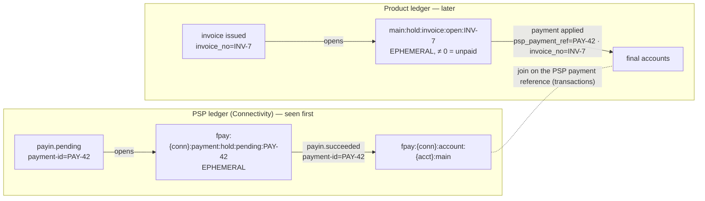
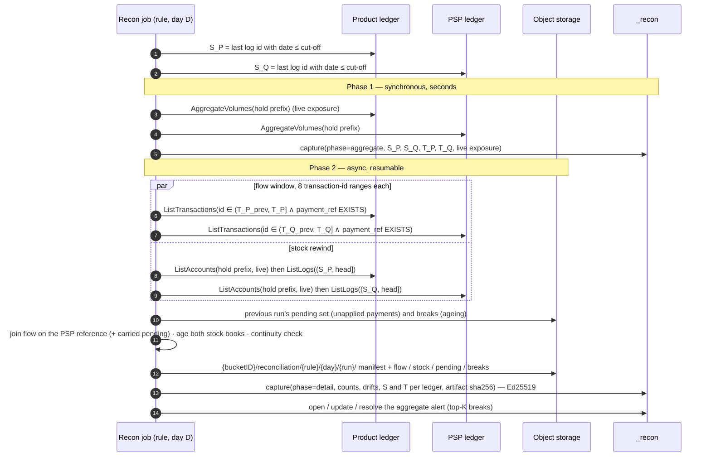

# Transaction-level reconciliation (lettering) — design, measurements, evidence

> ⏳ **Planned — design under evaluation.** Nothing on this page is implemented yet. The decision
> record is [ADR-005](../prd/adr-005-transaction-level-reconciliation.md). This page holds the
> mechanism, the recommended booking, the measurements and the upstream evidence behind it.

---

## 1. What it is, and what it is not

The control reconciles, **per PSP payment reference**, the *PSP ledger* that Connectivity feeds
against the *product ledger* that pilots the business.

- The payment is seen on the PSP ledger first.
- The product ledger later books a transaction carrying that reference, which letters a *business*
  hold: an invoice, an order.
- Both ledgers book as **lettering**. EPHEMERAL holds drain to zero at finality and then purge
  themselves.

A daily run covers **100 to 1,000,000 payments**. The control reads the flow with filtered
`ListTransactions`, and the stock with live listings corrected by the short log window since the
cut-off. It takes **no query checkpoint**.

| It is | It is not |
|---|---|
| Every finalised PSP payment is applied by the product for the same amount, and every product application points at a real finalised payment, **per PSP payment reference** | Pairing postings with bank-statement lines ("2-/3-way match"), fuzzy matching or match suggestions |
| Exact arithmetic at a deterministic business cut-off | A continuous per-tick monitor. Continuous exposure stays with `balance_equation` / `stale_holds` |
| **One aggregate alert** per run, plus the complete break list kept in object storage | One alert per payment |

## 2. The booking this control relies on



The two holds are keyed differently: the PSP ledger by payment, the product ledger by invoice. The
join therefore sits on **transactions**, through the PSP reference. The payment → invoice link lives
only in the product transaction.

- **Open items are a query.** At any instant, the open book is simply the set of non-zero holds.
  Lettered holds purge, so the open book stays small whatever the history.
- **A lettered item exists only in its transactions.** This was verified on a live ledger at
  `0b4676d97`:
  - a lettered hold is gone from `ListAccounts` and `AggregateVolumes`;
  - *neither* its opening transaction *nor* its lettering transaction is returned by an address
    filter, in any, source or destination role. The opening one was returned while the hold was
    open;
  - `reference == "{id}:done"` still finds the lettering transaction;
  - its `post_commit_volumes` still shows the hold at `100 − 100 = 0`.

  EN-2036 (formancehq/ledger#2058 @ `20a5595d6`, open, not merged) makes a purged hold reachable
  by **exact address** again. Its prefix path then scales with every hold ever created (§7.6). None
  of this changes the design, which never reads the flow by address.
- **The join key must therefore be indexed transaction metadata**, and the address cannot be the
  only carrier.
  - Connectivity's `formancepayments` profile already does this: `payments.formance.com/payment-id`
    and `formance.com/observation.event-type` are indexed (`formancehq/connectivity-plugins-poc`,
    `plugins/formancepayments/profiles/formancepayments.yaml:1143-1147` @ `9df05c5b`).
  - The shipped Stripe plugin does not model holds at all. It books Stripe balance transactions
    with `stripe_txn_id` indexed (`formancehq/connectivity`, `plugins/stripe/internal/adapter/grpc/server.go:227-236` @ `e7ca3e29`).

### Recommended booking design (ADR-005 §8)

This design is tuned for the read paths measured in §7:

- **The flow is read with `ListTransactions`**, filtered server-side on `payment_ref EXISTS`, so it
  costs O(payments in the window).
- `ListLogs` would cost O(every log in the window): it can only filter by ledger, log id and date
  (`misc/proto/common.proto`, `QueryFilter`: no metadata condition is allowed on
  `QUERY_TARGET_LOGS`). It is kept for the short rewind window only.
- Listing by prefix costs O(open accounts).

| | PSP ledger (Connectivity) | Product ledger |
|---|---|---|
| **In-flight hold** (EPHEMERAL) | `psp:{conn}:payment:pending:{payment_ref}` (and `psp:{conn}:refund:pending:{refund_ref}`), a single prefix per kind | `product:hold:invoice:{business_ref}` (and `product:hold:refund:{refund_no}`): **one hold per business object**, not one per state |
| **Final accounts** (NORMAL) | `psp:{conn}:account:{acct}:main`, and **`psp:{conn}:fees`**: with no tolerance, every fee is an explicit posting | **`product:clearing:{conn}`**: the application transaction credits the invoice hold from the clearing account, so the clearing balance is the product's view of cash at the PSP (an aggregate control total) |
| **One transaction =** | one event of one payment: pending, succeeded, failed… A refund or a chargeback is **its own payment reference**, not an event of the original payment (decision 7) | one application of one payment to one business object. A payment split across two invoices is two transactions with the same `payment_ref` |
| **Transaction metadata** (declared, typed) | `payment_ref`, **`merchant_ref`** (the business id the merchant passed when it created the payment: Stripe `metadata`, Adyen `merchantReference`…), `state` (the rule maps its values to pending, final and failed), `kind` (payment, refund, chargeback) | `payment_ref` on applications; `business_ref` on **every** transaction touching a business hold, including its opening; `kind` |
| **`reference`** | `{payment_ref}:{state}`: idempotent on re-delivery | `{payment_ref}:{business_ref}` |
| **`timestamp`** | the PSP event time | the business event time |
| **Postings** | exact amounts, with fees split out | application **strict on the amount** (`send [$asset $amount]`, never `*`): an over-application shows as a negative hold, and a partial payment leaves an honest residual |
| **Indexes** | **`payment_ref` (mandatory: it drives the flow read)**; `inserted_at` and log date (to resolve the cut; bisection otherwise); `merchant_ref` (investigation) | **`payment_ref` and `business_ref` (mandatory: together they drive the flow read)**; `inserted_at` and log date |
| **Mutability** | key and state metadata are **write-once**. A correction is a new transaction, never a `SavedMetadata` on an existing one. Recon flags any violation it sees in the rewind window (`key_metadata_mutated`). **Labels** (ask L8) would make this structural | same |

**Why `merchant_ref` matters.** Without it, a payment the PSP finalised that the product never
applied is known only by its `payment_ref`: the controller learns "money arrived, 1,000 €, PAY-42"
but not for what. With it, the engine joins the `unapplied_payment` with the **open invoice** it was
meant for, and the break reads as an action item: "INV-7 is paid at the PSP (PAY-42, 3 days ago),
apply it". This is the most useful single field in the design.

**Unrelated traffic costs (almost) nothing.** The filtered transaction read returns only the
payments. On 1M transactions of which 10 % were payments, it took 0.8 s against 15 s for the
unfiltered log window (§7.2). The short rewind window is the only read that sees every log, so a
dedicated receivables ledger is not needed for performance. Metadata-only writes on holds are still
best avoided: each one is a log in the rewind window.

**Refunds and chargebacks** are their own pair: a refund hold, a refund reference, and a payment
with its own `payment_ref` on the PSP side (ADR-005 decision 7).

### Mapping a connector for reconciliation

The PSP ledger is fed by a Connectivity connector, and the mapping from PSP events to ledger
transactions is configured **per customer, when they implement it**. Nothing here requires a change
to a connector. It is the checklist an implementer follows so that the connector's output can be
reconciled with a `lettering_match` rule. The rule adapts to field names: it names the key field
and the state field per side, so `payment_id` and `event_type` work as well as `payment_ref` and
`state`.

| # | The connector mapping must… | Why |
|---|---|---|
| 1 | carry the **PSP payment reference** as declared transaction metadata, **with an index**, on every transaction of a payment | The flow is read by filtering on its presence. The rule rejects a key without an index (EN-2316). The hold address is never used as the key (§7.6) |
| 2 | book **one transaction per event of one payment reference**. A batched payout that settles many payments is split into one transaction per payment | The control cannot split a multi-reference transaction: it reads the key from the transaction, not from the postings' addresses |
| 3 | carry the **state** of the event (pending, succeeded, failed…) as transaction metadata | The rule maps its values to `pending`, `final` and `failed` per deployment |
| 4 | carry **`merchant_ref`**, the business id the merchant passed when creating the payment (Stripe `metadata`, Adyen `merchantReference`…) | It turns an `unapplied_payment` into "invoice X is paid: apply it" |
| 5 | keep key and state metadata **write-once**. A correction is a new transaction, never a `SavedMetadata` on an existing one | A filtered re-read of a past day must not change. Recon flags violations in the rewind window (`key_metadata_mutated`) |
| 6 | book **refunds and chargebacks as their own payment references**, not as a reversal of the original payment | Each is its own 1-to-1 pair (ADR-005 decision 7) |
| 7 | book **fees and FX as explicit postings** to their own accounts | The comparison is exact, with no tolerance |
| 8 | use **EPHEMERAL holds, one per payment, under one prefix per kind** | The open book is then a prefix listing, and lettered holds leave it |
| 9 | set `reference = {payment_ref}:{state}` | Re-delivery of an event is idempotent |
| 10 | have the **`inserted_at` or log-date index** created on the ledger | It resolves the cut-off in one read, instead of by bisection |

**Where two existing mappings stand**, as a starting point:

- `formancepayments`, in [`formancehq/connectivity-plugins-poc`](https://github.com/formancehq/connectivity-plugins-poc)
  (`plugins/formancepayments/profiles/formancepayments.yaml` @ `9df05c5b`):
  - **covered:** row 1, with `payments.formance.com/payment-id` on every payment transaction and
    indexed (`:1143-1147`); row 3, with `formance.com/observation.event-type` indexed and
    `payments.formance.com/payment-status`; row 8, with an EPHEMERAL
    `fpay:{conn}:payment:hold:pending:{payment_id}` hold (`:64-73`); row 9 in intent, since
    `reference = {conn}:padj:{adjustment_id}` is idempotent per event;
  - **to configure:** row 4, as there is no merchant reference on transactions
    (`payments.formance.com/reference` is account metadata); row 6, as refunds are mapped
    (`PAYIN_REFUNDED` and five siblings, `:430-704`) but as deltas **on the original payment id**,
    not as their own payment reference; row 7, as a `fees` account is declared (`:82`) but no mapping
    posts to it; row 10, as the profile indexes `timestamp` but neither `inserted_at` nor the log
    date.
- The Stripe plugin, in [`formancehq/connectivity`](https://github.com/formancehq/connectivity) (`plugins/stripe` @ `e7ca3e29`), does not model holds. It books balance transactions keyed by
  `stripe_txn_id`, so rows 1–3 and 8 need a lettering mapping first.

The product side is the customer's own Numscript. Its conventions are in the booking table above,
and the booking guide ([EN-2335](https://formance-team.atlassian.net/browse/EN-2335)) will turn both
sides into a customer-facing document.

## 3. Workflow



- **The cut.** `S` = the last log with `date ≤ cut-off` on each ledger. Log dates come from the
  ledger's HLC and are strictly monotonic
  (`docs/technical/architecture/subsystems/consensus/hybrid-logical-clock.md`). Both sides are
  therefore cut at the **same business time**, whatever the cluster and whenever the job runs. The
  capture records `S` and the log hash at `S`, so the cut can be re-derived.
  - *Resolving `S`:* per-ledger log ids are contiguous from 1, so the head is
    `GetLedgerStats.log_count`.
  - `ListLogs` has no reverse order, so `S` = (the first log with `date > cut-off`) − 1, found with
    one ascending page of size 1. That needs the per-ledger log-date index
    (`LOG_BUILTIN_INDEX_DATE`).
- **The flow leg** reads the window's transactions by id range, filtered server-side on the key's
  presence (ADR-005 §5).
  - `T` is the transaction-id image of the cut: the last transaction with `inserted_at ≤ cut-off`.
  - The logs remain the immutable, permanent path for re-deriving a past day exactly ("Log and
    audit history is permanent", ledger backup README), because transaction metadata is mutable.
- **The stock leg** is a live listing *rewound* to `S` (§4).
- **Continuity.** Per side and per asset: `open(S) = open(S_prev) + opened(W) − lettered(W)`. A lost
  window event breaks the identity, which makes the read's completeness checkable.

### Reads and indexes

Every read is gRPC on `BucketService`, through recon's vendored client (`internal/ledgerpb`).

| Read | RPC | Index needed |
|---|---|---|
| Head of a ledger's log | `GetLedgerStats` → `log_count` (per-ledger log ids are contiguous from 1) | none |
| Resolve `S` from the cut-off | `ListLogs`, filter `log_builtin_uint(DATE) > cut-off`, page 1 → `S = id − 1` | **log-date index** (`LOG_BUILTIN_INDEX_DATE`, Pebble `lldt`). Without it, fall back to bisecting on log id: page-1 `ListLogs` calls filtered on `log_id`, reading each log's date, about 20 calls for 1M logs (not benched). **A main path, not an edge case**: Connectivity's `formancepayments` profile creates neither this index nor `inserted_at` (checklist row 10), so the run records which path resolved the cut and the statement names the index to add |
| Resolve `T` (transaction-id cut) | `ListTransactions`, filter `builtin_uint(INSERTED_AT) > cut-off`, page 1 → `T = id − 1`. Per-ledger transaction ids are contiguous (an unfiltered `(0, 1M]` returned exactly 1M rows) | `inserted_at` index (`TX_BUILTIN_INDEX_INSERTED_AT`), or bisection on id |
| **Flow window** | `ListTransactions`, filter `And(builtin_uint(ID) ∈ (lo, hi], membership)`, page 1000. Membership is `metadata[<psp.key>] EXISTS` on the PSP ledger, and `Or(<product.key> EXISTS, <product.businessId> EXISTS)` on the product ledger, so that hold openings are returned for continuity. The field names come from the rule, for example `payments.formance.com/payment-id` with `formancepayments` | **metadata indexes on `payment_ref` (and `business_ref` on the product side): mandatory.** While it builds, reads return a retryable `Unavailable` ("index is still building") |
| Rewind window `(S, head]`, and exact re-derivation of a past day | `ListLogs`, filter `log_id ∈ (lo, hi]`, page 1000, cursor in the `x-next-cursor` trailer | **none** |
| Open holds | `ListAccounts`, filter `address` prefix, page 1000 | **none**. An address-prefix listing iterates the main store, not the read index |
| Investigation: "every transaction of payment PAY-42", "which payments settled invoice INV-7" | `ListTransactions`, filter on metadata or `reference` | **indexed metadata** for the PSP reference and the business id, plus the `reference` index. This is not needed by the batch. Until EN-2036 merges, it is the only lookup left once a hold is purged, since address filters miss it (§2). After that, an exact address reaches it too |

Each `ListLogs` call is a server stream of at most 1,000 `Log`. The transaction sits at
`payload.apply.log.data.created_transaction.transaction`, or
`…reverted_transaction.revert_transaction`, and carries its postings, its metadata and its
`post_commit_volumes`.

Each `ListTransactions` call is a server stream of at most 1,000 `Transaction`, and each carries
its postings, its metadata and its `post_commit_volumes`.

**Parallel reads.** A window `(lo, hi]` splits into K disjoint id ranges, of transaction ids for the
flow and of log ids for the rewind. K concurrent streams each page their own range.

- This needs **no snapshot**. A log at or below the head is immutable. A transaction at or below the
  cut is immutable too, except for its metadata and revert flags, hence the write-once convention.
  Ranges read at different instants therefore return what one frozen read would have returned. An
  account listing does not have this property: its pages see moving balances.
- **Merging the ranges.** For the flow, each range keeps its per-reference facts, and the facts are
  combined in transaction-id order. For the rewind, each account keeps its *first* touch after `S`, taken
  from the lowest range that touched it.
- Measured on one node (§7.2):
  - logs: 7.3k/s to 13.8k/s on one stream, 41k/s to 66k/s over 8 streams;
  - transactions: 94.5k/s on one stream, 351k/s over 8.

  Scaling is sub-linear: the service sets the limit, not the client.
- **Completeness is checkable for free on unfiltered ranges.** Log and transaction ids are both
  contiguous per ledger, so an unfiltered range `(lo, hi]` must return exactly `hi − lo` rows. The
  filtered flow read has gaps by design; there, completeness rests on the index and on the
  continuity identity. A short count means a replica that lags or a read that failed,
  and it fails the run instead of silently shrinking the window.
- That check also makes it possible to read from followers (`x-consistency: stale`) to take load off
  the leader: a follower that has not yet applied up to `hi` returns fewer logs, and the range is
  retried.

## 4. The rewind: an exact state at `S` with no checkpoint

After a live, possibly torn, listing of the scope has finished, read the logs `(S, head]`. For each
scope account touched there, **discard the listed value**. Replace it with the account's balance
*just before its first touch after `S`*:

```text
pre = post_commit_volumes[account] − Σ(this transaction's postings on account)
```

- Touched accounts that are missing from the listing are added back when `pre ≠ 0`.
- Accounts created after `S` have `pre = 0` and drop out.
- An account untouched in `(S, head]` held one value for the whole listing, so the listed value is
  its value at `S`.

The method needs no baseline and no stored state, and it applies to NORMAL accounts as well as to
EPHEMERAL holds. Only created and reverted transactions move balances, and both carry
`post_commit_volumes` (`misc/proto/common.proto:133-136`, `823-831`).

**Proof run** (§7.4): against a checkpoint taken at `S`, under concurrent writes, the rewound listing
matched on every one of 1,002,408 rows. The raw live listing differed on 2,233.

## 5. Matching semantics

**States are declared by the rule, per side** (ADR-005 §6). Each side names its key field, its
state field and the value sets meaning `pending`, `final` and `failed`, and the product side names
its business-id field. How PSP states are modelled is a per-deployment choice, so recon hard-codes no
vocabulary.

| Leg | Class | Meaning |
|---|---|---|
| Flow | `matched` | PSP `final`, and product applications summing to the same amount |
| Flow | `under_applied` / `over_applied` | Product applications for the reference sum to less or more than the PSP amount. A payment split across invoices is summed first. **No tolerance**: a fee or FX difference is a break |
| Flow | `unapplied_payment` | PSP `final`, no product application yet. **Pending while within `grace`** (proposed default 3 days), then a break. Carried from day to day in `pending.ndjson.gz` |
| Flow | `orphan_application` | A product application points at a reference the PSP never finalised: **critical** |
| Flow | `reversed_after_application` | The PSP reports `failed` on a reference after the product applied it: **critical** |
| Stock (each side) | `open` + age bucket | Pending payment (PSP side) or unpaid business object (product side). Proposed buckets: 0–1, 2–7, 8–30, > 30 days |
| Stock (each side) | `negative_hold` | A required state was skipped ("investigate id") |
| Stock (each side) | `stuck` | Open past the side's `maxAge`, the `stale_holds` signal per key |

- **Refunds and chargebacks are ordinary 1-to-1 pairs.** On the PSP ledger they are a payment with
  its own reference; on the product ledger, a refund hold lettered by a transaction carrying that
  reference. They go through the same classes and are never a reversal of the original payment.
- **A transaction whose state is in no set is never dropped silently.** It takes no part in matching,
  but it is counted per side, per state value and per asset as `unclassified`, with a warning, and
  listed in `flow.ndjson.gz`. This catches a connector mapping that doesn't follow the conventions.
  For example, `formancepayments` books refunds on the original payment id as `payin.refunded`
  (checklist row 6).
- The two stock books are **aged, not joined**: an unpaid invoice has no PSP counterpart by design.
- Ageing (`new` / `persisting` / `cleared`) comes from the previous day's artifact.
- Arithmetic is exact in minor units, colors are collapsed per asset, and `asset: "*"` fans out per
  asset as in ADR-004.

### What the controller sees: a reconciliation statement, never a bare drift

A net drift of 0 proves nothing. Two breaks of +1,000 € and −1,000 € also net to zero. Every run
therefore answers with a **reconciliation statement**: the classic *état de rapprochement*, built
from the two control totals down to the explained items, with an explicit verdict.

**Verdict, in the order it is evaluated:**

| Verdict | Condition | What it tells the controller |
|---|---|---|
| `INCOMPLETE` | A window range returned fewer logs than `hi − lo`, a continuity identity fails, or the bridge below has a non-zero **unexplained residual** | "No conclusion can be drawn": the engine failed, not the books. It opens an engine-error alert, never a green one |
| `BREAKS` | at least one break row | the count and gross amount of breaks, split by class |
| `RECONCILED_WITH_PENDING` | no break, but unapplied payments still within `grace` | "OK for now". The pending items, their amount and the date each one becomes a break |
| `RECONCILED` | none of the above | the only green state |

**The bridge**, per asset, for the window:

```text
  PSP — finalised payments in the window                              A     (count n_A)
− Product — applications in the window                                B     (count n_B)
= Net difference                                                      A − B
  explained by:
    + unapplied payments, within grace (pending)                      …     (n)
    + unapplied payments, past grace                         BREAK    …     (n)
    − orphan applications (no finalised PSP payment)      CRITICAL    …     (n)
    ± under / over applications                              BREAK    …     (n)
    − applications of payments finalised on an earlier day            …     (n)   carried from D−k
  = unexplained residual                                  must be 0, else INCOMPLETE
Gross breaks: Σ|drift| = …    Offsetting: yes/no (net ≈ 0 while gross > 0)
```

Around the bridge, the statement shows:

- **the open books**: PSP pending holds and product open holds, each with its total, count and age
  buckets, and the continuity check;
- **triage in severity order**:
  1. critical first: `orphan_application`, `reversed_after_application`. Money was booked in the
     product with no cash behind it;
  2. then under- and over-applications;
  3. then unapplied payments past grace;
  4. then stuck holds.

  Each class shows its top-K by amount, **new versus persisting** from the previous day, and the
  detail's path and filter (`breaks.ndjson.gz`, `class = …`).
- **when `merchant_ref` exists**, every unapplied payment is paired with the open business hold it
  names;
- **`unclassified` transactions**, per side and state value, with a warning. They do not change the
  verdict, but they say the rule's state sets or the connector mapping need attention.

The alert's evidence is this statement, not a single drift figure. Its headline states the verdict
and the gross amount first, and the net second.

### Result artifacts, retention and the period view

```text
{backup bucket}/{bucketID}/reconciliation/{ruleId}/{YYYY-MM-DD}/{runId}/
  manifest.json       {cuts:[{ledger, S, T, logHash, cutoff}], files:[{name, sha256, rows}], counts, drifts, continuity, expiresAt}
  flow.ndjson.gz      {"ref":"PAY-42","class":"matched","psp":{"tx":981,"amount":"1000"},"product":[{"tx":1204,"invoice":"INV-7","amount":"1000"}]}
  pending.ndjson.gz   the unapplied payments carried to the next day, each with the day it was first seen
  stock.ndjson.gz     {"side":"product","hold":"main:hold:invoice:open:INV-9","balance":"-500","ageDays":12,"bucket":"8-30d"}
  breaks.ndjson.gz    every non-matched row of both legs
```

**Location.** The files go to the **ledger's backup object storage**, S3 or Azure, under a prefix
that is a sibling of `backups/`.

- The ledger's orphan prune only deletes unreferenced objects under `{bucketID}/backups/data/` and
  `{bucketID}/backups/exports/` (`internal/infra/backup/manager.go:229-235`, `segment.go:54-61`), so
  `{bucketID}/reconciliation/` is never touched.
- Recon brings its own credentials. `file` is available for development.

**Integrity.** The manifest's SHA-256 is written into the Ed25519-signed capture, so the signature
covers every file transitively.

**Retention.** 90 days by default, configurable per rule.

- The primary mechanism is the storage lifecycle rule on the prefix, with recon's `expiresAt` sweep
  as the fallback.
- An expired day can be recomputed from the permanent logs with the same cut.

**Period view.** The rule runs daily by default, with the existing `periodType` (`daily`, `weekly`
or `monthly`, calendar-based in the rule's timezone). The period's alert carries the aggregate
comparison, and the period summary is built from the daily **manifests** rather than from the
ledgers. For each day it gives:

- the counts per class;
- the net and absolute drift;
- the breaks opened and cleared;
- the link to that day's files.

Breaks still open at period end keep the day they first appeared. A break that clears after its
period has closed shows up in the next period.

**What opens the alert:** a non-zero net drift *or* at least one break row. Offsetting breaks net
to zero, so the aggregate alone is never the trigger.

Measured size: **about 15 bytes per break**, gzipped (3,499 breaks = 54 KB).

## 6. Could Pebble do better?

We checked this against the Pebble v2.1.4 sources and the ledger's call sites. The ledger calls
**none** of `NewEventuallyFileOnlySnapshot`, `WithRestrictToSpans`, `RemoteStorage`,
`IngestExternalFiles`, `Excise` or `ScanInternal`.

| Primitive | What it would give | Why not |
|---|---|---|
| `DB.NewSnapshot()` (`db.go:1629`) | A consistent view that costs one mutex and a sequence number: no files, no Raft order, no slot | It can only live server-side. It keeps overwritten versions alive while it is open, is lost on restart, and the ledger's `NewReadHandle` holds `dbMu.RLock` for the handle's lifetime (`internal/storage/dal/reader.go:80-96`). It is the right basis for a ledger-side *consistent export* (F-g), which this use case no longer needs. |
| `NewEventuallyFileOnlySnapshot(ranges)` (`db.go:1652`) | Scoped to key ranges, and ledger keys are ledger-contiguous (`internal/domain/keys.go:105-131`) | Once file-only it pins **the whole Version** (`snapshot.go:280`) and hides unflushed keys outside the ranges |
| `Checkpoint(WithRestrictToSpans)` (`checkpoint.go:57`) | Hard-links only the SSTs that overlap the spans | It still copies every WAL and the MANIFEST (`:394-413`, `:477-557`), can surface stale keys outside the spans (`:50-56`), and keeps the slot and the lifecycle |
| `Options.Experimental.RemoteStorage` / `IngestExternalFiles` | SSTs read from object storage | Pebble ships no S3 or Azure driver, only an interface and test implementations. It is designed for shared L5/L6 beside a local MANIFEST and WAL, not for a database read out of a bucket |
| Backup to S3/Azure | A durable copy of a frozen state | It covers the whole store and exists for disaster recovery: reading it means restoring a node, and "it does not provide point-in-time queries" |

**Conclusion.** Pebble is not what limits this use case; the ledger's read API is. And the log is
already the exact, permanent, partitionable "snapshot" the use case needs.

## 7. Measurements

**Setup.** A throwaway single-node ledger (`--cluster-id bench`, ports 18888/17777/19000), with its
data in the session scratchpad and **isolated from the daily-driver ledger on :8888**. It was built
from `release/v3.0` @ `0b4676d97`, then from the tip @ `a08f99bc3`, and ran on an Apple-silicon
laptop.

- Two ledgers of 1M accounts each: `psp:tx:{16-hex id}` and `bank:tx:{id}`.
- Ids are pseudo-random, so address order is unrelated to insertion order.
- `bank` carries injected drift per 1,000 ids: one id missing, one id at +1, one id funded twice,
  plus 0.05 % extra ids.
- There is no replication and no network. Read the absolute numbers as a lower bound and the ratios
  as the finding.
- The bench is [`tools/bench-txlevel`](../../tools/bench-txlevel/README.md), a Go client over recon's
  vendored `internal/ledgerpb`. Its README gives the exact commands to reproduce every figure below.

### 7.1 Account reads

| Operation | 100k / scope | 1M / scope |
|---|---|---|
| Load (`Apply`, 200–500 tx per batch, 16 workers) | ~95k tx/s | ~115k tx/s |
| `AggregateVolumes` prefix, live | 0.22 s | 2.9 s |
| `AggregateVolumes` prefix, at checkpoint | 3.9 s | 62 s (both SHAs) |
| `ListAccounts` scan, live, page 1000 | 1.1 s (≈90k/s) | 21.3 s (≈47k/s) |
| `ListAccounts` scan, live, **page 200** (recon's `queryPageSize`) | 5.3 s | — |
| `ListAccounts` scan, at checkpoint, one reader | 26.3 s (3.8k/s) | 5 min 10 s |
| Create query checkpoint | 1.09 s | 0.61 s |
| **Keyed diff of two scopes, live** (parallel scans + merge-join + gzip) | 2.1 s | 21.9 s |
| Keyed diff at checkpoint, `0b4676d97` | concurrent reads fail (EN-2108) | 10 min 25 s (sequential) |
| Keyed diff at checkpoint, tip (EN-2108 fixed) | 8.3 s (parallel) | 2 min 38 s (parallel) |
| Merge-join + write, alone | 3 ms | 29 ms |

### 7.2 Log and transaction reads

**Ledger `psp`**, 1M transactions, one account each:

| Operation | 100k logs | 1M logs |
|---|---|---|
| `ListLogs` log-id window + fold of `post_commit_volumes`, 1 stream | 13.3 s (7.5k/s) | 2 min 18 s (7.3k/s) |
| Same, **8 parallel log-id ranges** | — | 24.2 s (41k/s) |

**Ledger `mixed`**, 1M transactions of which **10 % are payments** (`load-mixed`). The payments
carry `kind` and `payment_ref` metadata, the rest carries `kind = internal`, and `kind` is declared
and indexed. Tip `a08f99bc3`:

| Read of the same 1M-transaction window | 1 stream | 8 id ranges |
|---|---|---|
| `ListLogs`, everything | 72.5 s (13.8k/s) | 15.1 s (66k/s) |
| `ListTransactions`, everything | 10.6 s (94.5k/s) | 2.85 s (351k/s) |
| `ListTransactions`, `kind = payment` → 100k rows | 2.09 s | 0.56 s |
| `ListTransactions`, **`payment_ref EXISTS`** → 100k rows | 2.93 s | **0.80 s** |

Every row returned by `ListTransactions` carried its `post_commit_volumes`. The `payment_ref` index
was created on the loaded ledger, and its backfill over 1M transactions was ready about 1 s later.

**Mutability, shown.** `retag` rewrote one payment's `kind` to `internal` after the fact. The same
`kind = payment` read of the same past window then returned **99,999** rows, while
`payment_ref EXISTS` still returned 100,000. That transaction's log was unchanged; the retag
appears as a new `SavedMetadata` log at the head. This is why the flow filters on the key's
**presence**, and why the key and state metadata are write-once.

### 7.3 What the numbers say

1. **The join is free.** Moving the data is the whole cost: 29 ms of join for 1M × 2.
2. **A checkpoint makes reads about ×20 slower.** Every page reopens both checkpoint databases with
   the backup profile (`internal/adapter/grpc/server_bucket.go:336-398`,
   `internal/storage/dal/store_readonly.go`). On the tip, two concurrent readers are *faster* than
   one: 100k × 2 in 8.3 s, against 26 s for one scope. The shared open survives while any reader
   holds it, which shows the reopen is the cost. Not asked: evaluations take no checkpoint (§8, F-b).
3. **Page size costs ×4.7.** Bulk reads must use `MaxPageSize` = 1000.
4. **Every listed account emits an INFO log line** (`internal/application/ctrl/store.go:189-195`):
   3.86M lines, a 970 MB log. → ask **L2**.
5. **For the same data, logs are 5–7× slower than transactions** (13.8k/s against 94.5k/s on one
   stream). Neither can filter on metadata server-side, except `ListTransactions`, which returns
   only the payments. The flow therefore reads transactions, and the logs keep the short rewind
   window and exact re-derivation. → asks **L6** and **L8**.
6. **Disk.** A 100k-account checkpoint kept its 169 MB alive after the live store had grown to
   1.9 GB. A checkpoint's cost is churn × lifetime, on every replica.

### 7.4 Rewind proof

The bench command `rewind` ([tools/bench-txlevel](../../tools/bench-txlevel/README.md)):

1. Record `S` (the `psp` log head) and create an **oracle checkpoint** with no write in between.
2. Start 8 writers doing top-ups, drains of each account's original amount (to zero the first time
   an untouched account is drained), and new-account creations on `psp:tx:*`.
3. List the 1M scope **live** while they run.
4. Stop the writers, read the logs `(S, head]` and rewind.
5. Compare row for row with the checkpoint's listing.

| | Value |
|---|---|
| Writes committed during the listing | 8,208 transactions |
| Live listing | 14.8 s, 1,002,752 rows |
| Correction window `(S, head]` | 8,208 logs, 4,446 scope accounts touched, fold in **267 ms** |
| Oracle (checkpoint at `S`), non-zero rows | 1,002,408 |
| **Raw live listing ≠ state at `S`** | **2,233 rows**, the torn read |
| **Rewound listing ≠ state at `S`** | **0 rows** |

Resolving the cut from a date was checked separately (`cutprobe`), on a ledger with the log-date
index and 5 transactions 300 ms apart and a cut-off halfway between the 3rd and the 4th. One
ascending page of `date > cut-off` returned log id 5, so `S` = 4.

That is the 3rd transaction, because log 1 is the `CreateIndex`. **Per-ledger log ids count every
ledger log, not only transactions**, so a log id is not a transaction id.

### 7.5 Projected daily run

The projection assumes 1M lettering events per day per side, with an open book of `N_open` holds.

| Step | Cost |
|---|---|
| Resolve `S` and `T` (one date-filtered page per ledger and per read path) | ms |
| Flow: 1M payments per side, filtered `ListTransactions` over 8 ranges, both sides in parallel | ~8 s (125k payments/s measured with `payment_ref EXISTS`; the unadopted `kind =` filter read 177k/s), **whatever the ledger's other traffic** |
| Stock rewind: live listing of `N_open` + logs `(S, head]` | `N_open / 47k` s + (logs written since the cut-off) / 41k s |
| Joins + artifacts | < 1 s |
| **Total** | **≈ 10–30 s, with no checkpoint** |

The same run on query checkpoints would take **2 min 38 s** on the tip (10 min on the local SHA)
just to extract two 1M scopes. It would hold a cluster checkpoint slot for that long, and it could
still only see the run instant, not the cut-off.

### 7.6 Where the key comes from: transaction metadata, not the hold address

On the PSP ledger, the hold is named after the payment reference (`…:hold:{ref}`). So the flow could
in principle be found by an **address prefix** on the holds, with the reference taken from the
posting, instead of by the `payment_ref` metadata. That would bring two real advantages: an address in
a posting never changes (unlike metadata, §7.2 `retag`), and a transaction that letters many holds at
once would split naturally, posting by posting. Today that path cannot work at all, because a
purged hold is unreachable by address ([EN-2331](https://formance-team.atlassian.net/browse/EN-2331)).
The question measured here is whether it would be viable **once EN-2331 is fixed**.

**Setup.** Same isolated single-node ledger, built from the tip `a08f99bc3` (port 38888).
`load-lettering` books each payment as two transactions: `world → psp:hold:{id}`, then
`psp:hold:{id} → psp:main`, both with `payment_ref = id`. The holds are **NORMAL**, so the lettered
holds stay listed at zero. That is how an address-prefix filter behaves once purged accounts are
resolved from the account→tx mappings, as EN-2331 proposes. The window is the **last** N transaction
ids, and the history is everything before it.

| History | Window | `payment_ref EXISTS` | Address prefix `psp:hold:` |
|---|---|---|---|
| 100k payments (200k tx) | 2k tx | 36 ms | 4.75 s |
| 100k payments | 20k tx | 473 ms | 23.0 s |
| 1M payments (2M tx) | 2k tx | 48 ms | **47.8 s** |
| 1M payments | 20k tx | 637 ms (98 ms over 8 ranges) | **8 min 8 s** (server at 5.6 GB RSS) |

**Confirmed on the fixed ledger.** EN-2036's head `20a5595d6` resolves purged accounts from the
mappings, so the same bench ran with real **EPHEMERAL** holds, all of them lettered and purged.
With a 2k-transaction window: 56 ms against 5.7 s at 100k payments, and 65 ms against **50.7 s** at
1M. The NORMAL stand-in was faithful.

**Reading.**

- **The metadata filter costs O(window).** Multiplying the history by 10 barely moves it (+35 %),
  because the existence index is ordered by transaction id, so the id range is a seek.
- **The address prefix costs O(history) per page.** It is exactly ×10 when the history is ×10, for
  the same window. `AddressTxIterator` first collects the transaction ids of **every** account under
  the prefix into memory, sorts them, and only then seeks the window
  (`internal/storage/readstore/iterator_address.go:76-132` at `a08f99bc3`). That happens again for
  each 1,000-row page: about 24 s per page on a 1M-payment history.
- **At production scale the address path is unusable.** A day of 100k payments is 200 pages. On
  90 days of 100k payments per day, one page would scan 9M holds, so a single run would take hours.
- **Fixing EN-2331 does not change this.** Its preferred fix resolves addresses from the mapping
  keyspace, which is ordered by account, then transaction id (`[atxm][ledger][account][txID]`). Even
  with the id range pushed into that walk, each account under the prefix still costs a seek: O(holds
  ever created), not O(window). Only an address index ordered by transaction id would make this path
  O(window), and nothing asks for one.

**Conclusion.** The flow key stays a **declared, indexed transaction metadata field on both
ledgers** (ADR-005 §6). The hold address remains the key of the **stock** only, where a prefix
listing sees just the open holds. The two advantages of the address are obtained otherwise:
immutability by the write-once convention and, later, immutable labels (L8,
[EN-2326](https://formance-team.atlassian.net/browse/EN-2326)); and batched letterings by booking
one transaction per payment reference (ADR-005 §8, rule 2).

## 8. Ledger findings and asks

| # | Finding | Evidence | Ask |
|---|---|---|---|
| F-a | Concurrent reads of one checkpoint fail (`lock held by current process`, surfacing as a non-retryable `Unknown`) | Reproduced at `0b4676d97`; fixed by [EN-2108](https://formance-team.atlassian.net/browse/EN-2108) (`7492e7304`) | none |
| F-b | Checkpoint reads are ×20 slower: every page reopens both databases with the backup profile | §7.3.2 | For information only: evaluations take no checkpoint, and the test oracle and optional proof run can afford the slowdown. Passed on as a [comment on EN-2108](https://formance-team.atlassian.net/browse/EN-2108?focusedCommentId=25936) |
| F-c | One INFO log line per listed account | `store.go:189-195` | **L2** ([EN-2327](https://formance-team.atlassian.net/browse/EN-2327)) |
| F-d | A purged EPHEMERAL account's transactions are no longer returned by an address filter. That includes the **opening** transaction, which was returned before the purge. Unchanged on EN-2036's head `92b378e4b`: the mappings are kept, but the query checks that the account currently exists before reading them (`internal/query/compile.go:1069-1110`). **Fixed at `20a5595d6`** (PR open, not merged): addresses are read from the mappings. The prefix path then costs O(every hold ever created) per page: 50.7 s for a 2k window at 1M purged holds, [reported on the PR](https://github.com/formancehq/ledger/pull/2058#issuecomment-5817109700) | §2 probe, re-run on both PR heads; §7.6 bench with EPHEMERAL holds | **L5** ([EN-2331](https://formance-team.atlassian.net/browse/EN-2331)): a tested contract for the metadata and `reference` paths, which is all this design needs. Ledger side: resolve an exact address from the mappings; keep the prefix limited to current accounts, since extending it costs O(history) on every page (§7.6) |
| F-e | `ListLogs` runs at 7.3k–13.8k logs/s on one stream, 5–7× slower than `ListTransactions` over the same data | §7.2 | **L6** ([EN-2328](https://formance-team.atlassian.net/browse/EN-2328)) |
| F-e2 | Transaction metadata is mutable (`SavedMetadata` on a transaction id), so a filtered `ListTransactions` re-read of a past window can change; logs do not. Ledger v3 has no immutable alternative today: no label concept in the protos at `a08f99bc3`, and `reference` is exact-match only | §7.2 `retag` | **L8** ([EN-2326](https://formance-team.atlassian.net/browse/EN-2326)): immutable transaction labels, add-only indexed, filterable on `ListTransactions` and `ListLogs`. Until then: write-once convention, monitored through the rewind window (`key_metadata_mutated`) |
| F-f | Reads do not say which log id their snapshot saw | `AggregateVolumes` / `ListAccounts` responses | **L7** ([EN-2329](https://formance-team.atlassian.net/browse/EN-2329)): return the horizon (in EN-1480's scope) |
| F-g | No point-in-time read, and no single-snapshot multi-page listing | `common.proto:1844-1849`; `controller_default.go:436-438` | For information only (consistent export): not needed here |
| F-h | Checkpoints carry no owner and no TTL | `bucket.proto:326` | For information only: not needed here |

## Cross-links

- [ADR-005 — transaction-level reconciliation](../prd/adr-005-transaction-level-reconciliation.md)
- [ADR-003 — live reads, checkpoints removed](../prd/adr-003-checkpoint-anchor-and-crosscheck.md) · [ADR-004 — named sources](../prd/adr-004-multi-source-comparisons.md)
- [stale-holds.md](./stale-holds.md) (the open-hold ageing this generalises) · [templates.md](./templates.md) · [workflows.md](./workflows.md) · [scheduler.md](./scheduler.md)
- Ledger: `docs/technical/architecture/subsystems/read-path/query-checkpoints.md`, `.../backup/README.md`, `.../consensus/hybrid-logical-clock.md`
