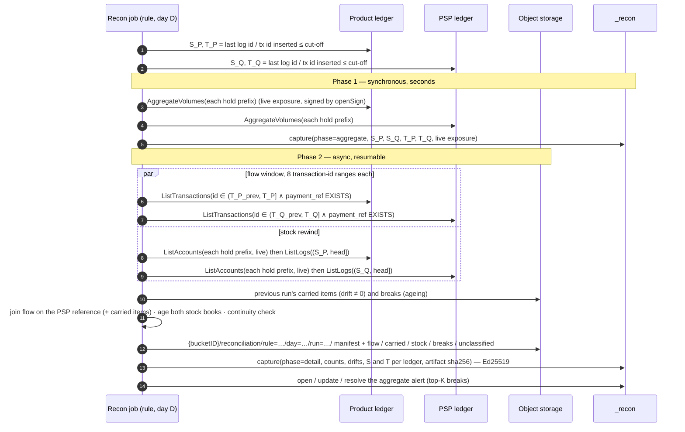

# Transaction-level reconciliation (lettering) — design, measurements, evidence

> ⏳ **Planned — design under evaluation.** Nothing on this page is implemented yet. The decision
> record is [ADR-005](../prd/adr-005-transaction-level-reconciliation.md). This page holds the
> mechanism, the recommended booking, the measurements and the upstream evidence behind it.

---

## 1. What it is, and what it is not

The control reconciles, **per PSP payment reference**, the *PSP ledger* that Connectivity feeds
against the *product ledger* that pilots the business.

- The payment is seen on the PSP ledger first.
- The product ledger later books a transaction carrying that reference, which letters a *business*
  hold: an invoice, an order.
- Both ledgers book as **lettering**. EPHEMERAL holds drain to zero at finality and then purge
  themselves.

A daily run covers **100 to 1,000,000 payments**. The control reads the flow with filtered
`ListTransactions`, and the stock with live listings corrected by the short log window since the
cut-off ([in plain terms](#flow-and-stock-in-plain-terms)). It takes **no query checkpoint**.

| It is | It is not |
|---|---|
| Every finalised PSP payment is applied by the product for the same amount, and every product application points at a real finalised payment, **per PSP payment reference** | Pairing postings with bank-statement lines ("2-/3-way match"), fuzzy matching or match suggestions |
| Exact arithmetic at a deterministic business cut-off | A continuous per-tick monitor. Continuous exposure stays with `balance_equation` / `stale_holds` |
| **One aggregate alert** per run, plus the complete break list kept in object storage | One alert per payment |

## 2. The booking this control relies on

Each arrow is a posting, from source to destination.

```mermaid
flowchart LR
    subgraph Q["PSP ledger (Connectivity) — seen first"]
      QA["fpay:{conn}:account:{acct}"] -->|"payin.pending, X<br/>payment-id=PAY-42"| QH["fpay:{conn}:payment:hold:pending:PAY-42<br/>EPHEMERAL, +X while pending"]
      QH -->|"payin.succeeded, X<br/>payment-id=PAY-42"| QF["fpay:{conn}:account:{acct}:main"]
    end
    subgraph P["Product ledger — later"]
      PH["main:hold:invoice:INV-7<br/>EPHEMERAL, −X = unpaid"] -->|"1 · invoice issued, X<br/>invoice_no=INV-7"| PR["user:revenue:A:pending"]
      PC["main:clearing:{conn}"] -->|"2a · payment applied, X<br/>psp_payment_ref=PAY-42 · invoice_no=INV-7"| PH
      PR -->|"2b · revenue recognised, X<br/>same atomic batch as 2a, no payment ref"| PF["user:revenue:A"]
    end
    QF -. "join on the PSP payment reference (transactions payin.succeeded ↔ 2a)" .- PC
```



The two holds are keyed differently: the PSP ledger by payment, the product ledger by invoice. The
join therefore sits on **transactions**, through the PSP reference. The payment → invoice link lives
only in the product transaction.

On the product ledger, the invoice is booked in three transactions:

1. **Invoice issued.** `main:hold:invoice:INV-7` → `user:revenue:A:pending`, X. The hold opens at
   −X: this product hold opens **negative**, while the PSP hold above opens positive. The sign
   depends on the integration, so the rule declares it for each hold prefix (`holds[].openSign`,
   ADR-005 §6). A refund hold on the same ledger may open with the other sign.
2. **Payment applied, as one atomic batch of two transactions:**
   1. `main:clearing:{conn}` → `main:hold:invoice:INV-7`, X. This is the **application**. It
      carries `psp_payment_ref` and `invoice_no`, brings the hold back to 0, and the hold is purged.
   2. `user:revenue:A:pending` → `user:revenue:A`, X. This is the **revenue recognition**. It does
      not touch the hold and takes no part in reconciliation.

**The amount of an application is its net posting on the accounts under the side's hold
prefixes**, each counted in the direction that settles it (§5). The revenue recognition therefore counts for
nothing, even if it carried the payment reference. It is still best kept without one.

- **Open items are a query.** At any instant, the open book is simply the set of non-zero holds.
  Lettered holds purge, so the open book stays small whatever the history.
- **A lettered item exists only in its transactions.** This was verified on a live ledger at
  `0b4676d97`:
  - a lettered hold is gone from `ListAccounts` and `AggregateVolumes`;
  - *neither* its opening transaction *nor* its lettering transaction is returned by an address
    filter, in any, source or destination role. The opening one was returned while the hold was
    open;
  - `reference == "{id}:done"` still finds the lettering transaction;
  - its `post_commit_volumes` still shows the hold at `100 − 100 = 0`.

  EN-2036 (formancehq/ledger#2058 @ `20a5595d6`, open, not merged) makes a purged hold reachable
  by **exact address** again. Its prefix path then scales with every hold ever created (§7.6). None
  of this changes the design, which never reads the flow by address.
- **The join key must therefore be indexed transaction metadata**, and the address cannot be the
  only carrier.
  - Connectivity's `formancepayments` profile already does this: `payments.formance.com/payment-id`
    and `formance.com/observation.event-type` are indexed (`formancehq/connectivity-plugins-poc`,
    `plugins/formancepayments/profiles/formancepayments.yaml:1143-1147` @ `9df05c5b`).
  - The shipped Stripe plugin does not model holds at all. It books Stripe balance transactions
    with `stripe_txn_id` indexed (`formancehq/connectivity`, `plugins/stripe/internal/adapter/grpc/server.go:227-236` @ `e7ca3e29`).

### Recommended booking design (ADR-005 §8)

This design is tuned for the read paths measured in §7:

- **The flow is read with `ListTransactions`**, filtered server-side on `payment_ref EXISTS`, so it
  costs O(payments in the window).
- `ListLogs` would cost O(every log in the window): it can only filter by ledger, log id and date
  (`misc/proto/common.proto`, `QueryFilter`: no metadata condition is allowed on
  `QUERY_TARGET_LOGS`). It is kept for the short rewind window only.
- Listing by prefix costs O(open accounts).

| | PSP ledger (Connectivity) | Product ledger |
|---|---|---|
| **In-flight hold** (EPHEMERAL) | `psp:{conn}:payment:pending:{payment_ref}` (and `psp:{conn}:refund:pending:{refund_ref}`), a single prefix per kind | `main:hold:invoice:{business_ref}` (and `main:hold:refund:{refund_no}`): **one hold per business object**, not one per state. Here the invoice hold opens negative, against pending revenue. Each prefix is one entry of the rule's `holds`, with its own sign |
| **Final accounts** (NORMAL) | `psp:{conn}:account:{acct}:main`, and **`psp:{conn}:fees`**: with no tolerance, every fee is an explicit posting | **`main:clearing:{conn}`**: the application transaction credits the invoice hold from the clearing account, so the clearing balance is the product's view of cash at the PSP (an aggregate control total). Revenue recognition, if any, is a separate transaction in the same atomic batch that does not touch the hold |
| **One transaction =** | one event of one payment: pending, succeeded, failed… A refund or a chargeback is **its own payment reference**, not an event of the original payment (decision 7) | one application of one payment to one business object. A payment split across two invoices is two transactions with the same `payment_ref` |
| **Transaction metadata** (declared, typed) | `payment_ref`, **`merchant_ref`** (the business id the merchant passed when it created the payment: Stripe `metadata`, Adyen `merchantReference`…), `state` (the rule maps its values to pending, final and failed), `kind` (payment, refund, chargeback) | `payment_ref` on applications only, not on the revenue recognition; `business_ref` on **every** transaction touching a business hold, including its opening; `kind` |
| **`reference`** | `{payment_ref}:{state}`: idempotent on re-delivery | `{payment_ref}:{business_ref}` |
| **`timestamp`** | the PSP event time | the business event time |
| **Postings** | exact amounts, with fees split out | application **strict on the amount** (`send [$asset $amount]`, never `*`): an over-application takes the hold past zero, to the sign opposite its opening (`negative_hold`), and a partial payment leaves an honest residual |
| **Indexes** | **`payment_ref` (mandatory: it drives the flow read)**; **`inserted_at` and log date (mandatory: they resolve the cut)**; `merchant_ref` (investigation) | **`payment_ref` and `business_ref` (mandatory: together they drive the flow read)**; **`inserted_at` and log date (mandatory)** |
| **Mutability** | key and state metadata are **write-once**. A correction is a new transaction, never a `SavedMetadata` on an existing one. Recon flags any violation it sees in the rewind window (`key_metadata_mutated`). **Labels** (ask L8) would make this structural | same |

**Why `merchant_ref` matters.** Without it, a payment the PSP finalised that the product never
applied is known only by its `payment_ref`: the controller learns "money arrived, 1,000 €, PAY-42"
but not for what. With it, the engine joins the `unapplied_payment` with the **open invoice** it was
meant for, and the break reads as an action item: "INV-7 is paid at the PSP (PAY-42, 3 days ago),
apply it". This is the most useful single field in the design.

**Unrelated traffic costs (almost) nothing.** The filtered transaction read returns only the
payments. On 1M transactions of which 10 % were payments, it took 0.8 s against 15 s for the
unfiltered log window (§7.2). The short rewind window is the only read that sees every log, so a
dedicated receivables ledger is not needed for performance. Metadata-only writes on holds are still
best avoided: each one is a log in the rewind window.

**Refunds and chargebacks** are their own pair: a refund hold, a refund reference, and a payment
with its own `payment_ref` on the PSP side (ADR-005 decision 7).

### Mapping a connector for reconciliation

The PSP ledger is fed by a Connectivity connector, and the mapping from PSP events to ledger
transactions is configured **per customer, when they implement it**. Nothing here requires a change
to a connector. It is the checklist an implementer follows so that the connector's output can be
reconciled with a `lettering_match` rule. The rule adapts to field names: it names the key field
and the state field per side, so `payment_id` and `event_type` work as well as `payment_ref` and
`state`.

| # | The connector mapping must… | Why |
|---|---|---|
| 1 | carry the **PSP payment reference** as declared transaction metadata, **with an index**, on every transaction of a payment | The flow is read by filtering on its presence. The rule rejects a key without an index (EN-2316). The hold address is never used as the key (§7.6) |
| 2 | book **one transaction per event of one payment reference**. A batched payout that settles many payments is split into one transaction per payment | The control cannot split a multi-reference transaction: it reads the key from the transaction, not from the postings' addresses |
| 3 | carry the **state** of the event (pending, succeeded, failed…) as transaction metadata | The rule maps its values to `pending`, `final` and `failed` per deployment |
| 4 | carry **`merchant_ref`**, the business id the merchant passed when creating the payment (Stripe `metadata`, Adyen `merchantReference`…) | It turns an `unapplied_payment` into "invoice X is paid: apply it" |
| 5 | keep key and state metadata **write-once**. A correction is a new transaction, never a `SavedMetadata` on an existing one | A filtered re-read of a past day must not change. Recon flags violations in the rewind window (`key_metadata_mutated`) |
| 6 | book **refunds and chargebacks as their own payment references**, not as a reversal of the original payment | Each is its own 1-to-1 pair (ADR-005 decision 7) |
| 7 | book **fees and FX as explicit postings** to their own accounts | The comparison is exact, with no tolerance |
| 8 | use **EPHEMERAL holds, one per payment, under one prefix per kind**, and note the sign each kind opens with | The open book is then a prefix listing, and lettered holds leave it. The rule declares each prefix with its sign (`holds[].openSign`) |
| 9 | set `reference = {payment_ref}:{state}` | Re-delivery of an event is idempotent |
| 10 | have the **`inserted_at` and log-date indexes** created on the ledger | Each resolves the cut-off in one read. The rule is rejected without them (EN-2316) |

**Where two existing mappings stand**, as a starting point:

- `formancepayments`, in [`formancehq/connectivity-plugins-poc`](https://github.com/formancehq/connectivity-plugins-poc)
  (`plugins/formancepayments/profiles/formancepayments.yaml` @ `9df05c5b`):
  - **covered:** row 1, with `payments.formance.com/payment-id` on every payment transaction and
    indexed (`:1143-1147`); row 3, with `formance.com/observation.event-type` indexed and
    `payments.formance.com/payment-status`; row 8, with an EPHEMERAL
    `fpay:{conn}:payment:hold:pending:{payment_id}` hold (`:64-73`); row 9 in intent, since
    `reference = {conn}:padj:{adjustment_id}` is idempotent per event;
  - **to configure:** row 4, as there is no merchant reference on transactions
    (`payments.formance.com/reference` is account metadata); row 6, as refunds are mapped
    (`PAYIN_REFUNDED` and five siblings, `:430-704`) but as deltas **on the original payment id**,
    not as their own payment reference; row 7, as a `fees` account is declared (`:82`) but no mapping
    posts to it; row 10, as the profile indexes `timestamp` but neither `inserted_at` nor the log
    date.
- The Stripe plugin, in [`formancehq/connectivity`](https://github.com/formancehq/connectivity) (`plugins/stripe` @ `e7ca3e29`), does not model holds. It books balance transactions keyed by
  `stripe_txn_id`, so rows 1–3 and 8 need a lettering mapping first.

The product side is the customer's own Numscript. Its conventions are in the booking table above,
and the booking guide ([EN-2335](https://formance-team.atlassian.net/browse/EN-2335)) will turn both
sides into a customer-facing document.

## 3. Workflow



- **The cut** turns the business cut-off into one log id `S` and one transaction id `T` per ledger
  ([below](#the-cut-from-a-business-time-to-id-ranges)).
- **The flow leg** reads the day's transactions as the id range `(T_prev, T]`, filtered server-side
  on the key's presence (ADR-005 §5). The logs remain the immutable, permanent path for re-deriving
  a past day exactly ("Log and audit history is permanent", ledger backup README), because
  transaction metadata is mutable.
- **The stock leg** is a live listing *rewound* to `S` (§4).
- **Continuity.** Per side, per hold prefix and per asset:
  `open(S) = open(S_prev) + opened(W) − lettered(W)`. A lost window event breaks the identity, which
  makes the read's completeness checkable.

### Flow and stock in plain terms

Take a day cut at midnight, and a run that starts at 02:00.

**The flow is what happened during the day.** It is the day's transactions that carry a PSP payment
reference: `payin.succeeded PAY-42, 1000` on the PSP ledger, the application `PAY-42 → INV-7, 1000`
on the product ledger. It answers one question: was every payment the PSP finalised today applied by
the product, for the same amount? It is read with `ListTransactions` over the day's id range
`(T_prev, T]` ([the cut](#the-cut-from-a-business-time-to-id-ranges)), filtered on the key's
presence so that only payments come back. The day is over, so this read gives the same answer at
02:00 or at 10:00.

**The stock is what is still open at midnight.** It is the holds that have not been lettered: unpaid
invoices on the product ledger, pending payments on the PSP ledger. It answers another question: what
is outstanding, and for how long? Lettered holds purge, so listing the accounts under the hold
prefixes gives the open book, and it stays small whatever the history.

**The listing is taken at 02:00, not at midnight.** The ledger kept writing in between:

```text
midnight (cut-off, log S)                          02:00 (run)
   |--------------- short log window ---------------|
   |  01:00  PAY-50 letters INV-9   → hold purged    |
   |  01:30  INV-12 is issued       → hold opened    |
```

So the 02:00 listing is wrong in two ways. **INV-9 is missing**: it was open at midnight, then
lettered and purged at 01:00. **INV-12 is extra**: it was opened after the cut-off. There is no cheap
way to ask the ledger for "the balances at midnight" without a query checkpoint, and the control
takes none ([ADR-005 §3](../prd/adr-005-transaction-level-reconciliation.md#3-why-not-query-checkpoints-measured)).

**The correction reads the logs from midnight to now**, the *short log window since the cut-off*:
`(S, head]`. It holds two hours of writes, not a day and not the history, which is why it is short.
For each hold touched in it, the rewind recovers the hold's balance just before that first touch,
and that is its balance at midnight (§4). Holds nobody touched since midnight had the same balance at
midnight as at 02:00, so the listing is already right for them.

In short: the flow is the day's keyed transactions, read by id range, and settled once the day is
over. The stock is the open holds listed at run time, set back to midnight with the few hours of logs
written since.

### The cut: from a business time to id ranges

The daily run has to answer "what happened on each ledger during day D", with bounds that give the
same answer if the run is replayed next week. The cut provides them: it converts the business
cut-off (say 24 September, 23:59:59 Europe/Paris) into **numbers the ledger already orders by**.

**What the ledger provides.**

- Every transaction gets an id from the ledger, per ledger, contiguous from 1, never reused, and
  increasing in insertion order. A transaction inserted later always has a larger id. (An
  unfiltered `(0, 1M]` returned exactly 1M rows.) Logs are numbered the same way.
- Every transaction carries two dates. **`timestamp`** is set by the writer and can be backdated.
  The **insertion date** (`inserted_at` for a transaction, the log date for a log) is set by the
  ledger's HLC when it writes. It cannot be backdated and it follows id order
  (`docs/technical/architecture/subsystems/consensus/hybrid-logical-clock.md` in the ledger).

**The cut.** `T` is the id of the last transaction inserted at or before the cut-off, and `S` the id
of the last log written at or before it. The previous day's `T_prev` and `S_prev` are already in
yesterday's capture.

```text
                    cut-off D−1                          cut-off D
                    23:59:59 on the 23rd                 23:59:59 on the 24th
                          │                                    │
  … tx 1 203 999  tx 1 204 000 │ tx 1 204 001  …  tx 1 318 500 │ tx 1 318 501 …
                          │                                    │
                   T_prev = 1 204 000                   T = 1 318 500

  Day D on this ledger = transaction ids (1 204 000, 1 318 500]
```

- **Resolving it** costs one read per ledger and per day: ask for the first transaction with
  `inserted_at > cut-off`, page size 1. It is id 1 318 501, so `T = 1 318 500`. `S` works the same
  way on the log-date index. **Both indexes are mandatory**: the rule is rejected without them, and
  a run waits while they build, as for the key's index. `formancepayments` creates neither today,
  so a Connectivity-fed ledger needs them added at implementation (checklist row 10).
- **Bisection was considered and dropped.** Because ids are contiguous and the insertion date grows
  with them, the cut could be found without the indexes by halving the id range from
  `(T_prev, head]`, reading one row's insertion date per step: about 18 reads for a day of 200k
  transactions, 30 for a billion. It is no faster than the index, it was never benched, and it would
  be a second, rarely exercised code path. The rule requires an index on its key anyway, so two more
  indexes do not change what onboarding asks for (ADR-005 §5).
- **Why the insertion date and not `timestamp`.** A transaction inserted today always gets an id
  above yesterday's `T`, so it lands in today's window even if its `timestamp` says yesterday. A past
  day is therefore **frozen**: nothing can be added to it after its cut. A cut on `timestamp` would
  let a backdated write silently change a day that was already reconciled.

**Why this makes the metadata-filtered read cheap.** The flow read is one query per range:

```text
ListTransactions  And( id ∈ (1 204 000, 1 318 500] ,  metadata[payment_ref] EXISTS )
```

The metadata existence index (`eidx`) holds **only** the transactions that carry the key, **ordered
by transaction id** ("Entities are stored in entity ID order", `internal/query/compile.go:943-945`
at ledger `f390ea683`). The ledger's `AndIterator` intersects its sorted inputs by seeking
(`internal/storage/readstore/combinator_and.go:86-153`). So the engine jumps straight to the first
key-bearing transaction above `T_prev`, reads in order, and stops after `T`. It never touches the
history before the day, nor the day's transactions that carry no payment.

The same question asked of the three orderings the ledger offers:

| Read | How the data is ordered | What the day costs | Measured |
|---|---|---|---|
| **Metadata index + id range** | by transaction id, key-bearing rows only | O(payments in the window) | 2k-tx window: 36 ms at a 100k-payment history, **48 ms at 1M**. 100k payments among 1M transactions: **0.8 s** |
| `ListLogs` over the window | by log id, every log; no metadata filter allowed | O(all traffic in the window) | 15 s for the same 1M-transaction window |
| Address prefix on the holds | by account, then transaction id | O(every hold ever created), on every page | 2k-tx window: 4.75 s at 100k, **47.8 s at 1M** (§7.6) |

**`S` serves the stock.** Open holds are listed live, then rewound by replaying the logs
`(S, head]` (§4). Logs are needed there, not transactions, because they carry every event,
including the metadata changes that the rewind window monitors (`key_metadata_mutated`).

**What the id ranges give for free.**

- **Parallelism.** `(T_prev, T]` splits into K sub-ranges, read concurrently and merged in id order.
  The rewind window `(S, head]` is split the same way. K is an **operator setting**, not a rule
  parameter: `--lettering-read-ranges` (default 8), capped process-wide by
  `--lettering-max-concurrent-reads` (default 16), so that several rules running at once do not
  multiply the readers on one ledger. Beyond 8 the read gains little and the ledger's writes pay
  more (§7.7).
- **Completeness.** Ids are contiguous, so an unfiltered range `(lo, hi]` must return exactly
  `hi − lo` rows. A short count makes the run `INCOMPLETE` instead of silently shrinking the window.
- **Replay.** `S`, `T` and the log hash at `S` are written in the signed capture, so a later
  re-read covers the same window. Both ledgers are cut at the same business time, whenever the job
  runs.
- **No checkpoint.** Everything at or below `T` is immutable, except transaction metadata. Hence the
  write-once convention, and later immutable labels
  ([EN-2326](https://formance-team.atlassian.net/browse/EN-2326)).

### Reads and indexes

Every read is gRPC on `BucketService`, through recon's vendored client (`internal/ledgerpb`).

| Read | RPC | Index needed |
|---|---|---|
| Head of a ledger's log | `GetLedgerStats` → `log_count` (per-ledger log ids are contiguous from 1) | none |
| Resolve `S` from the cut-off | `ListLogs`, filter `log_builtin_uint(DATE) > cut-off`, page 1 → `S = id − 1` | **log-date index** (`LOG_BUILTIN_INDEX_DATE`, Pebble `lldt`): **mandatory**. Connectivity's `formancepayments` profile does not create it today, so the implementer adds it (checklist row 10) |
| Resolve `T` (transaction-id cut) | `ListTransactions`, filter `builtin_uint(INSERTED_AT) > cut-off`, page 1 → `T = id − 1`. Per-ledger transaction ids are contiguous (an unfiltered `(0, 1M]` returned exactly 1M rows) | `inserted_at` index (`TX_BUILTIN_INDEX_INSERTED_AT`): **mandatory**, same remark |
| **Flow window** | `ListTransactions`, filter `And(builtin_uint(ID) ∈ (lo, hi], membership)`, page 1000. Membership is `metadata[<psp.key>] EXISTS` on the PSP ledger, and `Or(<product.key> EXISTS, <product.businessId> EXISTS)` on the product ledger, so that hold openings are returned for continuity. The field names come from the rule, for example `payments.formance.com/payment-id` with `formancepayments` | **metadata indexes on `payment_ref` (and `business_ref` on the product side): mandatory.** While it builds, reads return a retryable `Unavailable` ("index is still building") |
| Rewind window `(S, head]`, and exact re-derivation of a past day | `ListLogs`, filter `log_id ∈ (lo, hi]`, page 1000, cursor in the `x-next-cursor` trailer | **none** |
| Open holds | `ListAccounts`, filter `address` prefix, one listing per entry of the side's `holds`, page 1000 | **none**. An address-prefix listing iterates the main store, not the read index |
| Investigation: "every transaction of payment PAY-42", "which payments settled invoice INV-7" | `ListTransactions`, filter on metadata or `reference` | **indexed metadata** for the PSP reference and the business id, plus the `reference` index. This is not needed by the batch. Until EN-2036 merges, it is the only lookup left once a hold is purged, since address filters miss it (§2). After that, an exact address reaches it too |

Each `ListLogs` call is a server stream of at most 1,000 `Log`. The transaction sits at
`payload.apply.log.data.created_transaction.transaction`, or
`…reverted_transaction.revert_transaction`, and carries its postings, its metadata and its
`post_commit_volumes`.

Each `ListTransactions` call is a server stream of at most 1,000 `Transaction`, and each carries
its postings, its metadata and its `post_commit_volumes`.

**Parallel reads.** A window `(lo, hi]` splits into K disjoint id ranges, of transaction ids for the
flow and of log ids for the rewind. K concurrent streams each page their own range.

- This needs **no snapshot**. A log at or below the head is immutable. A transaction at or below the
  cut is immutable too, except for its metadata and revert flags, hence the write-once convention.
  Ranges read at different instants therefore return what one frozen read would have returned. An
  account listing does not have this property: its pages see moving balances.
- **Merging the ranges.** For the flow, each range keeps its per-reference facts, and the facts are
  combined in transaction-id order. For the rewind, each account keeps its *first* touch after `S`, taken
  from the lowest range that touched it.
- Measured on one node (§7.2):
  - logs: 7.3k/s to 13.8k/s on one stream, 41k/s to 66k/s over 8 streams;
  - transactions: 94.5k/s on one stream, 351k/s over 8.

  Scaling is sub-linear: the service sets the limit, not the client.
- **Completeness is checkable for free on unfiltered ranges.** Log and transaction ids are both
  contiguous per ledger, so an unfiltered range `(lo, hi]` must return exactly `hi − lo` rows. The
  filtered flow read has gaps by design; there, completeness rests on the index and on the
  continuity identity. A short count means a replica that lags or a read that failed,
  and it fails the run instead of silently shrinking the window.
- That check also makes it possible to read from followers (`x-consistency: stale`) to take load off
  the leader: a follower that has not yet applied up to `hi` returns fewer logs, and the range is
  retried.

## 4. The rewind: an exact state at `S` with no checkpoint

After a live, possibly torn, listing of the scope has finished, read the logs `(S, head]`. For each
scope account touched there, **discard the listed value**. Replace it with the account's balance
*just before its first touch after `S`*:

```text
pre = post_commit_volumes[account] − Σ(this transaction's postings on account)
```

- Touched accounts that are missing from the listing are added back when `pre ≠ 0`.
- Accounts created after `S` have `pre = 0` and drop out.
- An account untouched in `(S, head]` held one value for the whole listing, so the listed value is
  its value at `S`.

The method needs no baseline and no stored state, and it applies to NORMAL accounts as well as to
EPHEMERAL holds. Only created and reverted transactions move balances, and both carry
`post_commit_volumes` (`misc/proto/common.proto:133-136`, `823-831`).

**Worked example**, the day of [Flow and stock in plain terms](#flow-and-stock-in-plain-terms)
(invoice holds open negative):

| Hold | First touch after `S` | `post_commit_volumes` | Its own posting on the hold | `pre`, the balance at `S` | Effect |
|---|---|---|---|---|---|
| INV-9 | 01:00, payment applied | 0 | +500 | **−500** | missing from the listing (purged): added back |
| INV-12 | 01:30, invoice issued | −300 | −300 | **0** | created after `S`: drops out |
| INV-3 | none | — | — | listed value | untouched: the listing is right |

**Why the logs, and not a filtered `ListTransactions`**, for this window:

- The window is short, so reading every log costs little: 8,208 logs in 267 ms in the proof run.
- It is **complete**: log ids are contiguous, so the count `hi − lo` proves no log was missed.
- It depends on **no metadata convention**: a transaction that touched a hold without carrying the
  key is still corrected.

**Proof run** (§7.4): against a checkpoint taken at `S`, under concurrent writes, the rewound listing
matched on every one of 1,002,408 rows. The raw live listing differed on 2,233.

### Replaying an old day

Any past day can be replayed: the logs are permanent, and the day's cut (`S`, `T`, log hash) is in
the signed capture (ADR-005 §7, item 7).

**The flow costs the same at any age.** The cut of an old day resolves in one index page per
ledger, and the day is its id range `(T_prev, T]`, read filtered on the key:
O(payments of that day), a day or a year later. It matches the original run as long as key and
state metadata stayed write-once. The exact variant reads that day's logs `(S_prev, S]`, which is
slower but still one day's worth.

**The rewind from head grows with the day's age.** It reads every log since `S`, and it keeps the
first touch of every hold touched since. With 1M logs written a day, at the measured 15.1 s per 1M
logs over 8 ranges (§7.2):

| Replay | Logs in `(S, head]` | Read time |
|---|---|---|
| The next day (the normal run) | ~1M | ~15 s |
| A week later | ~7M | ~2 min |
| A month later | ~30M | ~8 min |
| A year later | ~365M | **~1 h 30**, with close to a year of holds to track |

**So a replay starts from the nearest stored stock, not from head.** Each run stores its stock at its
cut (`stock.ndjson.gz`), and the stock is additive over time:

```text
stock(S_D) = stock(S_A) + hold movements in (S_A, S_D]
```

- **Forward** from an earlier stock `A`: read the logs `(S_A, S_D]`. Each touched hold takes its
  balance after its last touch at or before `S_D` (`post_commit_volumes`), and a hold at zero drops
  out. Untouched holds keep their stored balance.
- **Backward** from a later stock `A`: the rewind above, with that stored stock in place of the live
  listing, over `(S_D, S_A]`.
- The stored stock is verified against the SHA-256 in its signed capture before it is used.

| Age of the replayed day | Starting point | Cost |
|---|---|---|
| Within the 90-day retention | the previous day's stored stock | one day of logs, whatever the age |
| Beyond it | the nearest monthly anchor (`anchorRetention`) | at most about half a month of logs |
| No stored stock at all (anchors expired, rule created later) | the live listing, rewound from head | O(logs since the day), as in the table above |

A monthly anchor holds only the open book, which lettering keeps small, so keeping one per month
for a year costs a few files per rule. The flow and break files can still expire at 90 days: they
are recomputed at a fixed cost.

## 5. Matching semantics

**States are declared by the rule, per side** (ADR-005 §6). Each side names its key field, its
state field and the value sets meaning `pending`, `final` and `failed`, and the product side names
its business-id field. How PSP states are modelled is a per-deployment choice, so recon hard-codes no
vocabulary.

| Leg | Class | Meaning |
|---|---|---|
| Flow | `matched` | PSP `final`, and product applications summing to the same amount. An application's amount is its net posting on the accounts under the side's hold prefixes, each in its settling direction |
| Flow | `under_applied` / `over_applied` | Product applications for the reference sum to less or more than the PSP amount. A payment split across invoices is summed first. **No tolerance**: a fee or FX difference is a break |
| Flow | `unapplied_payment` | PSP `final`, no product application yet. **Pending while within `grace`** (proposed default 3 days), then a break. Carried from day to day in `carried.ndjson.gz`, like every reference whose drift is not 0 |
| Flow | `in_progress` | PSP `pending` only, no application: not a break. Its hold is in the PSP stock |
| Flow | `orphan_application` | A product application points at a reference the PSP never finalised: **critical** |
| Flow | `reversed_after_application` | The PSP reports `failed` on a reference after the product applied it: **critical** |
| Stock (each side) | `open` + age bucket | Pending payment (PSP side) or unpaid business object (product side). Proposed buckets: 0–1, 2–7, 8–30, > 30 days |
| Stock (each side) | `negative_hold` | The hold's balance has the sign opposite its prefix's `openSign`: a positive invoice hold, for example. An over-application or a skipped state ("investigate id") |
| Stock (each side) | `stuck` | Open past the side's `maxAge`, the `stale_holds` signal per key |
| Stock (each side) | `cleared` | Open at the previous run's `S` and lettered since: listed once, with a balance of 0. Not a break |

- **Refunds and chargebacks are ordinary 1-to-1 pairs.** On the PSP ledger they are a payment with
  its own reference; on the product ledger, a refund hold lettered by a transaction carrying that
  reference. They go through the same classes and are never a reversal of the original payment.
- **A transaction whose state is in no set is never dropped silently.** It takes no part in matching,
  but it is counted per side, per state value and per asset as `unclassified`, with a warning, and
  listed in `unclassified.ndjson.gz`. This catches a connector mapping that doesn't follow the
  conventions. For example, `formancepayments` books refunds on the original payment id as
  `payin.refunded` (checklist row 6).
- The two stock books are **aged, not joined**: an unpaid invoice has no PSP counterpart by design.
- Ageing comes from the previous day's artifact: `new` / `persisting` / `cleared` for holds, and
  `new` / `persisting` / `resolved` for breaks, matched by their `breakId`.
- Arithmetic is exact in minor units, colors are collapsed per asset, and `asset: "*"` fans out per
  asset as in ADR-004.

### What the controller sees: a reconciliation statement, never a bare drift

A net drift of 0 proves nothing. Two breaks of +1,000 € and −1,000 € also net to zero. Every run
therefore answers with a **reconciliation statement**: the classic *état de rapprochement*, built
from the two control totals down to the explained items, with an explicit verdict.

**Verdict, in the order it is evaluated:**

| Verdict | Condition | What it tells the controller |
|---|---|---|
| `INCOMPLETE` | A window range returned fewer logs than `hi − lo`, a continuity identity fails, or the bridge below has a non-zero **unexplained residual** | "No conclusion can be drawn": the engine failed, not the books. It opens an engine-error alert, never a green one |
| `BREAKS` | at least one break row | the count and gross amount of breaks, split by class |
| `RECONCILED_WITH_PENDING` | no break, but unapplied payments still within `grace` | "OK for now". The pending items, their amount and the date each one becomes a break |
| `RECONCILED` | none of the above | the only green state |

**The bridge**, per asset, for the window:

```text
  PSP — finalised payments in the window                              A     (count n_A)
− Product — applications in the window                                B     (count n_B)
= Net difference                                                      A − B
  explained by:
    + unapplied payments of the window (pending while within grace)   …     (n)
    − orphan applications (no finalised PSP payment)      CRITICAL    …     (n)
    ± under / over applications                              BREAK    …     (n)
    − applications of payments finalised on an earlier day            …     (n)   carried from D−k
  = unexplained residual                                  must be 0, else INCOMPLETE
Carried from earlier days, outside the window's net:
    unapplied payments still within grace                             …     (n)
    unapplied payments past grace                            BREAK    …     (n)
Gross breaks: Σ|drift| = …    Offsetting: yes/no (net ≈ 0 while gross > 0)
```

Around the bridge, the statement shows:

- **the open books**: PSP pending holds and product open holds, each with its total, count and age
  buckets, and the continuity check;
- **triage in severity order**:
  1. critical first: `orphan_application`, `reversed_after_application`. Money was booked in the
     product with no cash behind it;
  2. then under- and over-applications;
  3. then unapplied payments past grace;
  4. then stuck holds.

  Each class shows its top-K by amount, **new versus persisting** from the previous day, and the
  detail's path and filter (`breaks.ndjson.gz`, `class = …`).
- **when `merchant_ref` exists**, every unapplied payment is paired with the open business hold it
  names;
- **`unclassified` transactions**, per side and state value, with a warning. They do not change the
  verdict, but they say the rule's state sets or the connector mapping need attention.

The alert's evidence is this statement, not a single drift figure. Its headline states the verdict
and the gross amount first, and the net second.

### Result artifacts, retention and the period view

```text
{backup bucket}/{bucketID}/reconciliation/rule={ruleId}/day={YYYY-MM-DD}/run={runId}/
  manifest.json           the run: rule, cuts, execution, counts, statement, books, verdict, files with SHA-256
  flow.ndjson.gz          one row per payment reference and asset: the window's, plus the ones carried in
  carried.ndjson.gz       the join's open items handed to the next run: every reference whose drift is not 0
  stock.ndjson.gz         one row per open hold at S, plus the holds cleared since the previous run
  breaks.ndjson.gz        every break of both legs, open or resolved since the previous run
  unclassified.ndjson.gz  the transactions whose state is in none of the rule's sets
```

The path segments are `key=value`, so DuckDB, Spark or Athena read `rule`, `day` and `run` as
columns over a glob of many days, without a byte more per row. A complete day is in
[Worked example: one day of output](#worked-example-one-day-of-output).

**Who reads the files.** The customer first, analysing them with their own tools (jq, DuckDB,
pandas, a spreadsheet import), then recon's API and UI. The format is deliberately simple, and it
can evolve behind `schemaVersion`:

- gzipped NDJSON, one JSON object per line, with a JSON Schema per file for the manifest's
  `schemaVersion` (`lettering/1`);
- amounts are integers in minor units, written as strings, always next to their asset (`"100000"`
  in `EUR/2` is 1,000.00). Every drift reads `psp − product`;
- every class, severity, lifecycle and verdict value is lower snake_case (`under_applied`,
  `breaks`); only the statement prints the verdict in capitals;
- days are `YYYY-MM-DD` in the rule's timezone. Instants are RFC 3339 in UTC, except the period's
  `cutoff`, which keeps the rule's offset;
- an identifier has the same name in every file: `ref` (the PSP reference), `businessId` (the
  rule's business-id field), `hold` (the address), `holdId` (the address after its prefix; with the
  recommended booking it equals the business id) and `merchantRef`. Finding everything about INV-12
  is a filter on `businessId`, `holdId` or `merchantRef`;
- every row has `asset` and a `severity` (`ok`, `pending`, `break`, `critical`, and `warning` for
  an unclassified transaction). Stock and unclassified rows have a `side`; flow rows carry both
  sides.

| File | Unique key | Order |
|---|---|---|
| `flow` | `ref`, `asset` | `ref`, `asset` |
| `carried` | `ref`, `asset` | `ref`, `asset` |
| `stock` | `side`, `hold`, `asset` | `side`, `hold`, `asset` |
| `breaks` | `breakId` | open before resolved, then `severity` (critical first), then `\|amount\|` descending |
| `unclassified` | `side`, `tx` | `side`, `tx` |

**Flow rows.**

- `class` and `severity`.
- `pspAmount` is the finalised amount, `0` while the reference is not finalised. `productAmount` is
  the sum of its applications. `drift = pspAmount − productAmount`.
- `impact` is the row's share of the window's net difference: its finalised amount if it was
  finalised in the window, minus its applications booked in the window. The statement's bridge is
  `SUM(impact)` grouped by `class` and by `firstSeen < day`, and it adds up to the net.
- `firstSeen` is the day the reference entered the join: its first final PSP state or its first
  product application. An `in_progress` row has none. `breakOn`, on an unapplied payment, is
  `firstSeen` plus `grace`: the day it counts as a break.
- `merchantRef` and `pairedHold`, when the connector gives a merchant reference and it names an
  open hold. The stock row points back with `pairedRef`.
- `psp` and `product` list the reference's transactions: `tx`, `insertedAt`, `amount`, plus
  `state` on the PSP side and `businessId` and `holdId` on the product side. A reference carried
  in keeps the transactions of its earlier days.

**Carried rows** are the flow rows whose `drift` is not 0, copied as they are: unapplied payments,
under- and over-applications, orphan applications. The next run joins them with its own window, and
their transactions are what its carried-in rows show. They are a separate file so that it reads a
small file, not the whole flow.

**Stock rows.** `prefix`, `openSign`, `balance` (signed), `class` (`open`, `negative_hold`,
`stuck`, `cleared`), `lifecycle` against the previous run (`new`, `persisting`, `cleared`),
`openedAt`, `ageDays` and `bucket`. A cleared hold has `balance` 0, its `previousBalance` and its
`clearedAt`. `pairedRef` names the pending payment whose `merchantRef` points at the hold.

**Break rows** are the complete row of their flow or stock file, so a reader never joins files to
show a break, plus:

- `breakId`: a hash of rule, leg, class, key and asset. It stays the same from day to day, and
  recon attaches comments, assignments and acceptances to it;
- `leg` (`flow` or `stock`), `openedOn`, and `resolvedOn` once resolved;
- `lifecycle` (`new`, `persisting`, `resolved`);
- `amount`, signed: the `drift` of a flow row, the `balance` of a stock row.

`class`, `severity`, `lifecycle` and `amount` are the break's. A resolved break keeps the class,
severity and amount it had when it was last open, next to the row as it stands now: INV-5 below is
`stuck` for 700.00, with the cleared hold's balance of 0.

**Location.** The files go to the **ledger's backup object storage**, S3 or Azure, under a prefix
that is a sibling of `backups/`.

- The ledger's orphan prune only deletes unreferenced objects under `{bucketID}/backups/data/` and
  `{bucketID}/backups/exports/` (`internal/infra/backup/manager.go:229-235`, `segment.go:54-61`), so
  `{bucketID}/reconciliation/` is never touched.
- Recon brings its own credentials. `file` is available for development.

**Integrity.** The manifest's SHA-256 is written into the Ed25519-signed capture, so the signature
covers every file transitively.

**Retention.** 90 days by default, configurable per rule.

- The primary mechanism is the storage lifecycle rule on the prefix, with recon's `expiresAt` sweep
  as the fallback.
- An expired day can be recomputed from the permanent logs with the same cut.
- **Monthly stock anchors** outlive the 90 days: the last run of each month keeps its
  `manifest.json` and `stock.ndjson.gz` for `anchorRetention` (proposed 13 months). They keep the
  replay of an old day cheap ([§4](#replaying-an-old-day)).

**Period view.** The rule runs daily by default, with the existing `periodType` (`daily`, `weekly`
or `monthly`, calendar-based in the rule's timezone). The period's alert carries the aggregate
comparison, and the period summary is built from the daily **manifests** rather than from the
ledgers. For each day it gives:

- the counts per class;
- the net and absolute drift;
- the breaks opened and cleared;
- the link to that day's files.

Breaks still open at period end keep the day they first appeared. A break that clears after its
period has closed shows up in the next period.

**What opens the alert:** a non-zero net drift *or* at least one break row. Offsetting breaks net
to zero, so the aggregate alone is never the trigger.

Measured size: **about 15 bytes per break**, gzipped (3,499 breaks = 54 KB).

### Worked example: one day of output

A rule `psp-vs-billing` reconciles the PSP ledger `psp` (Connectivity's `formancepayments`) with the
product ledger `main`, for **24 September 2026**, cut-off 23:59:59 Europe/Paris, grace 3 days,
`maxAge` 30 days. It runs at 02:00. All figures are EUR, one asset `EUR/2`; the files carry minor
units as strings (`"100000"` = 1,000.00), the statement shows major units. Ids and hashes are
illustrative; the figures agree with each other across the files.

**What happened in the window.**

| Ref | PSP side | Product side | Class |
|---|---|---|---|
| PAY-42 | `payin.succeeded` 1,000.00 | applied to INV-7, 1,000.00 | `matched` |
| PAY-43 | `payin.succeeded` 1,000.00 | split: INV-8 600.00 + INV-10 400.00 | `matched` |
| PAY-40 | finalised on 22 Sep, carried in | applied to INV-5 today, 700.00 | `matched`, earlier day |
| PAY-44 | `payin.succeeded` 1,200.00 | applied to INV-11, 1,150.00 (a 50.00 fee never booked) | `under_applied`, break |
| PAY-45 | `payin.succeeded` 800.00 | not applied yet; its `merchant_ref` names INV-12 | `unapplied_payment`, pending until 27 Sep |
| PAY-39 | finalised on 20 Sep, still unapplied | — | `unapplied_payment`, past grace: break |
| PAY-46 | `payin.pending` 250.00 | — | `in_progress`: not a break, its hold is in the stock |
| PAY-99 | `payin.pending` only | applied to INV-13, 300.00 | `orphan_application`, **critical** |
| PAY-31 | `payin.refunded` 200.00, on the original payment id | — | `unclassified` (state in no set) |

Every payment finalised in the window went through `payin.pending` first, so its PSP hold opened
and was lettered on the same day.

**`manifest.json`**

```json
{
  "schemaVersion": "lettering/1",
  "rule": {
    "id": "psp-vs-billing", "version": 7, "sha256": "4c1d…",
    "grace": "3d", "maxAge": "30d", "buckets": ["0-1d", "2-7d", "8-30d", ">30d"],
    "psp":     {"ledger": "psp",  "key": "payments.formance.com/payment-id",
                "holds": [{"prefix": "fpay:stripe:payment:hold:pending:", "openSign": "positive"}]},
    "product": {"ledger": "main", "key": "psp_payment_ref", "businessId": "invoice_no",
                "holds": [{"prefix": "main:hold:invoice:", "openSign": "negative"},
                          {"prefix": "main:hold:refund:",  "openSign": "positive"}]}
  },
  "runId": "r-20260925-0200",
  "previousRun": {"runId": "r-20260924-0200", "manifestSha256": "a3e0…"},
  "period": {"type": "daily", "day": "2026-09-24", "cutoff": "2026-09-24T23:59:59+02:00", "tz": "Europe/Paris"},
  "startedAt": "2026-09-25T00:00:04Z",
  "finishedAt": "2026-09-25T00:00:31Z",
  "timingsMs": {"cut": 420, "flow": 11240, "stock": 6810, "join": 5930, "write": 1080},
  "cuts": [
    {"side": "psp",     "ledger": "psp",  "S_prev": 2411902, "S": 2640118, "T_prev": 1204000, "T": 1318500, "logHash": "sha256:3f9a…"},
    {"side": "product", "ledger": "main", "S_prev": 1530010, "S": 1574300, "T_prev": 880400,  "T": 902750,  "logHash": "sha256:b07c…"}
  ],
  "execution": {"readRanges": 8, "maxConcurrentReads": 16, "stockFrom": "live", "rewindLogs": {"psp": 4210, "main": 1873}},
  "verdict": "breaks",
  "counts": {
    "flow": {"matched": 3, "under_applied": 1, "over_applied": 0, "unapplied_payment": 2,
             "orphan_application": 1, "reversed_after_application": 0, "in_progress": 1},
    "flowSeverity": {"ok": 4, "pending": 1, "break": 2, "critical": 1},
    "stock": {"psp":     {"open": 2, "negative_hold": 0, "stuck": 0, "cleared": 0},
              "product": {"open": 4, "negative_hold": 1, "stuck": 1, "cleared": 1}},
    "breaks": {"new": 2, "persisting": 3, "resolved": 1},
    "carried": 4,
    "unclassified": [{"side": "psp", "state": "payin.refunded", "asset": "EUR/2", "count": 1, "amount": "20000"}],
    "anomalies": {"key_metadata_mutated": 0}
  },
  "statement": {
    "EUR/2": {
      "psp":     {"amount": "400000", "count": 4},
      "product": {"amount": "415000", "count": 6},
      "net": "-15000",
      "lines": [
        {"class": "unapplied_payment",  "earlierDay": false, "amount": "80000",  "count": 1},
        {"class": "orphan_application", "earlierDay": false, "amount": "-30000", "count": 1},
        {"class": "under_applied",      "earlierDay": false, "amount": "5000",   "count": 1},
        {"class": "matched",            "earlierDay": true,  "amount": "-70000", "count": 1}
      ],
      "residual": "0",
      "carriedOutside": [{"class": "unapplied_payment", "severity": "break", "amount": "50000", "count": 1}],
      "flowGross": "85000",
      "offsetting": false
    }
  },
  "books": [
    {"side": "psp",     "prefix": "fpay:stripe:payment:hold:pending:", "asset": "EUR/2", "openSign": "positive",
     "openPrev": "0",       "opened": "455000",  "lettered": "400000",  "open": "55000",   "count": 2,
     "buckets": {"0-1d": 2, "2-7d": 0, "8-30d": 0, ">30d": 0}, "continuityOk": true},
    {"side": "product", "prefix": "main:hold:invoice:",                "asset": "EUR/2", "openSign": "negative",
     "openPrev": "-430000", "opened": "-230000", "lettered": "-415000", "open": "-245000", "count": 5,
     "buckets": {"0-1d": 0, "2-7d": 2, "8-30d": 2, ">30d": 1}, "continuityOk": true},
    {"side": "product", "prefix": "main:hold:refund:",                 "asset": "EUR/2", "openSign": "positive",
     "openPrev": "0",       "opened": "20000",   "lettered": "0",       "open": "20000",   "count": 1,
     "buckets": {"0-1d": 1, "2-7d": 0, "8-30d": 0, ">30d": 0}, "continuityOk": true}
  ],
  "files": [
    {"name": "flow.ndjson.gz",         "rows": 8, "sha256": "e41d…"},
    {"name": "carried.ndjson.gz",      "rows": 4, "sha256": "7a02…"},
    {"name": "stock.ndjson.gz",        "rows": 9, "sha256": "c9b8…"},
    {"name": "breaks.ndjson.gz",       "rows": 6, "sha256": "15fe…"},
    {"name": "unclassified.ndjson.gz", "rows": 1, "sha256": "90b3…"}
  ],
  "anchor": false,
  "expiresAt": "2026-12-23"
}
```

- `rule` is the rule as it was evaluated. A replay uses the same version, and a reader sees the
  thresholds behind each class.
- `previousRun` links the days; its manifest hash chains them.
- `stockFrom` is `live` for a daily run. A replay says `daily`, `anchor` or `head`, with the stored
  stock it started from ([§4](#replaying-an-old-day)). `anchor` is `true` on the month's last run.
- `counts.flow` is keyed by the same class values as the flow file, and adds up to its row count.
- `statement` holds the bridge per asset, so a dashboard or a period summary needs no other file.
  `flowGross` sums the absolute drift of the flow breaks.
- `books` has one entry per side, hold prefix and asset: the open book at `S`, its age buckets and
  the continuity check. `opened` and `lettered` carry the prefix's `openSign`: for invoice holds,
  which open negative, `-430000 + (-230000) − (-415000) = -245000`.

**`flow.ndjson.gz`**, 8 rows:

```text
{"ref":"PAY-39","asset":"EUR/2","class":"unapplied_payment","severity":"break","pspAmount":"50000","productAmount":"0","drift":"50000","impact":"0","firstSeen":"2026-09-20","breakOn":"2026-09-23","psp":[{"tx":1071229,"state":"payin.succeeded","amount":"50000","insertedAt":"2026-09-20T09:14:55Z"}],"product":[]}
{"ref":"PAY-40","asset":"EUR/2","class":"matched","severity":"ok","pspAmount":"70000","productAmount":"70000","drift":"0","impact":"-70000","firstSeen":"2026-09-22","psp":[{"tx":1160874,"state":"payin.succeeded","amount":"70000","insertedAt":"2026-09-22T15:03:12Z"}],"product":[{"tx":884517,"businessId":"INV-5","holdId":"INV-5","amount":"70000","insertedAt":"2026-09-24T06:12:44Z"}]}
{"ref":"PAY-42","asset":"EUR/2","class":"matched","severity":"ok","pspAmount":"100000","productAmount":"100000","drift":"0","impact":"0","firstSeen":"2026-09-24","psp":[{"tx":1249870,"state":"payin.pending","amount":"100000","insertedAt":"2026-09-24T07:58:40Z"},{"tx":1250981,"state":"payin.succeeded","amount":"100000","insertedAt":"2026-09-24T08:01:17Z"}],"product":[{"tx":891204,"businessId":"INV-7","holdId":"INV-7","amount":"100000","insertedAt":"2026-09-24T08:05:10Z"}]}
{"ref":"PAY-43","asset":"EUR/2","class":"matched","severity":"ok","pspAmount":"100000","productAmount":"100000","drift":"0","impact":"0","firstSeen":"2026-09-24","psp":[{"tx":1261022,"state":"payin.pending","amount":"100000","insertedAt":"2026-09-24T09:20:05Z"},{"tx":1262410,"state":"payin.succeeded","amount":"100000","insertedAt":"2026-09-24T09:22:48Z"}],"product":[{"tx":893118,"businessId":"INV-8","holdId":"INV-8","amount":"60000","insertedAt":"2026-09-24T09:25:31Z"},{"tx":893119,"businessId":"INV-10","holdId":"INV-10","amount":"40000","insertedAt":"2026-09-24T09:25:31Z"}]}
{"ref":"PAY-44","asset":"EUR/2","class":"under_applied","severity":"break","pspAmount":"120000","productAmount":"115000","drift":"5000","impact":"5000","firstSeen":"2026-09-24","psp":[{"tx":1287004,"state":"payin.pending","amount":"120000","insertedAt":"2026-09-24T11:47:31Z"},{"tx":1288115,"state":"payin.succeeded","amount":"120000","insertedAt":"2026-09-24T11:50:02Z"}],"product":[{"tx":895660,"businessId":"INV-11","holdId":"INV-11","amount":"115000","insertedAt":"2026-09-24T11:55:48Z"}]}
{"ref":"PAY-45","asset":"EUR/2","class":"unapplied_payment","severity":"pending","pspAmount":"80000","productAmount":"0","drift":"80000","impact":"80000","firstSeen":"2026-09-24","breakOn":"2026-09-27","merchantRef":"INV-12","pairedHold":"main:hold:invoice:INV-12","psp":[{"tx":1300312,"state":"payin.pending","amount":"80000","insertedAt":"2026-09-24T13:10:26Z"},{"tx":1301876,"state":"payin.succeeded","amount":"80000","insertedAt":"2026-09-24T13:12:59Z"}],"product":[]}
{"ref":"PAY-46","asset":"EUR/2","class":"in_progress","severity":"ok","pspAmount":"0","productAmount":"0","drift":"0","impact":"0","psp":[{"tx":1312455,"state":"payin.pending","amount":"25000","insertedAt":"2026-09-24T20:41:09Z"}],"product":[]}
{"ref":"PAY-99","asset":"EUR/2","class":"orphan_application","severity":"critical","pspAmount":"0","productAmount":"30000","drift":"-30000","impact":"-30000","firstSeen":"2026-09-24","psp":[{"tx":1309640,"state":"payin.pending","amount":"30000","insertedAt":"2026-09-24T19:55:37Z"}],"product":[{"tx":899031,"businessId":"INV-13","holdId":"INV-13","amount":"30000","insertedAt":"2026-09-24T17:02:20Z"}]}
```

An application's `amount` is its net posting on the hold prefixes in the settling direction (§5),
so INV-7's application counts 1,000.00 even though the same batch recognised revenue. PAY-39 is
carried in: its `impact` is 0, because it was finalised on an earlier day and nothing was applied
today.

**`carried.ndjson.gz`**, handed to 25 September, the 4 flow rows whose drift is not 0:

```text
{"ref":"PAY-39","asset":"EUR/2","class":"unapplied_payment","severity":"break","pspAmount":"50000","productAmount":"0","drift":"50000","impact":"0","firstSeen":"2026-09-20","breakOn":"2026-09-23","psp":[{"tx":1071229,"state":"payin.succeeded","amount":"50000","insertedAt":"2026-09-20T09:14:55Z"}],"product":[]}
{"ref":"PAY-44","asset":"EUR/2","class":"under_applied","severity":"break","pspAmount":"120000","productAmount":"115000","drift":"5000","impact":"5000","firstSeen":"2026-09-24","psp":[{"tx":1287004,"state":"payin.pending","amount":"120000","insertedAt":"2026-09-24T11:47:31Z"},{"tx":1288115,"state":"payin.succeeded","amount":"120000","insertedAt":"2026-09-24T11:50:02Z"}],"product":[{"tx":895660,"businessId":"INV-11","holdId":"INV-11","amount":"115000","insertedAt":"2026-09-24T11:55:48Z"}]}
{"ref":"PAY-45","asset":"EUR/2","class":"unapplied_payment","severity":"pending","pspAmount":"80000","productAmount":"0","drift":"80000","impact":"80000","firstSeen":"2026-09-24","breakOn":"2026-09-27","merchantRef":"INV-12","pairedHold":"main:hold:invoice:INV-12","psp":[{"tx":1300312,"state":"payin.pending","amount":"80000","insertedAt":"2026-09-24T13:10:26Z"},{"tx":1301876,"state":"payin.succeeded","amount":"80000","insertedAt":"2026-09-24T13:12:59Z"}],"product":[]}
{"ref":"PAY-99","asset":"EUR/2","class":"orphan_application","severity":"critical","pspAmount":"0","productAmount":"30000","drift":"-30000","impact":"-30000","firstSeen":"2026-09-24","psp":[{"tx":1309640,"state":"payin.pending","amount":"30000","insertedAt":"2026-09-24T19:55:37Z"}],"product":[{"tx":899031,"businessId":"INV-13","holdId":"INV-13","amount":"30000","insertedAt":"2026-09-24T17:02:20Z"}]}
```

If PAY-44's missing 50.00 is booked tomorrow with the reference, tomorrow's run finds PAY-44 here
and classes it `matched`. Without the carried row, it would see an application with no payment.

**`stock.ndjson.gz`**, 8 open holds at `S` and 1 cleared, 9 rows:

```text
{"side":"product","hold":"main:hold:invoice:INV-11","asset":"EUR/2","prefix":"main:hold:invoice:","holdId":"INV-11","openSign":"negative","balance":"-5000","class":"open","severity":"ok","lifecycle":"persisting","openedAt":"2026-09-04T08:30:00Z","ageDays":20,"bucket":"8-30d"}
{"side":"product","hold":"main:hold:invoice:INV-12","asset":"EUR/2","prefix":"main:hold:invoice:","holdId":"INV-12","openSign":"negative","balance":"-80000","class":"open","severity":"ok","lifecycle":"persisting","openedAt":"2026-09-19T12:05:00Z","ageDays":5,"bucket":"2-7d","pairedRef":"PAY-45"}
{"side":"product","hold":"main:hold:invoice:INV-14","asset":"EUR/2","prefix":"main:hold:invoice:","holdId":"INV-14","openSign":"negative","balance":"10000","class":"negative_hold","severity":"break","lifecycle":"persisting","openedAt":"2026-09-18T16:20:00Z","ageDays":6,"bucket":"2-7d"}
{"side":"product","hold":"main:hold:invoice:INV-3","asset":"EUR/2","prefix":"main:hold:invoice:","holdId":"INV-3","openSign":"negative","balance":"-120000","class":"stuck","severity":"break","lifecycle":"persisting","openedAt":"2026-08-14T10:02:00Z","ageDays":41,"bucket":">30d"}
{"side":"product","hold":"main:hold:invoice:INV-5","asset":"EUR/2","prefix":"main:hold:invoice:","holdId":"INV-5","openSign":"negative","balance":"0","class":"cleared","severity":"ok","lifecycle":"cleared","openedAt":"2026-08-21T09:40:00Z","ageDays":34,"bucket":">30d","previousBalance":"-70000","clearedAt":"2026-09-24T06:12:44Z"}
{"side":"product","hold":"main:hold:invoice:INV-9","asset":"EUR/2","prefix":"main:hold:invoice:","holdId":"INV-9","openSign":"negative","balance":"-50000","class":"open","severity":"ok","lifecycle":"persisting","openedAt":"2026-09-12T07:45:00Z","ageDays":12,"bucket":"8-30d"}
{"side":"product","hold":"main:hold:refund:RF-2","asset":"EUR/2","prefix":"main:hold:refund:","holdId":"RF-2","openSign":"positive","balance":"20000","class":"open","severity":"ok","lifecycle":"new","openedAt":"2026-09-24T14:30:00Z","ageDays":0,"bucket":"0-1d"}
{"side":"psp","hold":"fpay:stripe:payment:hold:pending:PAY-46","asset":"EUR/2","prefix":"fpay:stripe:payment:hold:pending:","holdId":"PAY-46","openSign":"positive","balance":"25000","class":"open","severity":"ok","lifecycle":"new","openedAt":"2026-09-24T20:41:09Z","ageDays":0,"bucket":"0-1d"}
{"side":"psp","hold":"fpay:stripe:payment:hold:pending:PAY-99","asset":"EUR/2","prefix":"fpay:stripe:payment:hold:pending:","holdId":"PAY-99","openSign":"positive","balance":"30000","class":"open","severity":"ok","lifecycle":"new","openedAt":"2026-09-24T19:55:37Z","ageDays":0,"bucket":"0-1d"}
```

INV-14 is positive while invoice holds open negative, hence `negative_hold`. INV-5, open yesterday
at −700.00, was lettered by PAY-40 today: it stays in the file as `cleared`.

**`breaks.ndjson.gz`**, 5 open and 1 resolved, 6 rows:

```text
{"breakId":"5e0b9c2d71a4f836","leg":"flow","lifecycle":"new","openedOn":"2026-09-24","amount":"-30000","ref":"PAY-99","asset":"EUR/2","class":"orphan_application","severity":"critical","pspAmount":"0","productAmount":"30000","drift":"-30000","impact":"-30000","firstSeen":"2026-09-24","psp":[{"tx":1309640,"state":"payin.pending","amount":"30000","insertedAt":"2026-09-24T19:55:37Z"}],"product":[{"tx":899031,"businessId":"INV-13","holdId":"INV-13","amount":"30000","insertedAt":"2026-09-24T17:02:20Z"}]}
{"breakId":"d4f8a1c3e5b70926","leg":"stock","lifecycle":"persisting","openedOn":"2026-09-14","amount":"-120000","side":"product","hold":"main:hold:invoice:INV-3","asset":"EUR/2","prefix":"main:hold:invoice:","holdId":"INV-3","openSign":"negative","balance":"-120000","class":"stuck","severity":"break","openedAt":"2026-08-14T10:02:00Z","ageDays":41,"bucket":">30d"}
{"breakId":"1c7f3a90d2e84b55","leg":"flow","lifecycle":"persisting","openedOn":"2026-09-23","amount":"50000","ref":"PAY-39","asset":"EUR/2","class":"unapplied_payment","severity":"break","pspAmount":"50000","productAmount":"0","drift":"50000","impact":"0","firstSeen":"2026-09-20","breakOn":"2026-09-23","psp":[{"tx":1071229,"state":"payin.succeeded","amount":"50000","insertedAt":"2026-09-20T09:14:55Z"}],"product":[]}
{"breakId":"7b24e1f09c3d6a12","leg":"stock","lifecycle":"persisting","openedOn":"2026-09-21","amount":"10000","side":"product","hold":"main:hold:invoice:INV-14","asset":"EUR/2","prefix":"main:hold:invoice:","holdId":"INV-14","openSign":"negative","balance":"10000","class":"negative_hold","severity":"break","openedAt":"2026-09-18T16:20:00Z","ageDays":6,"bucket":"2-7d"}
{"breakId":"a93d02e6b7f1c448","leg":"flow","lifecycle":"new","openedOn":"2026-09-24","amount":"5000","ref":"PAY-44","asset":"EUR/2","class":"under_applied","severity":"break","pspAmount":"120000","productAmount":"115000","drift":"5000","impact":"5000","firstSeen":"2026-09-24","psp":[{"tx":1287004,"state":"payin.pending","amount":"120000","insertedAt":"2026-09-24T11:47:31Z"},{"tx":1288115,"state":"payin.succeeded","amount":"120000","insertedAt":"2026-09-24T11:50:02Z"}],"product":[{"tx":895660,"businessId":"INV-11","holdId":"INV-11","amount":"115000","insertedAt":"2026-09-24T11:55:48Z"}]}
{"breakId":"3a6e9d0b2c8f4171","leg":"stock","lifecycle":"resolved","openedOn":"2026-09-21","resolvedOn":"2026-09-24","amount":"-70000","side":"product","hold":"main:hold:invoice:INV-5","asset":"EUR/2","prefix":"main:hold:invoice:","holdId":"INV-5","openSign":"negative","balance":"0","class":"stuck","severity":"break","openedAt":"2026-08-21T09:40:00Z","ageDays":34,"bucket":">30d","previousBalance":"-70000","clearedAt":"2026-09-24T06:12:44Z"}
```

INV-5 had been `stuck` since 21 September; its clearing resolves that break.

**`unclassified.ndjson.gz`**, 1 row:

```text
{"side":"psp","tx":1276330,"ref":"PAY-31","asset":"EUR/2","severity":"warning","state":"payin.refunded","amount":"20000","insertedAt":"2026-09-24T10:36:14Z"}
```

**The statement** the alert carries:

```text
psp-vs-billing — 24 Sep 2026 (cut-off 23:59:59 Europe/Paris) — BREAKS
5 breaks (3 flow, 2 stock), 1 critical, 1 resolved · flow drift gross 850.00 EUR, net −150.00 EUR

EUR
  PSP — finalised payments in the window                           4,000.00  (4)
− Product — applications in the window                             4,150.00  (6)
= Net difference                                                     −150.00
  explained by:
    + unapplied payments of the window (pending until 27 Sep)        +800.00  (1)  PAY-45 → INV-12
    − orphan applications                             CRITICAL       −300.00  (1)  PAY-99
    ± under / over applications                          BREAK        +50.00  (1)  PAY-44
    − applications of payments finalised on an earlier day           −700.00  (1)  PAY-40, from 22 Sep
  = unexplained residual                                                0.00  ✓
Carried from earlier days, outside the window's net:
    unapplied payments past grace                        BREAK        500.00  (1)  PAY-39, since 20 Sep
Gross breaks: Σ|drift| = 850.00    Offsetting: no

Open books at S                     total      count   0–1d  2–7d  8–30d  >30d   continuity
  PSP pending holds                  550.00       2       2     —     —      —      ✓
  Product invoices (open −)       −2,450.00       5       —     2     2      1      ✓   1 stuck, 1 negative_hold
  Product refunds (open +)           200.00       1       1     —     —      —      ✓

Triage
  1. CRITICAL  orphan_application  PAY-99 → INV-13, 300.00          new
  2. BREAK     under_applied       PAY-44 → INV-11, short by 50.00   new
  3. BREAK     unapplied_payment   PAY-39, 500.00, since 20 Sep      persisting
  4. BREAK     stuck               INV-3, −1,200.00, 41 days         persisting
               negative_hold       INV-14, +100.00                   persisting
Resolved: stuck INV-5, lettered by PAY-40.
Pending (not breaks): PAY-45, 800.00, becomes a break on 27 Sep — merchant_ref names INV-12: apply it.
⚠ Unclassified: 1 PSP transaction with state "payin.refunded", 200.00 — the rule's state sets or the
  connector mapping need attention (checklist row 6).
Detail: {bucketID}/reconciliation/rule=psp-vs-billing/day=2026-09-24/run=r-20260925-0200/
```

The PSP total counts the four payments finalised in the window (PAY-42, 43, 44, 45); the product
total counts the six applications booked in it, including PAY-40's, whose payment was finalised
two days earlier, and PAY-99's, which has no finalised payment. Every difference is explained, so
the residual is zero and the verdict is `BREAKS`, not `INCOMPLETE`.

**Rebuilding the bridge from the files.** A customer gets the same four lines from the flow file
alone, with DuckDB for example:

```sql
SELECT class, firstSeen < '2026-09-24' AS earlierDay,
       sum(CAST(impact AS BIGINT)) AS amount, count(*) AS n
FROM read_json_auto('reconciliation/rule=psp-vs-billing/day=2026-09-24/*/flow.ndjson.gz',
                    hive_partitioning = true)
WHERE impact <> '0'
GROUP BY ALL;
```

It returns `unapplied_payment` +80000, `orphan_application` −30000, `under_applied` +5000 and
`matched` (earlier day) −70000, which add up to the net of −15000.

## 6. Could Pebble do better?

We checked this against the Pebble v2.1.4 sources and the ledger's call sites. The ledger calls
**none** of `NewEventuallyFileOnlySnapshot`, `WithRestrictToSpans`, `RemoteStorage`,
`IngestExternalFiles`, `Excise` or `ScanInternal`.

| Primitive | What it would give | Why not |
|---|---|---|
| `DB.NewSnapshot()` (`db.go:1629`) | A consistent view that costs one mutex and a sequence number: no files, no Raft order, no slot | It can only live server-side. It keeps overwritten versions alive while it is open, is lost on restart, and the ledger's `NewReadHandle` holds `dbMu.RLock` for the handle's lifetime (`internal/storage/dal/reader.go:80-96`). It is the right basis for a ledger-side *consistent export* (F-g), which this use case no longer needs. |
| `NewEventuallyFileOnlySnapshot(ranges)` (`db.go:1652`) | Scoped to key ranges, and ledger keys are ledger-contiguous (`internal/domain/keys.go:105-131`) | Once file-only it pins **the whole Version** (`snapshot.go:280`) and hides unflushed keys outside the ranges |
| `Checkpoint(WithRestrictToSpans)` (`checkpoint.go:57`) | Hard-links only the SSTs that overlap the spans | It still copies every WAL and the MANIFEST (`:394-413`, `:477-557`), can surface stale keys outside the spans (`:50-56`), and keeps the slot and the lifecycle |
| `Options.Experimental.RemoteStorage` / `IngestExternalFiles` | SSTs read from object storage | Pebble ships no S3 or Azure driver, only an interface and test implementations. It is designed for shared L5/L6 beside a local MANIFEST and WAL, not for a database read out of a bucket |
| Backup to S3/Azure | A durable copy of a frozen state | It covers the whole store and exists for disaster recovery: reading it means restoring a node, and "it does not provide point-in-time queries" |

**Conclusion.** Pebble is not what limits this use case; the ledger's read API is. And the log is
already the exact, permanent, partitionable "snapshot" the use case needs.

## 7. Measurements

**Setup.** A throwaway single-node ledger (`--cluster-id bench`, ports 18888/17777/19000), with its
data in the session scratchpad and **isolated from the daily-driver ledger on :8888**. It was built
from `release/v3.0` @ `0b4676d97`, then from the tip @ `a08f99bc3`, and ran on an Apple-silicon
laptop.

- Two ledgers of 1M accounts each: `psp:tx:{16-hex id}` and `bank:tx:{id}`.
- Ids are pseudo-random, so address order is unrelated to insertion order.
- `bank` carries injected drift per 1,000 ids: one id missing, one id at +1, one id funded twice,
  plus 0.05 % extra ids.
- There is no replication and no network. Read the absolute numbers as a lower bound and the ratios
  as the finding.
- The bench is [`tools/bench-txlevel`](../../tools/bench-txlevel/README.md), a Go client over recon's
  vendored `internal/ledgerpb`. Its README gives the exact commands to reproduce every figure below.

### 7.1 Account reads

| Operation | 100k / scope | 1M / scope |
|---|---|---|
| Load (`Apply`, 200–500 tx per batch, 16 workers) | ~95k tx/s | ~115k tx/s |
| `AggregateVolumes` prefix, live | 0.22 s | 2.9 s |
| `AggregateVolumes` prefix, at checkpoint | 3.9 s | 62 s (both SHAs) |
| `ListAccounts` scan, live, page 1000 | 1.1 s (≈90k/s) | 21.3 s (≈47k/s) |
| `ListAccounts` scan, live, **page 200** (recon's `queryPageSize`) | 5.3 s | — |
| `ListAccounts` scan, at checkpoint, one reader | 26.3 s (3.8k/s) | 5 min 10 s |
| Create query checkpoint | 1.09 s | 0.61 s |
| **Keyed diff of two scopes, live** (parallel scans + merge-join + gzip) | 2.1 s | 21.9 s |
| Keyed diff at checkpoint, `0b4676d97` | concurrent reads fail (EN-2108) | 10 min 25 s (sequential) |
| Keyed diff at checkpoint, tip (EN-2108 fixed) | 8.3 s (parallel) | 2 min 38 s (parallel) |
| Merge-join + write, alone | 3 ms | 29 ms |

### 7.2 Log and transaction reads

**Ledger `psp`**, 1M transactions, one account each:

| Operation | 100k logs | 1M logs |
|---|---|---|
| `ListLogs` log-id window + fold of `post_commit_volumes`, 1 stream | 13.3 s (7.5k/s) | 2 min 18 s (7.3k/s) |
| Same, **8 parallel log-id ranges** | — | 24.2 s (41k/s) |

**Ledger `mixed`**, 1M transactions of which **10 % are payments** (`load-mixed`). The payments
carry `kind` and `payment_ref` metadata, the rest carries `kind = internal`, and `kind` is declared
and indexed. Tip `a08f99bc3`:

| Read of the same 1M-transaction window | 1 stream | 8 id ranges |
|---|---|---|
| `ListLogs`, everything | 72.5 s (13.8k/s) | 15.1 s (66k/s) |
| `ListTransactions`, everything | 10.6 s (94.5k/s) | 2.85 s (351k/s) |
| `ListTransactions`, `kind = payment` → 100k rows | 2.09 s | 0.56 s |
| `ListTransactions`, **`payment_ref EXISTS`** → 100k rows | 2.93 s | **0.80 s** |

Every row returned by `ListTransactions` carried its `post_commit_volumes`. The `payment_ref` index
was created on the loaded ledger, and its backfill over 1M transactions was ready about 1 s later.

**Mutability, shown.** `retag` rewrote one payment's `kind` to `internal` after the fact. The same
`kind = payment` read of the same past window then returned **99,999** rows, while
`payment_ref EXISTS` still returned 100,000. That transaction's log was unchanged; the retag
appears as a new `SavedMetadata` log at the head. This is why the flow filters on the key's
**presence**, and why the key and state metadata are write-once.

### 7.3 What the numbers say

1. **The join is free.** Moving the data is the whole cost: 29 ms of join for 1M × 2.
2. **A checkpoint makes reads about ×20 slower.** Every page reopens both checkpoint databases with
   the backup profile (`internal/adapter/grpc/server_bucket.go:336-398`,
   `internal/storage/dal/store_readonly.go`). On the tip, two concurrent readers are *faster* than
   one: 100k × 2 in 8.3 s, against 26 s for one scope. The shared open survives while any reader
   holds it, which shows the reopen is the cost. Not needed by recon (§8, F-b); filed for the Ledger team as [EN-2336](https://formance-team.atlassian.net/browse/EN-2336).
3. **Page size costs ×4.7.** Bulk reads must use `MaxPageSize` = 1000.
4. **Every listed account emits an INFO log line** (`internal/application/ctrl/store.go:189-195`):
   3.86M lines, a 970 MB log. → ask **L2**.
5. **For the same data, logs are 5–7× slower than transactions** (13.8k/s against 94.5k/s on one
   stream). Neither can filter on metadata server-side, except `ListTransactions`, which returns
   only the payments. The flow therefore reads transactions, and the logs keep the short rewind
   window and exact re-derivation. → asks **L6** and **L8**.
6. **Disk.** A 100k-account checkpoint kept its 169 MB alive after the live store had grown to
   1.9 GB. A checkpoint's cost is churn × lifetime, on every replica.

### 7.4 Rewind proof

The bench command `rewind` ([tools/bench-txlevel](../../tools/bench-txlevel/README.md)):

1. Record `S` (the `psp` log head) and create an **oracle checkpoint** with no write in between.
2. Start 8 writers doing top-ups, drains of each account's original amount (to zero the first time
   an untouched account is drained), and new-account creations on `psp:tx:*`.
3. List the 1M scope **live** while they run.
4. Stop the writers, read the logs `(S, head]` and rewind.
5. Compare row for row with the checkpoint's listing.

| | Value |
|---|---|
| Writes committed during the listing | 8,208 transactions |
| Live listing | 14.8 s, 1,002,752 rows |
| Correction window `(S, head]` | 8,208 logs, 4,446 scope accounts touched, fold in **267 ms** |
| Oracle (checkpoint at `S`), non-zero rows | 1,002,408 |
| **Raw live listing ≠ state at `S`** | **2,233 rows**, the torn read |
| **Rewound listing ≠ state at `S`** | **0 rows** |

Resolving the cut from a date was checked separately (`cutprobe`), on a ledger with the log-date
index and 5 transactions 300 ms apart and a cut-off halfway between the 3rd and the 4th. One
ascending page of `date > cut-off` returned log id 5, so `S` = 4.

That is the 3rd transaction, because log 1 is the `CreateIndex`. **Per-ledger log ids count every
ledger log, not only transactions**, so a log id is not a transaction id.

### 7.5 Projected daily run

The projection assumes 1M lettering events per day per side, with an open book of `N_open` holds.

| Step | Cost |
|---|---|
| Resolve `S` and `T` (one date-filtered page per ledger and per read path) | ms |
| Flow: 1M payments per side, filtered `ListTransactions` over 8 ranges, both sides in parallel | ~8 s (125k payments/s measured with `payment_ref EXISTS`; the unadopted `kind =` filter read 177k/s), **whatever the ledger's other traffic** |
| Stock rewind: live listing of `N_open` + logs `(S, head]` | `N_open / 47k` s + (logs written since the cut-off) / 41k s |
| Joins + artifacts | < 1 s |
| **Total** | **≈ 10–30 s, with no checkpoint** |

The same run on query checkpoints would take **2 min 38 s** on the tip (10 min on the local SHA)
just to extract two 1M scopes. It would hold a cluster checkpoint slot for that long, and it could
still only see the run instant, not the cut-off.

### 7.6 Where the key comes from: transaction metadata, not the hold address

On the PSP ledger, the hold is named after the payment reference (`…:hold:{ref}`). So the flow could
in principle be found by an **address prefix** on the holds, with the reference taken from the
posting, instead of by the `payment_ref` metadata. That would bring two real advantages: an address in
a posting never changes (unlike metadata, §7.2 `retag`), and a transaction that letters many holds at
once would split naturally, posting by posting. Today that path cannot work at all, because a
purged hold is unreachable by address ([EN-2331](https://formance-team.atlassian.net/browse/EN-2331)).
The question measured here is whether it would be viable **once EN-2331 is fixed**.

**Setup.** Same isolated single-node ledger, built from the tip `a08f99bc3` (port 38888).
`load-lettering` books each payment as two transactions: `world → psp:hold:{id}`, then
`psp:hold:{id} → psp:main`, both with `payment_ref = id`. The holds are **NORMAL**, so the lettered
holds stay listed at zero. That is how an address-prefix filter behaves once purged accounts are
resolved from the account→tx mappings, as EN-2331 proposes. The window is the **last** N transaction
ids, and the history is everything before it.

| History | Window | `payment_ref EXISTS` | Address prefix `psp:hold:` |
|---|---|---|---|
| 100k payments (200k tx) | 2k tx | 36 ms | 4.75 s |
| 100k payments | 20k tx | 473 ms | 23.0 s |
| 1M payments (2M tx) | 2k tx | 48 ms | **47.8 s** |
| 1M payments | 20k tx | 637 ms (98 ms over 8 ranges) | **8 min 8 s** (server at 5.6 GB RSS) |

**Confirmed on the fixed ledger.** EN-2036's head `20a5595d6` resolves purged accounts from the
mappings, so the same bench ran with real **EPHEMERAL** holds, all of them lettered and purged.
With a 2k-transaction window: 56 ms against 5.7 s at 100k payments, and 65 ms against **50.7 s** at
1M. The NORMAL stand-in was faithful.

**Reading.**

- **The metadata filter costs O(window).** Multiplying the history by 10 barely moves it (+35 %),
  because the existence index is ordered by transaction id, so the id range is a seek.
- **The address prefix costs O(history) per page.** It is exactly ×10 when the history is ×10, for
  the same window. `AddressTxIterator` first collects the transaction ids of **every** account under
  the prefix into memory, sorts them, and only then seeks the window
  (`internal/storage/readstore/iterator_address.go:76-132` at `a08f99bc3`). That happens again for
  each 1,000-row page: about 24 s per page on a 1M-payment history.
- **At production scale the address path is unusable.** A day of 100k payments is 200 pages. On
  90 days of 100k payments per day, one page would scan 9M holds, so a single run would take hours.
- **Fixing EN-2331 does not change this.** Its preferred fix resolves addresses from the mapping
  keyspace, which is ordered by account, then transaction id (`[atxm][ledger][account][txID]`). Even
  with the id range pushed into that walk, each account under the prefix still costs a seek: O(holds
  ever created), not O(window). Only an address index ordered by transaction id would make this path
  O(window), and nothing asks for one.

**Conclusion.** The flow key stays a **declared, indexed transaction metadata field on both
ledgers** (ADR-005 §6). The hold address remains the key of the **stock** only, where a prefix
listing sees just the open holds. The two advantages of the address are obtained otherwise:
immutability by the write-once convention and, later, immutable labels (L8,
[EN-2326](https://formance-team.atlassian.net/browse/EN-2326)); and batched letterings by booking
one transaction per payment reference (ADR-005 §8, rule 2).

### 7.7 Concurrent readers: choosing K

**Setup.** A fresh single-node ledger at `release/v3.0` `f390ea683` (the last commit on gRPC protocol
10, which recon's vendored protos spoke at the time; they have since been re-synced to protocol 11
at `fe668e01a`, whose changes — a revert-only field and error reason — are additive and off the
read path). Ledger `mixed`: 1M
transactions, 100k of them payments (`load-mixed`). Client and server share one Apple M4 Pro
(12 cores). Median of three runs.

**Read time of the whole 1M-transaction window, by number of concurrent ranges K:**

| K | `payment_ref EXISTS` (100k rows) | Speed-up | Unfiltered (1M rows) | Speed-up |
|---|---|---|---|---|
| 1 | 3.10 s | ×1 | 10.5 s | ×1 |
| 2 | 1.56 s | ×2.0 | 6.2 s | ×1.7 |
| 4 | 0.97 s | ×3.2 | 4.85 s | ×2.2 |
| **8** | **0.76 s** | **×4.1** | **2.85 s** | **×3.7** |
| 12 | 0.68 s | ×4.6 | 2.57 s | ×4.1 |
| 16 | 0.60 s | ×5.2 | 2.10 s | ×5.0 |
| 24 | 0.58 s | ×5.3 | 1.92 s | ×5.5 |
| 32 | 0.57 s | ×5.4 | 2.01 s | ×5.2 |
| 64 | 0.42 s (noisy: 0.40–0.50 s) | ×7.4 | 1.90 s | ×5.5 |

**What the readers cost the ledger's writes.** 300k transactions written (`load-mixed`, 16 writers)
while K readers loop over the unfiltered window, two series:

| K | Write time | Writes slowed by |
|---|---|---|
| 0 (no reader) | 2.35 s | — |
| 1 | 2.41 s | ~2 % |
| **8** | 2.6–3.0 s | **~10–20 %** |
| 16 | 3.3–3.9 s | ~30–40 % |
| 32 | 3.6–3.7 s | ~35 % |
| 64 | 5.0 s | ~50 % |

**Reading.**

- The gain is almost linear up to 4 readers, bends between 8 and 16, and flattens after 16.
- **8 is the default**: about ×4 on the read, for writes slowed by 10–20 % while the read lasts,
  which is seconds at this volume. 16 buys about 20 % more read speed for 30–40 % slower writes.
- The optimum depends on the deployment. Here the client competed with the server for the same
  cores, and there was no network latency; in production each page pays a round trip, which
  favours more readers, and a three-node cluster behaves differently. **Re-measure in staging**
  before changing the default.
- This is why K is an operator setting (`--lettering-read-ranges`, `--lettering-max-concurrent-reads`,
  ADR-005 §7) that the team running the deployment can tune without a rule change, and why it is
  not exposed to customers.

## 8. Ledger findings and asks

| # | Finding | Evidence | Ask |
|---|---|---|---|
| F-a | Concurrent reads of one checkpoint fail (`lock held by current process`, surfacing as a non-retryable `Unknown`) | Reproduced at `0b4676d97`; fixed by [EN-2108](https://formance-team.atlassian.net/browse/EN-2108) (`7492e7304`) | none |
| F-b | Checkpoint reads are ×20 slower: every page reopens both databases with the backup profile | §7.3.2 | For information: evaluations take no checkpoint, and the test oracle and optional proof run can afford the slowdown. Filed at the Ledger team's request as [EN-2336](https://formance-team.atlassian.net/browse/EN-2336) (ex-L1), related to EN-2108 |
| F-c | One INFO log line per listed account | `store.go:189-195` | **L2** ([EN-2327](https://formance-team.atlassian.net/browse/EN-2327)) |
| F-d | A purged EPHEMERAL account's transactions are no longer returned by an address filter. That includes the **opening** transaction, which was returned before the purge. Unchanged on EN-2036's head `92b378e4b`: the mappings are kept, but the query checks that the account currently exists before reading them (`internal/query/compile.go:1069-1110`). **Fixed at `20a5595d6`** (PR open, not merged): addresses are read from the mappings. The prefix path then costs O(every hold ever created) per page: 50.7 s for a 2k window at 1M purged holds, [reported on the PR](https://github.com/formancehq/ledger/pull/2058#issuecomment-5817109700) | §2 probe, re-run on both PR heads; §7.6 bench with EPHEMERAL holds | **L5** ([EN-2331](https://formance-team.atlassian.net/browse/EN-2331)): a tested contract for the metadata and `reference` paths, which is all this design needs. Ledger side: resolve an exact address from the mappings; keep the prefix limited to current accounts, since extending it costs O(history) on every page (§7.6) |
| F-e | `ListLogs` runs at 7.3k–13.8k logs/s on one stream, 5–7× slower than `ListTransactions` over the same data | §7.2 | **L6** ([EN-2328](https://formance-team.atlassian.net/browse/EN-2328)) |
| F-e2 | Transaction metadata is mutable (`SavedMetadata` on a transaction id), so a filtered `ListTransactions` re-read of a past window can change; logs do not. Ledger v3 has no immutable alternative today: no label concept in the protos at `a08f99bc3`, and `reference` is exact-match only | §7.2 `retag` | **L8** ([EN-2326](https://formance-team.atlassian.net/browse/EN-2326)): immutable transaction labels, add-only indexed, filterable on `ListTransactions` and `ListLogs`. Until then: write-once convention, monitored through the rewind window (`key_metadata_mutated`) |
| F-f | Reads do not say which log id their snapshot saw | `AggregateVolumes` / `ListAccounts` responses | **L7** ([EN-2329](https://formance-team.atlassian.net/browse/EN-2329)): return the horizon (in EN-1480's scope) |
| F-g | No point-in-time read, and no single-snapshot multi-page listing | `common.proto:1844-1849`; `controller_default.go:436-438` | For information only (consistent export): not needed here |
| F-h | Checkpoints carry no owner and no TTL | `bucket.proto:326` | For information only: not needed here |

## Cross-links

- [ADR-005 — transaction-level reconciliation](../prd/adr-005-transaction-level-reconciliation.md)
- [ADR-003 — live reads, checkpoints removed](../prd/adr-003-checkpoint-anchor-and-crosscheck.md) · [ADR-004 — named sources](../prd/adr-004-multi-source-comparisons.md)
- [stale-holds.md](./stale-holds.md) (the open-hold ageing this generalises) · [templates.md](./templates.md) · [workflows.md](./workflows.md) · [scheduler.md](./scheduler.md)
- Ledger: `docs/technical/architecture/subsystems/read-path/query-checkpoints.md`, `.../backup/README.md`, `.../consensus/hybrid-logical-clock.md`
