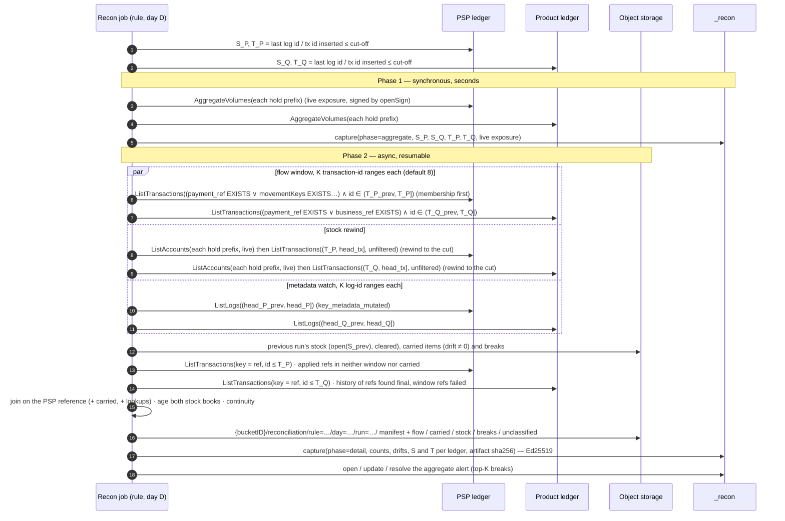

# Transaction-level reconciliation (lettering) — design, measurements, evidence

> ⏳ **Planned — design under evaluation.** Nothing on this page is implemented yet. The decision
> record is [ADR-005](../prd/adr-005-transaction-level-reconciliation.md). This page holds the
> mechanism, the recommended booking, the measurements and the upstream evidence behind it.

---

## 1. What it is, and what it is not

The control reconciles, **per PSP payment reference**, the *PSP ledger* that Connectivity feeds
against the *product ledger* that pilots the business.

- The payment is seen on the PSP ledger first.
- The product ledger later books a transaction carrying that reference, which letters a *business*
  hold: an invoice, an order.
- Both ledgers book as **lettering**. EPHEMERAL holds drain to zero at finality and then purge
  themselves.

A daily run covers **100 to 1,000,000 payments**. The control reads the flow with filtered
`ListTransactions`, and the stock with live listings corrected by the short window of transactions
since the cut-off ([in plain terms](#flow-and-stock-in-plain-terms)). It takes **no query checkpoint**.

| It is | It is not |
|---|---|
| Every finalised PSP payment is applied by the product for the same amount, and every product application points at a real finalised payment, **per PSP payment reference** | Pairing postings with bank-statement lines ("2-/3-way match"), fuzzy matching or match suggestions |
| Exact arithmetic at a deterministic business cut-off | A continuous per-tick monitor. Continuous exposure stays with `balance_equation` / `stale_holds` |
| **One aggregate alert** per run, plus the complete break list kept in object storage | One alert per payment |

## 2. The booking this control relies on

Each arrow is a posting, from source to destination.


```mermaid
flowchart LR
    subgraph Q["PSP ledger (Connectivity) — seen first"]
      QA["fpay:{conn}:account:{acct}"] -->|"payin.pending, X<br/>payment-id=PAY-42"| QH["fpay:{conn}:payment:hold:pending:PAY-42<br/>EPHEMERAL, +X while pending"]
      QH -->|"payin.succeeded, X<br/>payment-id=PAY-42"| QF["fpay:{conn}:account:{acct}:main"]
    end
    subgraph P["Product ledger — later"]
      PH["main:hold:invoice:INV-7<br/>EPHEMERAL, −X = unpaid"] -->|"1 · invoice issued, X<br/>invoice_no=INV-7"| PR["user:revenue:A:pending"]
      PC["main:clearing:{conn}"] -->|"2a · payment applied, X<br/>psp_payment_ref=PAY-42 · invoice_no=INV-7"| PH
      PR -->|"2b · revenue recognised, X<br/>same atomic batch as 2a, no payment ref"| PF["user:revenue:A"]
    end
    QF -. "join on the PSP payment reference (transactions payin.succeeded ↔ 2a)" .- PC
```

The two holds are keyed differently: the PSP ledger by payment, the product ledger by invoice. The
join therefore sits on **transactions**, through the PSP reference. The payment → invoice link lives
only in the product transaction.

On the product ledger, the invoice is booked in three transactions:

1. **Invoice issued.** `main:hold:invoice:INV-7` → `user:revenue:A:pending`, X. The hold opens at
   −X: this product hold opens **negative**, while the PSP hold above opens positive. The sign
   depends on the integration, so the rule declares it for each hold prefix (`holds[].openSign`,
   ADR-005 §6). A refund hold on the same ledger may open with the other sign.
2. **Payment applied, as one atomic batch of two transactions:**
   1. `main:clearing:{conn}` → `main:hold:invoice:INV-7`, X. This is the **application**. It
      carries `psp_payment_ref` and `invoice_no`, brings the hold back to 0, and the hold is purged.
   2. `user:revenue:A:pending` → `user:revenue:A`, X. This is the **revenue recognition**. It does
      not touch the hold and takes no part in reconciliation.

**The amount of an application is its net posting on the accounts under the side's hold prefixes**,
each counted in the direction that settles it (ADR-005 §6). The revenue recognition therefore counts for
nothing, even if it carried the payment reference. It is still best kept without one.

**The amount of a PSP payment is its net posting on the rule's `psp.paymentAccount`**, the account
its final event credits (`fpay:{conn}:account:*:main` for `formancepayments`), never its movement on
the hold. The hold is right only when the `pending` and the final amount agree:

| Case, `formancepayments` | `payin.succeeded` posts | Net on the hold | Paid | On `paymentAccount` |
|---|---|---|---|---|
| `pending` X, then final X | X hold → `main` | −X | X | X |
| final Y, no `pending` before | Y mirror → `main` (the hold is empty) | 0 | Y | Y |
| `pending` X, then final Y < X | Y hold → `main`, then X − Y hold → mirror | −X | Y | Y |
| `pending` X, then final Y > X | X hold + Y − X mirror → `main` | −X | Y | Y |

The hold keeps its role for the PSP stock: `opened` and `lettered` are hold movements, so
continuity holds in every row above.

- **Open items are a query.** At any instant, the open book is simply the set of non-zero holds.
  Lettered holds purge, so the open book stays small whatever the history.
- **A lettered item exists only in its transactions.** This was verified on a live ledger at
  `0b4676d97`:
  - a lettered hold is gone from `ListAccounts` and `AggregateVolumes`;
  - *neither* its opening transaction *nor* its lettering transaction is returned by an address
    filter, in any, source or destination role. The opening one was returned while the hold was
    open;
  - `reference == "{id}:done"` still finds the lettering transaction;
  - its `post_commit_volumes` still shows the hold at `100 − 100 = 0`.

  EN-2036 (formancehq/ledger#2058, merged as `38c6eef55` on `release/v3.0`, not yet released)
  makes a purged hold reachable by **exact address** again; its prefix path scales with every hold
  ever created (§7.6, §8 F-d). The design never reads the flow by address.
- **The join key must therefore be indexed transaction metadata**, and the address cannot be the
  only carrier.
  - Connectivity's `formancepayments` profile already does this: `payments.formance.com/payment-id`
    and `formance.com/observation.event-type` are indexed (`formancehq/connectivity-plugins-poc`,
    `plugins/formancepayments/profiles/formancepayments.yaml:1143-1147` @ `9df05c5b`).
  - The shipped Stripe plugin does not model holds at all. It books Stripe balance transactions with
    `stripe_txn_id` indexed (`formancehq/connectivity`,
    `plugins/stripe/internal/adapter/grpc/server.go:227-236` @ `e7ca3e29`).

### Recommended booking design (ADR-005 §8)

This design is tuned for the read paths measured in §7: the flow is read with `ListTransactions`
filtered server-side on `payment_ref EXISTS`, O(payments in the window); `ListLogs` allows no
metadata filter, so it would cost O(every log in the window) and serves the metadata watch only
(§3); listing the holds by prefix costs O(open accounts).

| | PSP ledger (Connectivity) | Product ledger |
|---|---|---|
| **In-flight hold** (EPHEMERAL) | `psp:{conn}:payment:pending:{payment_ref}` (and `psp:{conn}:refund:pending:{refund_ref}`), a single prefix per kind | `main:hold:invoice:{business_ref}` (and `main:hold:refund:{refund_no}`): **one hold per business object**, not one per state. Here the invoice hold opens negative, against pending revenue. Each prefix is one entry of the rule's `holds`, with its own sign |
| **Final accounts** (NORMAL) | `psp:{conn}:account:{acct}:main`, and **`psp:{conn}:fees`**: with no tolerance, every fee is an explicit posting | **`main:clearing:{conn}`**: the application transaction credits the invoice hold from the clearing account, so the clearing balance is the product's view of cash at the PSP (an aggregate control total). Revenue recognition, if any, is a separate transaction in the same atomic batch that does not touch the hold |
| **One transaction =** | one event of one payment: pending, succeeded, failed… A refund or a chargeback is **its own payment reference**, not an event of the original payment (decision 7) | one application of one payment to one business object. A payment split across two invoices is two transactions with the same `payment_ref` |
| **Transaction metadata** (declared, typed) | `payment_ref`; a **movement key** on every other movement of the payment account, payouts and fees (the rule's `psp.movementKeys`, decision 23); **`merchant_ref`** (the business id the merchant passed when it created the payment: Stripe `metadata`, Adyen `merchantReference`…), `state` (the rule maps its values to pending, final and failed), `kind` (payment, refund, chargeback) | `payment_ref` on applications only, not on the revenue recognition; `business_ref` on **every** transaction touching a business hold, including its opening; `kind` |
| **`reference`** | `{payment_ref}:{state}`: idempotent on re-delivery | `{payment_ref}:{business_ref}` |
| **`timestamp`** | the PSP event time | the business event time |
| **Postings** | exact amounts, with fees split out | application **strict on the amount** (`send [$asset $amount]`, never `*`): an over-application takes the hold past zero, to the sign opposite its opening (`wrong_sign`), and a partial payment leaves an honest residual |
| **Indexes** | **`payment_ref` and the `psp.movementKeys` fields (mandatory: they drive the flow read)**; **`inserted_at` and log date (mandatory: they resolve the cut)**; `merchant_ref` (investigation) | **`payment_ref` and `business_ref` (mandatory: together they drive the flow read)**; **`inserted_at` and log date (mandatory)** |
| **Mutability** | key and state metadata are **write-once**. A correction is a new transaction, never a `SavedMetadata` on an existing one. Recon reads every log since its previous run and flags any violation (`key_metadata_mutated`). **Labels** (ask L8) would make this structural | same |

**Why `merchant_ref` matters.** Without it, an `unapplied_payment` is known only by its
`payment_ref`. With it, the engine pairs it with the **open invoice** it was meant for, and the
break reads as an action item: "INV-7 is paid at the PSP (PAY-42), apply it". This is the most
useful single field in the design.

**Unrelated traffic costs (almost) nothing.** The filtered flow read returns only the payments
(§7.2). Only the rewind and the metadata watch see all the traffic; the watch grows with the
ledger's logs, and it is the longest step of a run (§3, §7.15). A dedicated
receivables ledger is therefore not needed for performance. Metadata-only writes are still best
avoided: each one is a log the watch reads.

**Refunds and chargebacks** are their own pair: a refund hold, a refund reference, and a payment
with its own `payment_ref` on the PSP side (ADR-005 decision 7).

### When application is deferred or manual: a payment-to-apply hold

The booking above assumes the product applies a payment as soon as the PSP finalises it. A business
that applies later or by hand (a B2B transfer lettered days later) keeps that booking: the payment
waits in the carried items as an `unapplied_payment` and becomes a P3 break past `product.grace`, so
the team raises `product.grace` to its usual lettering delay.

**Option, outside the V1 rule contract.** The product books each received payment on its own
EPHEMERAL hold, the classic "unapplied cash": `main:clearing:{conn}` → `main:hold:payment:PAY-45`
on receipt, then `main:hold:payment:PAY-45` → `main:hold:invoice:INV-12` on application. An
unapplied, partial or over-applied payment is then a product stock fact (open, `stuck`, a remainder,
`wrong_sign`), and the join shrinks to *PSP final ↔ product receipt*. The V1 rule would misread it:
the application moves two holds, and the receipt carries the reference without being an
application. It needs a `role` per `holds` entry (`business` or `suspense`) and a product-side
`state.received`, with a flow class for a PSP final with no receipt. The booking guide (EN-2335)
describes both.

### Mapping a connector for reconciliation

The PSP ledger is fed by a Connectivity connector, and the mapping from PSP events to ledger
transactions is configured **per customer, when they implement it**. Nothing here requires a change
to a connector. It is the checklist an implementer follows so that the connector's output can be
reconciled with a `lettering_match` rule. The rule adapts to field names: it names the key field
and the state field per side, so `payment_id` and `event_type` work as well as `payment_ref` and
`state`.

| # | The connector mapping must… | Why |
|---|---|---|
| 1 | carry the **PSP payment reference** as declared transaction metadata, **with an index**, on every transaction of a payment | The flow is read by filtering on its presence. The rule rejects a key without an index (EN-2316). The hold address is never used as the key (§7.6) |
| 2 | book **one transaction per event of one payment reference**. A batched payout that settles many payments is split into one transaction per payment | The control cannot split a multi-reference transaction: it reads the key from the transaction, not from the postings' addresses |
| 3 | carry the **state** of the event (pending, succeeded, failed…) as transaction metadata | The rule maps its values to `pending`, `final` and `failed` per deployment |
| 4 | carry **`merchant_ref`**, the business id the merchant passed when creating the payment (Stripe `metadata`, Adyen `merchantReference`…) | It turns an `unapplied_payment` into "invoice X is paid: apply it" |
| 5 | keep key and state metadata **write-once**. A correction is a new transaction, never a `SavedMetadata` on an existing one | A filtered re-read of a past day must not change. Recon reads every log since its previous run and flags violations (`key_metadata_mutated`) |
| 6 | book **refunds and chargebacks as their own payment references**, not as a reversal of the original payment | Each is its own 1-to-1 pair (ADR-005 decision 7) |
| 7 | book **fees and FX as explicit postings** to their own accounts | The comparison is exact, with no tolerance |
| 8 | use **EPHEMERAL holds, one per payment, under one prefix per kind**, and note the sign each kind opens with | The open book is then a prefix listing, and lettered holds leave it. The rule declares each prefix with its sign (`holds[].openSign`) |
| 9 | set `reference = {payment_ref}:{state}` | Re-delivery of an event is idempotent |
| 10 | have the **`inserted_at` and log-date indexes** created on the ledger | Each resolves the cut-off in one read. The rule is rejected without them (EN-2316) |
| 11 | credit the **payment amount of a final event to one account per payment kind**, which the rule names as `psp.paymentAccount` (an address pattern), and **credit nothing else to it** | The PSP amount is read there; the hold alone misses a final event with no `pending` before it, or one whose amount differs. The book of that account is then the only check that sees a final with no `pending` and no key (§7.9, ADR-005 §8 rule 10) |
| 12 | carry a **declared key on every debit of that account**: `payment_ref` for a refund, the reference of its own object for a payout or a fee, declared in the rule as `psp.movementKeys` | The debit book of the payment account then closes at 0; an unkeyed debit is a P1 break, `unkeyed_payment_movement` (§7.9) |

**Where two existing mappings stand**, as a starting point:

- `formancepayments`, in
  [`formancehq/connectivity-plugins-poc`](https://github.com/formancehq/connectivity-plugins-poc)
  (`plugins/formancepayments/profiles/formancepayments.yaml` @ `9df05c5b`):
  - **covered:** row 1, with `payments.formance.com/payment-id` on every payment transaction and
    indexed (`:1143-1147`); row 3, with `formance.com/observation.event-type` indexed and
    `payments.formance.com/payment-status`; row 8, with an EPHEMERAL
    `fpay:{conn}:payment:hold:pending:{payment_id}` hold (`:64-73`); row 9 in intent, since
    `reference = {conn}:padj:{adjustment_id}` is idempotent per event; row 11, as
    `payin.succeeded` credits `fpay:{conn}:account:{acct}:main` with the payment amount;
  - **to configure:** row 4, as there is no merchant reference on transactions
    (`payments.formance.com/reference` is account metadata); row 6, as refunds are mapped
    (`PAYIN_REFUNDED` and five siblings, `:430-704`) but as deltas **on the original payment id**,
    not as their own payment reference; row 7, as a `fees` account is declared (`:82`) but no
    mapping posts to it; row 10, as the profile indexes `timestamp` but neither `inserted_at` nor
    the log date; row 12, as payouts and fees on `…:account:{acct}:main` would need a key of
    their own. Row 11 does not hold today: see the open question below.
- The Stripe plugin, in [`formancehq/connectivity`](https://github.com/formancehq/connectivity)
  (`plugins/stripe` @ `e7ca3e29`), does not model holds. It books balance transactions keyed by
  `stripe_txn_id`, so rows 1–3 and 8 need a lettering mapping first.

**Open question for the Connectivity team: the payment account with `formancepayments`.** No
decision is taken here; the table is for that review.

- **The facts** (`formancepayments.yaml` @ `9df05c5b`):
  - `fpay:{conn}:account:{acct}:main` is credited by `PAYIN_SUCCEEDED` (`:191`), and also by
    `OUTFLOW_PENDING` (`:279`), `PAYOUT_SUCCEEDED` (`:329`), `TRANSFER_SUCCEEDED` (`:376`,
    `:381`), `OUTFLOW_COMPENSATE` (`:418`, `:422`), `PAYIN_REFUND_REVERSED` (`:503`) and
    `PAYOUT_REFUNDED` (`:548`);
  - every payment event, payins, payouts, transfers and refunds, sets
    `payments.formance.com/payment-id`, with its own `formance.com/observation.event-type`
    (`:157-701`); `CONVERSION` and `ORDER_FILL` set no payment id (`:743`, `:788`), and whether
    they touch the payment account is to check.
- **What follows, with the rule as specified today:** the flow read returns these transactions,
  since they carry the key. Their states are in no set, so they are `unclassified`, which caps
  every day at `reconciled_with_warnings`. And they post on the payment account, so row 11 fails
  and the book of decision 23 cannot close.

| Option | What changes | Trade-off |
|---|---|---|
| A. The connector mapping gives every movement kind its own key | The mapping, per customer | Clean, but depends on Connectivity and on each implementation |
| B. The rule declares a set of **movement states** (payout, transfer, refund and outflow event types): transactions with the key in those states feed the payment-account book, not the matching nor `unclassified` | The rule contract (EN-2316) | Works with the connector as it is and keeps the book strict; conversions and order fills still need a key or to stay off the account |
| C. The book becomes a warning instead of a P1 break | Decision 23 | Loses the only check that sees a final with no pending and no reference |

The product side is the customer's own Numscript. Its conventions are in the booking table above,
and the booking guide ([EN-2335](https://formance-team.atlassian.net/browse/EN-2335)) will turn both
sides into a customer-facing document.

## 3. Workflow


```mermaid
sequenceDiagram
    autonumber
    participant J as Recon job (rule, day D)
    participant P as PSP ledger
    participant Q as Product ledger
    participant O as Object storage
    participant C as _recon

    J->>P: S_P, T_P = last log id / tx id inserted ≤ cut-off
    J->>Q: S_Q, T_Q = last log id / tx id inserted ≤ cut-off
    Note over J,C: Phase 1 — synchronous, seconds
    J->>P: AggregateVolumes(each hold prefix)  (live exposure, signed by openSign)
    J->>Q: AggregateVolumes(each hold prefix)
    J->>C: capture(phase=aggregate, S_P, S_Q, T_P, T_Q, live exposure)
    Note over J,O: Phase 2 — async, resumable
    par flow window, K transaction-id ranges each (default 8)
        J->>P: ListTransactions((payment_ref EXISTS ∨ movementKeys EXISTS…) ∧ id ∈ (T_P_prev, T_P])  (membership first)
        J->>Q: ListTransactions((payment_ref EXISTS ∨ business_ref EXISTS) ∧ id ∈ (T_Q_prev, T_Q])
    and stock rewind
        J->>P: ListAccounts(each hold prefix, live) then ListTransactions((T_P, head_tx], unfiltered) (rewind to the cut)
        J->>Q: ListAccounts(each hold prefix, live) then ListTransactions((T_Q, head_tx], unfiltered) (rewind to the cut)
    and metadata watch, K log-id ranges each
        J->>P: ListLogs((head_P_prev, head_P])  (key_metadata_mutated)
        J->>Q: ListLogs((head_Q_prev, head_Q])
    end
    J->>O: previous run's stock (open(S_prev), cleared), carried items (drift ≠ 0) and breaks
    J->>P: ListTransactions(key = ref, id ≤ T_P) · applied refs in neither window nor carried
    J->>Q: ListTransactions(key = ref, id ≤ T_Q) · history of refs found final, window refs failed
    J->>J: join on the PSP reference (+ carried, + lookups) · age both stock books · continuity
    J->>O: {bucketID}/reconciliation/rule=…/day=…/run=…/ manifest + flow / carried / stock / breaks / unclassified
    J->>C: capture(phase=detail, counts, drifts, S and T per ledger, artifact sha256) — Ed25519
    J->>C: open / update / resolve the aggregate alert (top-K breaks)
```

- **The cut** turns the business cut-off into one log id `S` and one transaction id `T` per ledger
  ([below](#the-cut-from-a-business-time-to-id-ranges)).
- **The flow leg** reads the day's transactions as the id range `(T_prev, T]`, filtered server-side
  on the key's presence (ADR-005 §5). The logs remain the immutable, permanent path for re-deriving
  a past day exactly ("Log and audit history is permanent", ledger backup README), because
  transaction metadata is mutable.
- **The stock leg** is a live listing *rewound* to `S` (§4).
- **Continuity.** Per side, per hold prefix and per asset:
  `open(S) = open(S_prev) + opened(W) − lettered(W)`. A lost window event breaks the identity, which
  makes the read's completeness checkable.

### Flow and stock in plain terms

Take a day cut at midnight, and a run that starts at 02:00.

**The flow is what happened during the day.** It is the day's transactions that carry a PSP payment
reference: `payin.succeeded PAY-42, 1000` on the PSP ledger, the application `PAY-42 → INV-7, 1000`
on the product ledger. It answers one question: was every payment the PSP finalised today applied by
the product, for the same amount? It is read with `ListTransactions` over the day's id range
`(T_prev, T]` ([the cut](#the-cut-from-a-business-time-to-id-ranges)), filtered on the key's
presence so that only payments come back. The day is over, so this read gives the same answer at
02:00 or at 10:00.

**The stock is what is still open at midnight.** It is the holds that have not been lettered: unpaid
invoices on the product ledger, pending payments on the PSP ledger. It answers another question:
what is outstanding, and for how long? Lettered holds purge, so listing the accounts under the hold
prefixes gives the open book, and it stays small whatever the history.

**The listing is taken at 02:00, not at midnight.** The ledger kept writing in between:

```text
midnight (cut-off, log S)                          02:00 (run)
   |--------------- short log window ---------------|
   |  01:00  PAY-50 letters INV-9   → hold purged    |
   |  01:30  INV-15 is issued       → hold opened    |
```

So the 02:00 listing is wrong in two ways. **INV-9 is missing**: it was open at midnight, then
lettered and purged at 01:00. **INV-15 is extra**: it was opened after the cut-off. There is no
cheap way to ask the ledger for "the balances at midnight" without a query checkpoint, and the
control takes none ([ADR-005
§3](../prd/adr-005-transaction-level-reconciliation.md#3-why-not-query-checkpoints-measured)).

**The correction reads the transactions written from midnight to now**, the *short window since
the cut-off*: `(T, head_tx]`. It holds two hours of writes, not a day and not the history, which is
why it is short.
For each hold touched in it, the rewind recovers the hold's balance just before that first touch,
and that is its balance at midnight (§4). Holds nobody touched since midnight had the same balance
at midnight as at 02:00, so the listing is already right for them.

### The cut: from a business time to id ranges

The daily run has to answer "what happened on each ledger during day D", with bounds that give the
same answer if the run is replayed next week. The cut provides them: it converts the business
cut-off (say 24 September, 23:59:59 Europe/Paris) into **numbers the ledger already orders by**.

**What the ledger provides.**

- Every transaction gets an id from the ledger, per ledger, contiguous from 1, never reused, and
  increasing in insertion order. A transaction inserted later always has a larger id. (An
  unfiltered `(0, 1M]` returned exactly 1M rows.) Logs are numbered the same way.
- Every transaction carries two dates. **`timestamp`** is set by the writer and can be backdated.
  The **insertion date** (`inserted_at` for a transaction, the log date for a log) is set by the
  ledger's HLC when it writes. It cannot be backdated and it follows id order
  (`docs/technical/architecture/subsystems/consensus/hybrid-logical-clock.md` in the ledger).

**The cut.** `T` is the id of the last transaction inserted at or before the cut-off, and `S` the id
of the last log written at or before it. The previous day's `T_prev` and `S_prev` are already in
yesterday's capture.

```text
                    cut-off D−1                          cut-off D
                    23:59:59 on the 23rd                 23:59:59 on the 24th
                          │                                    │
  … tx 1 203 999  tx 1 204 000 │ tx 1 204 001  …  tx 1 318 500 │ tx 1 318 501 …
                          │                                    │
                   T_prev = 1 204 000                   T = 1 318 500

  Day D on this ledger = transaction ids (1 204 000, 1 318 500]
```

- **Resolving it** costs one read per ledger and per day: ask for the first transaction with
  `inserted_at > cut-off`, page size 1. It is id 1 318 501, so `T = 1 318 500`. The filter is
  **bounded above**, `cut-off < inserted_at ≤ cut-off + δ`, widened while the page comes back empty
  (ADR-005 decision 24): the ledger materializes the whole range of a date filter before it pages
  it (`internal/query/compile.go:1382-1416`, `materializeIterator` at `:1913`, at `7dd615dba`), so
  an open filter would cost everything written since the cut-off, the whole history on an old
  day's replay (§7.12). `S` works the same way on the log-date index. **Both indexes are mandatory**: the rule is rejected without them, a
  run waits while they build, as for the key's index, and an index missing at run time is an engine
  error (`incomplete`), never a silent fallback. `formancepayments` creates neither today,
  so a Connectivity-fed ledger needs them added at implementation (checklist row 10).
- **The insertion date, not `timestamp`**, so a past day is **frozen**: a transaction inserted
  today always gets an id above yesterday's `T`, even backdated. Why, and why bisection of the id
  range was dropped, are in [ADR-005
  §5](../prd/adr-005-transaction-level-reconciliation.md#5-decision-a--the-cut-is-a-log-id-and-the-stock-is-rewound-to-it).

**Why this makes the metadata-filtered read cheap.** The flow read is one query per range:

```text
ListTransactions  And( metadata[payment_ref] EXISTS ,  id ∈ (1 204 000, 1 318 500] )
```

The metadata existence index (`eidx`) holds **only** the transactions that carry the key, **ordered
by transaction id** ("Entities are stored in entity ID order", `internal/query/compile.go:943-945`
at ledger `f390ea683`). The ledger's `AndIterator` intersects its sorted inputs by seeking
(`internal/storage/readstore/combinator_and.go:86-153`). So the engine jumps straight to the first
key-bearing transaction above `T_prev`, reads in order, and stops after `T`. It never touches the
history before the day, nor the day's transactions that carry no payment.

**The membership comes first.** The ledger drives an `And` from its first term, in the order given;
membership first, the product `Or` read measured 2.7 to 3.4 times faster, with the same rows (§7.11).

The same question asked of the three orderings the ledger offers:

| Read | How the data is ordered | What the day costs | Measured |
|---|---|---|---|
| **Metadata index + id range** | by transaction id, key-bearing rows only | O(payments in the window) | 2k-tx window: 36 ms at a 100k-payment history, **48 ms at 1M**. 100k payments among 1M transactions: **0.8 s** |
| `ListLogs` over the window | by log id, every log; no metadata filter allowed | O(all traffic in the window) | 15 s for the same 1M-transaction window |
| Address prefix on the holds | by account, then transaction id | O(every hold ever created), on every page | 2k-tx window: 4.75 s at 100k, **47.8 s at 1M** (§7.6) |

**`T` serves the stock too.** Open holds are listed live, then rewound by replaying the
transactions `(T, head_tx]`, unfiltered (§4).

**`S` serves the metadata watch.** Only the logs carry the metadata changes recon monitors
(`key_metadata_mutated`). So every log in `(head_prev, head]`, the logs since the previous run's
head, is watched, and no log goes unwatched. `head_prev` is the `logHead` of `previousRun`, the last
complete run; with no previous run (a first run), it is `S_prev`, the cut the first run already
resolves for continuity. That is a day of logs: it grows with the ledger's logs
per day, not with its payments, and it is the largest step of a run (§7.13, §7.15). The run reads
`(head_prev, head]` itself, over K ranges: 134–158 s for the 4.1M logs of a 1M-payment product
ledger (§7.15), with no job and no stored state (ADR-005 decision 25).

**Deferred after V1: an incremental watch.** A job per watched ledger would read its logs in slices
during the day and store them, sealed, in that ledger's backup destination; the run would check the
slices and read only the last stretch. That would bring the run's critical path to the other steps'
15–25 s, for a job, a slice chain per ledger and their retention. An hourly slice of about 170,000
logs is estimated at a few seconds from the logs' rate (§7.13), not measured. L10 would shrink the
full read instead (§8, F-j).

### Reads and indexes

Every read is gRPC on `BucketService`, through recon's vendored client (`internal/ledgerpb`).

| Read | RPC | Index needed |
|---|---|---|
| Heads of a ledger | `GetLedgerStats` → `log_count` and `transaction_count` (per-ledger log ids and transaction ids are each contiguous from 1, and are two different counters) | none |
| Resolve `S` from the cut-off | `ListLogs`, filter `cut-off < log_builtin_uint(DATE) ≤ cut-off + δ` (bounded, widened while empty: the range is materialized before paging), page 1 → `S = id − 1` | **log-date index** (`LOG_BUILTIN_INDEX_DATE`, Pebble `lldt`): **mandatory** (checklist row 10) |
| Resolve `T` (transaction-id cut) | `ListTransactions`, filter `cut-off < builtin_uint(INSERTED_AT) ≤ cut-off + δ`, page 1, `reverse = true` → `T = id − 1`. Per-ledger transaction ids are contiguous (an unfiltered `(0, 1M]` returned exactly 1M rows) | `inserted_at` index (`TX_BUILTIN_INDEX_INSERTED_AT`): **mandatory**, same remark |
| **Flow window** | `ListTransactions`, filter `And(membership, builtin_uint(ID) ∈ (lo, hi])`, **membership first** ([above](#the-cut-from-a-business-time-to-id-ranges), §7.11), `reverse = true`, page 1000. Membership is `metadata[<psp.key>] EXISTS` on the PSP ledger, or `Or(<psp.key> EXISTS, <psp.movementKeys> EXISTS…)` when the rule declares movement keys (decision 23), and `Or(<product.key> EXISTS, <holds[].businessId> EXISTS…)`, one term per hold kind, on the product ledger, so that hold openings are returned for continuity. The field names come from the rule, for example `payments.formance.com/payment-id` with `formancepayments` | **metadata indexes on `payment_ref` (and `business_ref` on the product side): mandatory.** While it builds, reads return a retryable `Unavailable` ("index is still building") |
| Rewind window `(T, head_tx]`, and replays | `ListTransactions`, filter `builtin_uint(ID) ∈ (lo, hi]` and nothing else, **newest first** (the default order; §4), in chunks, page 1000 | **none**: an id range reads the main store and never waits for the index (§7.8) |
| Metadata watch `(head_prev, head]`, purge check, and exact re-derivation of a past day | `ListLogs`, filter `log_id ∈ (lo, hi]`, page 1000, cursor in the `x-next-cursor` trailer | **none** |
| Open holds | `ListAccounts`, filter `address` prefix, one listing per entry of the side's `holds`, page 1000 | **none**. An address-prefix listing iterates the main store, not the read index |
| Investigation: "every transaction of payment PAY-42", "which payments settled invoice INV-7" | `ListTransactions`, filter on metadata or `reference` | **indexed metadata** for the PSP reference and the business id, plus the `reference` index. This is not needed by the batch. On a released v3.0 it is the only lookup left once a hold is purged (§2) |

Each `ListLogs` call is a server stream of at most 1,000 `Log`. The transaction sits at
`payload.apply.log.data.created_transaction.transaction`, or
`…reverted_transaction.revert_transaction`, and carries its postings, its metadata and its
`post_commit_volumes`.

Each `ListTransactions` call is a server stream of at most 1,000 `Transaction`, and each carries
its postings, its metadata and its `post_commit_volumes`.

**Parallel reads, completeness and replay: what the id ranges give for free.** A window `(lo, hi]`
splits into K disjoint id ranges, read concurrently: transaction ids for the flow `(T_prev, T]` and
the rewind `(T, head_tx]`, log ids for the watch `(head_prev, head]`. K is an
**operator setting**, not a rule parameter: `--lettering-read-ranges` (default 8), capped
process-wide by `--lettering-max-concurrent-reads` (default 16), so that several rules running at
once do not multiply the readers on one ledger. Eight readers read about 4× faster than one; up to
16 the read still gains about 20 % while the ledger's writes pay more, and beyond 16 it barely
improves (§7.7).

- This needs **no snapshot and no checkpoint**. A log at or below the head is immutable. A
  transaction at or below the cut is immutable too, except for its metadata and revert flags, hence
  the write-once convention and, later, immutable labels
  ([EN-2326](https://formance-team.atlassian.net/browse/EN-2326)). Ranges read at different instants
  therefore return what one frozen read would have returned. An account listing does not have this
  property: its pages see moving balances.
- **Merging the ranges.** For the flow, each range keeps its per-reference facts, and the facts are
  combined in transaction-id order. The rewind reads its window newest first, in chunks read by K
  workers and applied newest first: each touch overwrites the account's value, so what is left is
  its balance just before its first touch after `T`, and an account back at zero is dropped (§4,
  §7.16).
- Scaling is sub-linear (§7.2, §7.15): the service sets the limit, not the client.
- **Completeness is checkable for free on unfiltered ranges.** Log and transaction ids are both
  contiguous per ledger, so an unfiltered range `(lo, hi]` must return exactly `hi − lo` rows:
  transactions for the rewind, logs for the watch. A short count means a replica that lags or a
  read that failed, and it makes the run `incomplete` instead of silently shrinking the window. The
  filtered flow read has gaps by design; there, completeness rests on the index and on the
  continuity identity.
- That check also makes it possible to read from followers (`x-consistency: stale`) to take load off
  the leader: a follower that has not yet applied up to `hi` returns fewer logs, and the range is
  retried.
- **Replay.** `S`, `T` and `logSha256`, the SHA-256 of the log at `S`, are written in the signed
  capture, so a later re-read covers the same window ([Replaying an old day](#replaying-an-old-day)).
  Both ledgers are cut at the same business time, whenever the job runs.

## 4. The rewind: an exact state at `S` with no checkpoint

After a live, possibly torn, listing of the scope has finished, read the transactions
`(T, head_tx]`, unfiltered, **newest first** (the API's default order). For each scope account
touched there, **discard the listed value**. Replace it with the account's balance *just before its
first touch after the cut*: each touch overwrites the account's value with its balance just before
that touch, so the last value written is the one before the first touch.

```text
pre = post_commit_volumes[account] − Σ(this transaction's postings on account)
```

- Touched accounts that are missing from the listing are added back when `pre ≠ 0`.
- Accounts created after the cut have `pre = 0` and drop out.
- An account back at `pre = 0` is dropped as soon as it is read, unless the listing holds it (then
  0 overrides the listed value). So the fold holds only the accounts open at the point it has read
  down to, whatever the window's length: 1M accounts for a 20M-transaction window that touched
  10M, where an id-order fold that keeps each first touch holds all 10M (§7.16). The window is
  read in chunks by K workers and applied chunk by chunk, newest first.
- An account untouched in the window held one value for the whole listing, so the listed value is
  its value at the cut.

The method needs no baseline and no stored state, and it applies to NORMAL accounts as well as to
EPHEMERAL holds. Only created and reverted transactions move balances, and both carry
`post_commit_volumes` (`misc/proto/common.proto:133-136`, `827-835` at `03d8792b5`). A revert is its own
transaction, with its own id (`internal/domain/processing/processor_revert_transaction.go:188-207`
at `7dd615dba`), so the unfiltered transactions of the window hold every balance movement.

**Worked example**, the day of [Flow and stock in plain terms](#flow-and-stock-in-plain-terms)
(invoice holds open negative):

| Hold | First touch after `S` | `post_commit_volumes` | Its own posting on the hold | `pre`, the balance at `S` | Effect |
|---|---|---|---|---|---|
| INV-9 | 01:00, payment applied | 0 | +500 | **−500** | missing from the listing (purged): added back |
| INV-15 | 01:30, invoice issued | −300 | −300 | **0** | created after `S`: drops out |
| INV-3 | none | — | — | listed value | untouched: the listing is right |

**Consistency check from `purged_accounts`** (optional; the rewind is exact without it). Since
EN-2036 (ledger `38c6eef55`; the field came without a protocol bump, `grpcprotocol.Version` is
`13` before and after it), each log carries `LedgerLog.purged_accounts`, the
addresses whose `EPHEMERAL` current state it removed. `ListLogs` exposes it at
`Log.payload.apply.log.purged_accounts`. The metadata watch reads the logs `(head_prev, head]`,
which include `(S, head]`, so the run already has it. The field explains the one legitimate way an account open at `S` can be missing from the live listing:

- a touched hold with `pre ≠ 0` that the listing does not contain must be named in the
  `purged_accounts` of some log in `(S, head]`. Otherwise the listing missed a live account, which
  the run reports as `incomplete` rather than repairing silently;
- a `NORMAL` hold is never purged, so it can never be absent from the listing with `pre ≠ 0`.

Two properties of the field bound what it can prove (`internal/infra/state/write_set.go:537-551` at
`7dd615dba`):

- the purge is decided at the batch boundary and emitted **once, on the batch's last log** for that
  ledger, not on the log that zeroed the hold. A hold zeroed and re-funded within one batch is never
  purged;
- a batch that straddles `S` can therefore name a hold that no log after `S` touches: it was zeroed
  at or before `S`, so its balance at `S` is 0 and it drops out. Being named in `purged_accounts`
  does not imply being touched in the window.

A purged hold also loses its account metadata, and re-funding the address starts a fresh account
with none of it. So a hold the rewind adds back takes every field from its address, the logs or the
previous stored stock, never from account metadata. Its volumes restart too: on `7dd615dba`, a hold
opened with 100, lettered, then re-funded with 100 shows `post_commit_volumes` of `100-0` on the
re-funding, not a cumulative `200-100`. The balance (input − output) is right on both sides of the
purge, so the rewind uses balances only on the EPHEMERAL holds, never cumulative input or output
volumes. The payment-account book is the exception: its account is NORMAL, never purged, so its
input and output are rewound as they are (decision 23). The lettering
log itself still carries the purged hold in `post_commit_volumes` (`100-100`) and names it in
`purged_accounts`.

**Why the unfiltered transactions**, and neither a filtered read nor the logs, for this window:

- It is **complete**: transaction ids are contiguous, so the count `hi − lo` proves no transaction
  was missed.
- It depends on **no metadata convention**: a transaction that touched a hold without carrying the
  key is still corrected. A filtered read would miss it.
- It holds **every balance movement**, and none of the metadata-only logs.
- It is **5 to 9 times faster** than the logs: an id range reads the main store and never waits for
  the index, while `ListLogs` always does (§7.8).

**Proof runs**, against a checkpoint taken at the cut, under concurrent writes: the rewound listing
matched on every row, from the logs (§7.4) and from the transactions, with reverts and
metadata-only writes (§7.8).

### Replaying an old day

Any past day can be replayed: the logs are permanent, and the day's cut (`S`, `T`, `logSha256`) is in
the signed capture (ADR-005 §7, item 7). A replay runs the daily algorithm as of that day; no stock
is stored for it.

**The flow costs the same at any age.** The cut of an old day resolves in one index page per
ledger, and the day is its id range `(T_prev, T]`, read filtered on the key:
O(payments of that day), a day or a year later. It matches the original run as long as key and
state metadata stayed write-once. The exact variant reads that day's logs `(S_prev, S]`, which is
slower but still one day's worth.

**The stock is the live listing, rewound from head** (§4). The window `(T, head_tx]` grows with the
day's age, and the fold's memory does not: it holds the open book, since it reads newest first and
drops a hold back at zero. Measured at 236k–261k transactions/s over 8 workers, holding at most the
1M open holds, 426 MiB of heap, on a window that touched 10M holds (§7.16):

| Replay, at 1M transactions a day | Transactions in `(T, head_tx]` | Rewind |
|---|---|---|
| The next day | ~1M | ~4 s |
| A month later | ~30M | ~2 min |
| At the end of the 90-day retention | ~90M | ~6 min |
| A year later | ~365M | ~26 min |

A product ledger of 1M payments a day writes about 4M transactions (§7.15), so its rewind takes about
four times as long: ~25 min at the end of the retention. An id-order fold that keeps each first
touch would hold every hold created since the day, about
760 bytes each (7.6 GB of heap for 10M, §7.16): about 70 GB for a 90-day-old day.

**The carried items come from the previous run while it is kept.** Within the rule's `retention`,
the previous day's carried and stock files seed the replay, and it reproduces the day's files byte
for byte (results reference §8). Beyond it, those files have expired: the replay rebuilds its
carried items from a backfill window, as a first run does (ADR-005 §7, item 6), which costs about
`psp.grace` + 1 days of flow reads. An item carried for longer than that window is missed, the
statement says "backfilled since …", and the files are no longer byte-identical to the original.
A customer who must reproduce older days raises `retention`.

## 5. Matching semantics

The states, classes, `grace`, ageing, refunds and the other matching rules are decisions, recorded in
[ADR-005 §6](../prd/adr-005-transaction-level-reconciliation.md#6-decision-b--matching-semantics).
Each class's outcome and fields are in the [results
reference](./transaction-level-results.md#6-file-reference). This section keeps the lookups by key
and the statement.

**References missing from the window are looked up by key.**

- An application whose reference is neither in the PSP window nor carried in is read on the PSP
  ledger with one `ListTransactions` filtered on the key, up to `T`. That finds a `failed` never
  applied (drift 0, not carried), an `in_progress` of an earlier day, or a payment finalised before
  `backfillFrom`, and the row is classed on that real history.
- When the PSP lookup finds a final state, the reference's earlier applications are read the same
  way on the product ledger, so that a second application on a payment matched days ago sums with
  the first and shows as `over_applied`.
- On every run, each PSP reference of the window with a `failed` event that is not carried is
  looked up on both ledgers, so that a payment matched on an earlier day and failed today shows as
  `reversed_after_application`. That holds even when the product also books on it today (an
  application undone the same day): the window alone would miss the earlier final state and
  application, and report a false orphan. Failures are rare, so this costs little.
- Lookups are grouped, 100 to 500 references per `Or` of equalities on the key, key first (the
  ledger has no `IN`): each then costs about a hundredth of a lookup alone (§7.13, EN-2318). The
  manifest counts them. The first run adds none: its product window starts `psp.grace` before `backfillFrom`
  (ADR-005 §7).

**Which side came first** (`firstSide`, for analysis only). Between two days the window decides;
within a day, `insertedAt`, although it compares the clocks of two ledgers. It is `psp` when the
PSP's first terminal state (`final` or `failed`) came before the first application, `product`
otherwise; a `failed` after a `final` does not change it.

### What the controller sees: a reconciliation statement, never a bare drift

A net drift of 0 proves nothing. Two breaks of +1,000 € and −1,000 € also net to zero. Every run
therefore answers with a **reconciliation statement**: the classic *état de rapprochement*, with an
explicit verdict. Each of its four checks closes on an identity that ties two independent
computations, so a statement that closes is also evidence that the reads were complete:

| Part | What ties it | What a failure catches |
|---|---|---|
| The bridge, for the window | The product total comes from the product books, the lines from the flow rows. The books are themselves tied to the rewound stock by continuity, which is read by another path. The PSP total is tied by the payment-account book below, not by the hold: it is read on the payment account (decision 17) | A lettering the join did not attribute to a reference: an engine fault, or a read cut short |
| The open items, all days together | The previous run's carried file against this run's, through the window's net | A carried item lost or counted twice between two runs |
| The open books, per ledger | The window's hold movements against the stock rewound to the cut | A lost event, or a hold moved by a transaction with neither the key nor a business id |
| The payment-account book, per account and asset | The account's volumes at the cut against the flow's credits and debits to it (decision 23) | A final with no pending and no reference, or a movement of the account that carries no declared key |

A failure of the first three makes the run `incomplete`: no conclusion is drawn, and the run is
never green. A residual of the payment-account book is a P1 break instead, so that one keyless
movement does not hide the rest of the day (decision 23).
Otherwise the verdict is `breaks`, `reconciled_with_warnings` (an unclassified transaction, or
identifying metadata changed after insertion), `reconciled_with_pending` or `reconciled`. The alert
opens on an open break that is not accepted, never on the net alone. The verdicts, every line of
the statement and how to read them are defined in the [results
reference](./transaction-level-results.md#4-the-verdict).

### Result artifacts, retention and the period view

The files and every field, retention and the file sizes are
specified in the [results reference](./transaction-level-results.md), the source of truth for the
format; its [worked example](./transaction-level-results.md#10-worked-example-one-day-of-output)
shows a complete day. Why the format is what it is: ADR-005 §7, item 3. Two points of mechanics
stay here.

**Location.** The files go to the backup object storage of the rule's **product ledger**, S3 or
Azure, under `{bucketID}/reconciliation/`, a sibling of `backups/`. The product ledger is the book
the rule answers for, and one PSP ledger may feed several products. The ledger's orphan prune only
deletes unreferenced objects under `{bucketID}/backups/data/` and `{bucketID}/backups/exports/`
(`internal/infra/backup/manager.go:229-235`, `segment.go:54-61`), so `{bucketID}/reconciliation/`
is never touched.

**A run that cannot conclude** writes its manifest and no data file, and the next run chains on
the last complete one ([results reference
§2](./transaction-level-results.md#2-where-the-files-are-and-which-run-counts)). `missing_index`
and `short_range` usually clear on the next run. `continuity`, `residual`, `purge_check` and
`stored_file_mismatch` repeat until the cause is fixed; `incomplete.detail` names the first items at
fault. When the fix cannot enter the window, an operator restarts the rule: its next run is a first
run, backfilled from the oldest open item of the last complete run (ADR-005 decision 26).
The carried items, the stored stock and the break history therefore never come from a run that
failed its checks.

## 6. Could Pebble do better?

We checked this against the Pebble v2.1.4 sources and the ledger's call sites. The ledger calls
**none** of `NewEventuallyFileOnlySnapshot`, `WithRestrictToSpans`, `RemoteStorage`,
`IngestExternalFiles`, `Excise` or `ScanInternal`.

| Primitive | What it would give | Why not |
|---|---|---|
| `DB.NewSnapshot()` (`db.go:1629`) | A consistent view that costs one mutex and a sequence number: no files, no Raft order, no slot | It can only live server-side. It keeps overwritten versions alive while it is open, is lost on restart, and the ledger's `NewReadHandle` holds `dbMu.RLock` for the handle's lifetime (`internal/storage/dal/reader.go:80-96`). It is the right basis for a ledger-side *consistent export* (F-g), which this use case no longer needs. |
| `NewEventuallyFileOnlySnapshot(ranges)` (`db.go:1652`) | Scoped to key ranges, and ledger keys are ledger-contiguous (`internal/domain/keys.go:105-131`) | Once file-only it pins **the whole Version** (`snapshot.go:280`) and hides unflushed keys outside the ranges |
| `Checkpoint(WithRestrictToSpans)` (`checkpoint.go:57`) | Hard-links only the SSTs that overlap the spans | It still copies every WAL and the MANIFEST (`:394-413`, `:477-557`), can surface stale keys outside the spans (`:50-56`), and keeps the slot and the lifecycle |
| `Options.Experimental.RemoteStorage` / `IngestExternalFiles` | SSTs read from object storage | Pebble ships no S3 or Azure driver, only an interface and test implementations. It is designed for shared L5/L6 beside a local MANIFEST and WAL, not for a database read out of a bucket |
| Backup to S3/Azure | A durable copy of a frozen state | It covers the whole store and exists for disaster recovery: reading it means restoring a node, and "it does not provide point-in-time queries" |

**Conclusion.** Pebble is not what limits this use case; the ledger's read API is. And the log is
already the exact, permanent, partitionable "snapshot" the use case needs.

## 7. Measurements

**Setup.** A throwaway single-node ledger (`--cluster-id bench`, ports 18888/17777/19000), with its
data in the session scratchpad and **isolated from the daily-driver ledger on :8888**. It was built
from `release/v3.0` @ `0b4676d97`, then from the tip @ `a08f99bc3`, and ran on an Apple-silicon
laptop.

- Two ledgers of 1M accounts each: `psp:tx:{16-hex id}` and `bank:tx:{id}`.
- Ids are pseudo-random, so address order is unrelated to insertion order.
- `bank` carries injected drift per 1,000 ids: one id missing, one id at +1, one id funded twice,
  plus 0.05 % extra ids.
- There is no replication and no network. Read the absolute numbers as a lower bound and the ratios
  as the finding.
- The bench is [`tools/bench-txlevel`](../../tools/bench-txlevel/README.md), a Go client over
  recon's vendored `internal/ledgerpb`. Its README gives the exact commands to reproduce every
  figure below.

### 7.1 Account reads

| Operation | 100k / scope | 1M / scope |
|---|---|---|
| Load (`Apply`, 200–500 tx per batch, 16 workers) | ~95k tx/s | ~115k tx/s |
| `AggregateVolumes` prefix, live | 0.22 s | 2.9 s |
| `AggregateVolumes` prefix, at checkpoint | 3.9 s | 62 s (both SHAs) |
| `ListAccounts` scan, live, page 1000 (first pass; a second pass on a warm cache reads ≈92k/s, §7.10) | 1.1 s (≈90k/s) | 21.3 s (≈47k/s) |
| `ListAccounts` scan, live, **page 200** (recon's `queryPageSize`) | 5.3 s | — |
| `ListAccounts` scan, at checkpoint, one reader | 26.3 s (3.8k/s) | 5 min 10 s |
| Create query checkpoint | 1.09 s | 0.61 s |
| **Keyed diff of two scopes, live** (parallel scans + merge-join + gzip) | 2.1 s | 21.9 s |
| Keyed diff at checkpoint, `0b4676d97` | concurrent reads fail (EN-2108) | 10 min 25 s (sequential) |
| Keyed diff at checkpoint, tip (EN-2108 fixed) | 8.3 s (parallel) | 2 min 38 s (parallel) |
| Merge-join + write, alone | 3 ms | 29 ms |

### 7.2 Log and transaction reads

**Ledger `psp`**, 1M transactions, one account each:

| Operation | 100k logs | 1M logs |
|---|---|---|
| `ListLogs` log-id window + fold of `post_commit_volumes`, 1 stream | 13.3 s (7.5k/s) | 2 min 18 s (7.3k/s) |
| Same, **8 parallel log-id ranges** | — | 24.2 s (41k/s) |

**Ledger `mixed`**, 1M transactions of which **10 % are payments** (`load-mixed`). The payments
carry `kind` and `payment_ref` metadata, the rest carries `kind = internal`, and `kind` is declared
and indexed. Tip `a08f99bc3`:

| Read of the same 1M-transaction window | 1 stream | 8 id ranges |
|---|---|---|
| `ListLogs`, everything | 72.5 s (13.8k/s) | 15.1 s (66k/s) |
| `ListTransactions`, everything | 10.6 s (94.5k/s) | 2.85 s (351k/s) |
| `ListTransactions`, `kind = payment` → 100k rows | 2.09 s | 0.56 s |
| `ListTransactions`, **`payment_ref EXISTS`** → 100k rows | 2.93 s | **0.80 s** |

Every row returned by `ListTransactions` carried its `post_commit_volumes`. The `payment_ref` index
was created on the loaded ledger, and its backfill over 1M transactions was ready about 1 s later.

**Mutability, shown.** `retag` rewrote one payment's `kind` to `internal` after the fact. The same
`kind = payment` read of the same past window then returned **99,999** rows, while
`payment_ref EXISTS` still returned 100,000. That transaction's log was unchanged; the retag
appears as a new `SavedMetadata` log at the head. This is why the flow filters on the key's
**presence**, and why the key and state metadata are write-once.

### 7.3 What the numbers say

1. **The join is free.** Moving the data is the whole cost: 29 ms of join for 1M × 2.
2. **A checkpoint makes reads about ×20 slower.** Every page reopens both checkpoint databases with
   the backup profile (`internal/adapter/grpc/server_bucket.go:336-398`,
   `internal/storage/dal/store_readonly.go`). On the tip, two concurrent readers are *faster* than
   one: 100k × 2 in 8.3 s, against 26 s for one scope. The shared open survives while any reader
   holds it, which shows the reopen is the cost. Not needed by recon (§8, F-b); filed for the Ledger
   team as [EN-2336](https://formance-team.atlassian.net/browse/EN-2336).
3. **Page size costs ×4.7.** Bulk reads must use `MaxPageSize` = 1000.
4. **Every listed account emitted an INFO log line** (`internal/application/ctrl/store.go:189-195`):
   3.86M lines, a 970 MB log. → ask **L2**, done (§8, F-c): now at TRACE.
5. **For the same data, logs are 5–7× slower than transactions** (13.8k/s against 94.5k/s on one
   stream). Only `ListTransactions` can filter on metadata server-side, so the flow reads
   transactions, and so does the rewind (§7.8). The logs serve the metadata watch and exact
   re-derivation. → asks **L6**, **L8** and **L10**.
6. **Disk.** A 100k-account checkpoint kept its 169 MB alive after the live store had grown to
   1.9 GB. A checkpoint's cost is churn × lifetime, on every replica.

### 7.4 Rewind proof

This proof read the window from the logs, the first design's source; §7.8 proves both sources the
same way. The bench command `rewind` records `S` and an **oracle checkpoint** with no write in
between, lists the 1M scope **live** while 8 writers top up, drain and create accounts on
`psp:tx:*`, then rewinds with the logs `(S, head]` and compares row for row with the checkpoint.

| | Value |
|---|---|
| Writes committed during the listing | 8,208 transactions |
| Live listing | 14.8 s, 1,002,752 rows |
| Correction window `(S, head]` | 8,208 logs, 4,446 scope accounts touched, fold in **267 ms** |
| Oracle (checkpoint at `S`), non-zero rows | 1,002,408 |
| **Raw live listing ≠ state at `S`** | **2,233 rows**, the torn read |
| **Rewound listing ≠ state at `S`** | **0 rows** |

Resolving the cut from a date (`cutprobe`: log-date index, 5 transactions 300 ms apart, cut-off
between the 3rd and the 4th): one ascending page of `date > cut-off` returned log id 5, so `S` = 4,
the 3rd transaction, because log 1 is the `CreateIndex`. **Per-ledger log ids count every ledger
log, not only transactions**, so a log id is not a transaction id.

### 7.5 Projected daily run

The step-by-step projection (1M logs a day, ≈ 25–45 s with no checkpoint) is superseded by the
end-to-end run of [§7.15](#715-one-days-run-end-to-end), which found its total short.

### 7.6 Where the key comes from: transaction metadata, not the hold address

On the PSP ledger, the hold is named after the payment reference (`…:hold:{ref}`). So the flow could
in principle be found by an **address prefix** on the holds, with the reference taken from the
posting, instead of by the `payment_ref` metadata. That would bring two real advantages: an address
in a posting never changes (unlike metadata, §7.2 `retag`), and a transaction that letters many
holds at once would split naturally, posting by posting. The question measured here is whether it
would be viable **with purged holds reachable by address prefix** (§8, F-d).

**Setup.** Tip `a08f99bc3`. `load-lettering` books each payment as two transactions:
`world → psp:hold:{id}`, then `psp:hold:{id} → psp:main`, both with `payment_ref = id`, on NORMAL
holds. The window is the **last** N transaction ids, and the history is everything before it.

| History | Window | `payment_ref EXISTS` | Address prefix `psp:hold:` |
|---|---|---|---|
| 100k payments (200k tx) | 2k tx | 36 ms | 4.75 s |
| 100k payments | 20k tx | 473 ms | 23.0 s |
| 1M payments (2M tx) | 2k tx | 48 ms | **47.8 s** |
| 1M payments | 20k tx | 637 ms (98 ms over 8 ranges) | **8 min 8 s** (server at 5.6 GB RSS) |

With real **EPHEMERAL** holds, all lettered and purged, on EN-2036's head `20a5595d6`, which
resolves purged accounts from the mappings, a 2k-transaction window read in 56 ms against 5.7 s at
100k payments, and 65 ms against **50.7 s** at 1M. The merged `38c6eef55` also includes purged holds
in a prefix listing, by walking the `[atxm][ledger][account][txID]` keys under the prefix (commit
`701d0f0bb`): still O(history) per page, not re-measured.

**Reading.**

- **The metadata filter costs O(window).** Multiplying the history by 10 barely moves it (+35 %),
  because the existence index is ordered by transaction id, so the id range is a seek.
- **The address prefix costs O(history) per page.** It is exactly ×10 when the history is ×10, for
  the same window. `AddressTxIterator` first collects the transaction ids of **every** account under
  the prefix into memory, sorts them, and only then seeks the window
  (`internal/storage/readstore/iterator_address.go:76-132` at `a08f99bc3`). That happens again for
  each 1,000-row page: about 24 s per page on a 1M-payment history.
- **At production scale the address path is unusable.** A day of 100k payments is 200 pages. On
  90 days of 100k payments per day, one page would scan 9M holds, so a single run would take hours.
- **Reaching purged holds by prefix does not change this.** `20a5595d6` resolves addresses from
  the mapping keyspace, which is ordered by account, then transaction id
  (`[atxm][ledger][account][txID]`). Even with the id range pushed into that walk, each account
  under the prefix still costs a seek: O(holds ever created), not O(window). Only an address index
  ordered by transaction id would make this path O(window), and nothing asks for one.

**Conclusion.** The flow key stays a **declared, indexed transaction metadata field on both
ledgers** (ADR-005 §6). The hold address remains the key of the **stock** only, where a prefix
listing sees just the open holds. The two advantages of the address are obtained otherwise:
immutability by the write-once convention and, later, immutable labels (L8,
[EN-2326](https://formance-team.atlassian.net/browse/EN-2326)); and batched letterings by booking
one transaction per payment reference (ADR-005 §8, rule 2).

### 7.7 Concurrent readers: choosing K

**Setup.** A fresh single-node ledger at `release/v3.0` `f390ea683`. Ledger `mixed`: 1M transactions, 100k of them payments
(`load-mixed`). Client and server share one Apple M4 Pro (12 cores). Median of three runs.

**Read time of the whole 1M-transaction window, by number of concurrent ranges K:**

| K | `payment_ref EXISTS` (100k rows) | Speed-up | Unfiltered (1M rows) | Speed-up |
|---|---|---|---|---|
| 1 | 3.10 s | ×1 | 10.5 s | ×1 |
| 2 | 1.56 s | ×2.0 | 6.2 s | ×1.7 |
| 4 | 0.97 s | ×3.2 | 4.85 s | ×2.2 |
| **8** | **0.76 s** | **×4.1** | **2.85 s** | **×3.7** |
| 12 | 0.68 s | ×4.6 | 2.57 s | ×4.1 |
| 16 | 0.60 s | ×5.2 | 2.10 s | ×5.0 |
| 24 | 0.58 s | ×5.3 | 1.92 s | ×5.5 |
| 32 | 0.57 s | ×5.4 | 2.01 s | ×5.2 |
| 64 | 0.42 s (noisy: 0.40–0.50 s) | ×7.4 | 1.90 s | ×5.5 |

**What the readers cost the ledger's writes.** 300k transactions written (`load-mixed`, 16 writers)
while K readers loop over the unfiltered window, two series:

| K | Write time | Writes slowed by |
|---|---|---|
| 0 (no reader) | 2.35 s | — |
| 1 | 2.41 s | ~2 % |
| **8** | 2.6–3.0 s | **~10–20 %** |
| 16 | 3.3–3.9 s | ~30–40 % |
| 32 | 3.6–3.7 s | ~35 % |
| 64 | 5.0 s | ~50 % |

**Reading.**

- The gain is almost linear up to 4 readers, bends between 8 and 16, and flattens after 16.
- **8 is the default**: about ×4 on the read, for writes slowed by 10–20 % while the read lasts,
  which is seconds at this volume. 16 buys about 20 % more read speed for 30–40 % slower writes.
- The optimum depends on the deployment. Here the client competed with the server for the same
  cores, and there was no network latency; in production each page pays a round trip, which
  favours more readers, and a three-node cluster behaves differently. **Re-measure in staging**
  before changing the default.
- Hence K is an operator setting (§3, ADR-005 §7), not a rule parameter.

### 7.8 Window source for balances: logs or unfiltered transactions

**Question.** The first design rewound with the logs `(S, head]`. Could the rewind read the
transactions `(T, head_tx]`, unfiltered, instead? They are complete, immutable and independent of
any metadata convention too, and they hold every balance movement, reverts included (§4). A read by
id range takes the main-store path and never waits for the index to align
(`internal/application/ctrl/list_entities.go:84-96`). `ListLogs` always waits for it, even
unfiltered (`internal/query/aligned_snapshot.go:70-72`).

**Setup.** A fresh single-node ledger at `7dd615dba`, one scope of 1M accounts (`load`). Median of
two runs.

**Exactness** (`rewind-sources`). The scope is listed live while 8 writers run. The writers mix:

- top-ups, drains and new accounts;
- reverts of transactions older than the cut;
- reverts of transactions written after it;
- metadata-only writes.

Both windows are then folded and compared, row for row, with a checkpoint taken at the cut.

| | Rows read | Differs from the oracle |
|---|---|---|
| Raw live listing (27 s, 1,000,245 rows) | — | 355 rows |
| Rewound from the logs `(S, head]` | 2,738 logs: 2,286 balance-moving transactions (914 reverts) and 452 metadata logs | **0** of 1,000,000 |
| Rewound from the transactions `(T, head_tx]` | 2,286 transactions (914 reverts) | **0** of 1,000,000 |

**Throughput** (`fold`). A fold of the whole 1M-transaction history, the read a replay or a forward
stock pays:

| Source | K = 1 | K = 8 |
|---|---|---|
| `ListLogs` + fold | 91 s (11k/s) | 16.5 s (61k/s) |
| Unfiltered `ListTransactions` + fold | 10.4 s (96k/s) | **3.0 s (~330k/s)** |
| Ratio | ×8.7 | ×5.5 |

These are the figures to plan with; the re-run and the logs' two regimes are in §7.13.

Folded forward from an empty stock up to the head, with no write running, both sources gave the live
listing exactly (`fold -compare`, 0 of 1,000,460 rows).

**Order.** `ListTransactions` lists **newest first** by default: `reverse = true` gives id order
(`internal/application/ctrl/controller_default.go:375`, "API: reverse=false → newest-first"). A fold
that keeps each account's first touch after the cut is silently wrong without it. The rewind reads
newest first and lets each touch overwrite instead, which gives the same stock and bounds its
memory (§4, §7.16). The flow's merge "in transaction-id order" (§3) needs `reverse = true`.

**Reading.**

- For balances, the unfiltered transactions are as exact as the logs, and 5 to 9 times faster to
  read (for a replay from head, §4). The rewind reads them (ADR-005 decision 22).
- What only the logs carry is the metadata changes the watch monitors, and `purged_accounts`, which
  the purge consistency check of §4 uses. The rewind is exact without that check.

### 7.9 A final with no pending and no key: the payment-account book

**Question.** A PSP final with no `pending` before it moves its hold by 0 (§2). If it also lacks the
payment reference, or the flow read misses it, it breaks no identity. Does a book of the rule's
`psp.paymentAccount` close that gap, and what does it cost?

The book compares the account's movement over the day with the flow's postings on it:

- credits: `input(S) − input(S_prev)` against the flow's credits to the account;
- debits: `output(S) − output(S_prev)` against the flow's debits.

The account is `NORMAL`, so its volumes are cumulative. Its value at `S` comes from a live read,
rewound with the window already read (§7.8). Its value at `S_prev` is the previous run's.

**Setup** (`silent`). Same ledger. The holds are `EPHEMERAL`, the payment account is `psp:main`, and
`payment_ref` and `movement_ref` are declared and indexed.

- **Day 1:** 5,000 pendings stay open, and 10,000 payments complete.
- **Day 2**, the window of 216,100 transactions:
  - 100,000 payments, pending then final;
  - 3,000 day-1 pendings finalised;
  - 10,000 keyed finals with no pending;
  - **100 finals with no pending and no payment reference;**
  - 1,000 keyed refunds, 1,000 payouts and 1,000 fees.
- **After the cut:** 5,000 more payments and 500 late settlements, so that the rewind has work to do.

In every variant, the rewound stock and `psp:main` at `S` matched a checkpoint taken at the cut.

| Variant | Hold continuity | Credit book | Debit book |
|---|---|---|---|
| Silent finals only | residual **0** | residual 4,909,050 = **exactly the 100 silent finals** | residual 53,000 = the unkeyed payouts and fees |
| Payouts and fees keyed with `movement_ref`, flow read with `Or(payment_ref, movement_ref)` | 0 | idem | **0** |
| Control: 10 holds drained without the reference | −357,355 = exactly those drains | silent finals + drains | 53,000 |

**Cost.**

- One `GetAccount` per payment account, and that account folded in the window already read:
  15,500 transactions in 84 ms.
- The `Or` of two keys raised the flow read from 1.34 s to 1.76 s for 216k transactions (+31 %).

**Reading.**

- The gap is real: a final that carries no pending and no key leaves the flow and the continuity
  green.
- The credit book of the payment account closes it exactly, at almost no cost.
- It stays strict on one condition: every credit to the account must be a keyed payment final.
- The debit book closes at 0 only if every debit carries a declared key: the payment reference for a
  refund, and the reference of its own object for a payout or a fee.
- Recon checks the book (ADR-005 decision 23): a residual, per account, direction
  and asset, opens a P1 break `unkeyed_payment_movement` on the leg `book`, and the rest of the
  statement stands. The payout and fee keys are the rule's `psp.movementKeys`. The booking design of
  the PSP ledger can still change to meet these conventions.

### 7.10 Daily stock: list and rewind, or forward from the stored stock

**Question.** A run can get its stock at `S` in two ways:

- **List and rewind** (§4): list the `N_open` open holds live, then fold the transactions written
  since the cut, `(T, head_tx]`.
- **Forward**: read the previous run's stored stock (`N_open` rows), then fold the day's `X`
  transactions `(T_prev, T]` onto it.

Listing costs grow with the open book, and forward costs grow with the day's traffic. At what open
book does the forward mode win?

**Setup** (`crossover`). The ledger of §7.8, with the 1M-account `psp` scope and no write running.
The open book is the accounts under growing hex sub-prefixes of `psp:tx:`, whose ids are uniform.
The folds read the last `X` transactions, unfiltered, with `reverse = true`, on 8 ranges. The stored
stock is gzipped NDJSON, decoded and merged in memory: the object-storage read is left out. The run
starts 2 h after the cut-off, so about 8 % of the next day is already written. The first pass ran on
a freshly started node (Pebble cache cold), and the second pass on the same process.

| Read | First pass | Second pass |
|---|---|---|
| Live listing, one stream, page 1000 | **48k accounts/s** (1M in 20.7 s) | 92k/s (1M in 10.8 s) |
| Unfiltered fold, K = 8 | 240k/s at 10k, **340k–360k tx/s** from 250k (1M in 2.9 s) | 320k–380k/s (1M in 2.66 s) |
| Stored stock decoded and merged | 1M rows (12.8 MB gzipped) in 0.85 s, 63k rows in 65 ms | the same |

A daily run lists once, on a cold cache, so the first pass is the one that counts. The 47k/s of §7.1
is the same first-pass figure. The fold barely depends on the cache.

**Crossover**, on the first pass:

| Transactions per day | Open holds: list and rewind / forward | Crossover |
|---|---|---|
| 100k | 4k: 0.12 s / 0.32 s; 63k: 1.35 s / 0.37 s | **~13.9k open holds (13.9 %)** |
| 1M | 4k: 0.35 s / 2.93 s; 250k: 5.25 s / 3.13 s; 1M: 21 s / 3.8 s | **~142k open holds (14.2 %)** |

On the second pass, the crossover moves to 23–26 %.

**Reading.**

- The crossover is about the listing rate over the fold rate: 48k / 343k ≈ 14 % of the day's
  transactions.
- A lettering book is far below it: 10k holds open against 1M transactions a day is 1 %. **List and
  rewind stays the daily mode.** It reads the ledger's current state, so an error in a stored stock
  never carries from one day to the next, and continuity stays independent of the flow read.
- Forward is the replay mode (§4) and, for a rule whose open book exceeds ~15 % of its daily
  traffic, the faster daily read. Its error then carries from day to day, so it needs the periodic
  proof. It is not needed in V1.
- Either way, the stock step is small next to the metadata watch (134–158 s for the 4.1M logs of a
  1M-payment product ledger, §7.15).
- No write ran, which would slow both modes. Each account has one transaction.

### 7.11 The product-side Or, and the order of an And's terms

**Question.** On the product ledger the flow's membership is an `Or` of one `EXISTS` per key: the
payment reference, and the business id of each hold kind, so that hold openings are returned for
continuity (§3). `Or(payment_ref, movement_ref)` cost +31 % on the PSP side (§7.9). What does the
product `Or` cost?

**Setup** (`load-product`, `product-or`). The ledger of §7.8. Two product ledgers of 50,000 invoices,
booked as §2 recommends:

- each invoice opened on an `EPHEMERAL` hold with `invoice_no`;
- 9 in 10 applied, as one batch: the application with `payment_ref` and `invoice_no`, then the
  revenue recognition with no key;
- 1 in 25 with a refund, its hold opened with `refund_no`, then applied with `payment_ref` and
  `refund_no`;
- unkeyed transactions besides: 1 per invoice on `product-n1` (194,000 transactions, 51 % of them in
  the flow), 9 on `product-n9` (594,000, 17 %).

The flow is 99,000 transactions on both. The reads cover the whole history, on 8 ranges, with
`reverse = true`; best of three runs.

| Read | `product-n1` | `product-n9` |
|---|---|---|
| `payment_ref EXISTS` alone, id range first (47,000 rows: no hold opening) | 0.34 s | 0.24 s |
| `Or(payment_ref, invoice_no, refund_no)`, **id range first**: `And(id, Or(…))` | 1.35 s | 0.81 s |
| The three `EXISTS` read one by one and merged client-side | 1.02 s | 0.66 s |
| The same `Or`, **membership first**: `And(Or(…), id)` | **0.40 s** | **0.29 s** |
| `Or(And(payment_ref, id), And(invoice_no, id), And(refund_no, id))` | 0.41 s | 0.29 s |
| `payment_ref EXISTS` alone, membership first | 0.18 s | 0.12 s |

Every form of the `Or` returned exactly the union of its terms, with no duplicate. On the last tenth
of `product-n9`'s history, a day at the end of a longer one, the `Or` of three read in 87 ms id
range first and in 32 ms membership first.

**Why the order matters** (ledger `7dd615dba`):

- The ledger keeps an `And`'s terms in the order the query gives them and drives the intersection
  from the first (`internal/query/compile.go:299-346`).
- With the id range first, the driving term is dense: every id of the window. For each row, the
  `And` finds the membership term behind and seeks it (`internal/storage/readstore/combinator_and.go:128-146`).
- Seeking an `Or` seeks every one of its terms (`internal/storage/readstore/combinator_or.go:69-85`).
  The read therefore pays one index seek per row and per term: the 4,000-row `refund_no` term alone
  added 0.3 s.
- With the membership first, the `Or` advances by merging its terms, and the id range is sought only
  to confirm each row.

**Reading.**

- **The flow reads its membership first, on both ledgers:** `And(membership, id ∈ (lo, hi])` (§3).
  The product `Or` then costs +17 to 21 % over `payment_ref` alone, for twice the rows (1.47 index
  entries per row), and the PSP read, a single `EXISTS`, gets about twice as fast.
- The unkeyed traffic does not slow the read: `product-n9` read no slower than `product-n1`.
- A client that writes the id range first pays the difference without knowing it. A ledger that
  ordered an `And`'s terms itself, or whose `Or` skipped re-seeking a term already past the target,
  would remove the trap (§8, finding F-i, ask L9: [EN-2356](https://formance-team.atlassian.net/browse/EN-2356)).
- No write ran during these reads; §7.13 measures the flow read under writes, and §7.15 at 1M
  payments.

### 7.12 Resolving the cut: bounded or open date filter

**Question.** The cut resolves `S` and `T` with one page of one row on a date index (§3). The ledger
materializes a date range before it pages it, so an open filter `date > cut-off` should cost every
entry written since the cut-off. How much, and does the bound of ADR-005 decision 24 remove it?

**Setup** (`cut-cost`). The ledger of §7.8, with a fresh ledger of 10M light transactions, 1,000
per `Apply` batch. The log-date (`lldt`) and `inserted_at` (`txiat`) indexes were created after the
load, on the existing history. For cut-offs with a growing number of entries after them, `S` is the
first log dated after the cut-off, minus one, and `T` is the first transaction inserted after it
(`reverse = true`), minus one. The bounded read starts about 1,000 entries wide and doubles while
the range is empty, as §3 prescribes: the transactions of one batch share a date, so a narrow range
can be empty. Best of three runs; every answer was checked against the dates on either side of it.

| Entries after the cut-off | `S`, open | `S`, bounded | `T`, open | `T`, bounded |
|---|---|---|---|---|
| 1,000 to 100,000 | 10 ms | 2–10 ms | 10 ms | 3–10 ms |
| 1M | 90 ms | 6 ms | 68 ms | 5 ms |
| 5M | 422 ms | 4 ms | 440 ms | 8 ms |
| 10M | 842 ms | 20 ms | 805 ms | 11 ms |

On the 10M existing transactions, the log-date index served after 18 s and the `inserted_at` index
after 60 s.

**Why** (ledger `7dd615dba`). Both indexes compile through `compileTimestampRangeCondition`
(`internal/query/compile.go:1382-1416`), which drains the whole range: `materializeEntities` copies
every entry, then sorts them (`:1927-1960`), before the first row is returned.

**Reading.**

- Open, the cut costs about 80–85 ns per entry written since the cut-off, on both indexes. For
  today's run that is negligible. For a replay a year later at 1M transactions a day, about 365M
  entries, it would be about 30 s per read and several GB of copied keys on the server
  (extrapolated, not measured: the node's memory was dominated by its caches).
- Bounded and widened while empty, the read stays at a few milliseconds whatever the age of the
  cut-off. This confirms ADR-005 decision 24.
- Adding both indexes to a ledger that already holds 10M transactions takes about a minute on one
  node (checklist row 10).
- No write ran during these reads.

### 7.13 Five checks before implementation

Run on the ledger of §7.8 (`7dd615dba`), on the data sets of §7.8 to §7.12, over several sessions of
the node on 2026-09-28.

**The cut's two dates** (`iat-check`). For every transaction, its `inserted_at` against the date of
the log that created (or reverted) it, and whether `inserted_at` ever goes down as the id goes up. On
`psp` (1M transactions, 914 reverts, 8 concurrent writers), `product-n9`, `silent-d1` and `cut10m`
(10M transactions from 16 concurrent workers): **0 mismatches, 0 backward steps.** `S` and `T` name
the same instant, and a transaction inserted after the cut-off always lands after `T` (§3).

**Listing an `EPHEMERAL` prefix after purges** (`purge-list`). 10,000 holds stay open while holds
opened and drained in the same batch, and so purged, accumulate:

| Purged holds | `ListAccounts`, 1 stream | `AggregateVolumes` |
|---|---|---|
| 0 | 193 ms | 38 ms |
| 100,000 | 202 ms | 37 ms |
| 300,000 | 234 ms | 48 ms |
| 1,000,000, right after | 273 ms | 97 ms |
| 1,000,000, a few minutes later | 217–224 ms | 42 ms |

The listing costs O(open holds); fresh deletions add a transient cost. The daily stock (§7.10) does
not grow as the book turns over.

**The logs, re-run** (`fold`, `watch`). The folds of §7.8 were run again on the same 1M-account `psp`
history, and the metadata watch was timed as it reads (every log of the window, unfiltered, counted
by payload kind, no fold). Two regimes showed, each stable within a session of the node:

| Read of 1M | One session (12:55–13:05) | Every other session |
|---|---|---|
| `ListLogs` + fold, 1 stream | 10.5 s | **94 s** |
| `ListLogs` + fold, 8 ranges | 3.9 s | **16.4–17.1 s** (stable over 13 min idle) |
| Watch (`ListLogs`, no fold), 8 ranges | 3.7 s (`cut10m`) | **25 s** (`cut10m`), 16.4 s per 1M (`product-n9`) |
| Unfiltered `ListTransactions` + fold, 8 ranges | 3.06 s | 3.06–3.25 s |

The fast regime was seen in one session only, and never again: not after an idle hour, not after a
full scan of the logs. It is not memory (48 GB of RAM for about 2 GB of data), nor the index lagging
(it caught up in under a second at start). The cause is not isolated. The code shows where the
difference can come from: a `ListLogs` universe is the read index's per-ledger log limb, so each log
costs an index entry and a point read of its payload in the main store (`AlignmentOwed` and the
horizon probe, `internal/query/aligned_snapshot.go` at `7dd615dba`), where a transaction-id range is
one scan of the main store. The transaction reads did not move all day.

**The flow read while the ledger writes** (`flow-writes`). The product membership, membership first
(§7.11), over a window fixed before any write, while 8 or 16 writers book keyed product transactions:

| Writes | On the same ledger | On another ledger of the node |
|---|---|---|
| 6.5k transactions/s | +10 % (median 460 ms against 417 ms) | +4 % |
| 27k transactions/s | +4 % | +33 % |

The rows never changed and the slowest page stayed under 100 ms: the read index's alignment does
not hold up a filtered read under these loads.

**Lookups by key** (`lookups`). 10,000 references of `product-n9`, `payment_ref = ref` and `id ≤ T`:

| Query | Total, 8 at a time | Per lookup |
|---|---|---|
| One reference per query | 13.1 s (6.6 s with 16 at a time) | 1.3 ms (about 10.5 ms per call) |
| `Or` of 10 equalities | 1.3 s | 0.13 ms |
| `Or` of 100 equalities, key first | 0.14 s | 0.014 ms |
| `Or` of 500 equalities, key first | 0.10 s | 0.01 ms |
| `Or` of 500 equalities, id range first | 0.64 s | 0.06 ms |

A single lookup costs its call. Grouped by 100 to 500 into an `Or` of equalities, key first (the
ledger has no `IN`), lookups cost about a hundredth. The id range first falls into the trap of §7.11.

**Reading.**

- **Plan with the slow regime.** Reading balances from the logs is 5.4 times slower than from the
  transactions on 8 ranges, and 9 times on one stream, as §7.8 measured. Decision 22 stands on speed
  as well as on exactness and on never waiting for the index. The watch costs 16–25 s per 1M logs
  on 8 ranges.
- **The same `ListLogs` read varied 4 to 9 times across sessions** of one node, on identical data,
  while the transactions did not. This is worth the Ledger team's attention (L6,
  [EN-2328](https://formance-team.atlassian.net/browse/EN-2328)): whatever made that session fast
  would bring the watch to about 4 s.
- The flow read holds under writes, and lookups are grouped (EN-2318).
- `S` and `T` name the same instant, and the open-hold listing does not grow with the purged holds.
- A three-node cluster adds a quorum round-trip per call, which lookups one by one would pay
  10,000 times.

### 7.14 The size of the result files

**Question.** EN-2322 left the size of the self-contained rows to measure before the format is
frozen, the flow file first. How large are a day's files, how long do they take to write, and
where should a file be split into parts (results doc §8)?

**Setup** (`file-size`). No ledger: a generated day of 1M payments in the `lettering/1` field order
(results doc §6), 88 % matched, about 7 % carried, 2 % breaks, and 60,000 open holds. Payment
references of 27 characters (a Stripe id) or 110 (a base64 Payments id, which `formancepayments`'
`slug(parent_ref, parent_id)` can yield). Gzip level 6 with no name and no timestamp (results doc
§8), one thread.

| File | Rows | 27-character references | 110-character references |
|---|---|---|---|
| `flow` | 1,000,000 | **74.3 MB** (74 B/row; 525 MB raw) | **141.9 MB** (142 B/row) |
| `carried` | ~70,000 | 4.8 MB | 9.4 MB |
| `stock` | 60,000 | 1.0 MB (17 B/row) | 1.0 MB |
| `breaks` | ~20,000 | 1.8 MB (93 B/row) | 3.2 MB (161 B/row) |
| `unclassified` | 1,000 | < 0.1 MB | 0.1 MB |

Encoding and compressing the flow file took 4.6 s (5.4 s with the long references); at level 1,
1.7 s for 89 MB; at level 9, 10.2 s for 73 MB. Its SHA-256 took 22 to 43 ms. DuckDB read it
(count, sum of `impact`, a filter on `outcome`) in 0.7 to 1.0 s, the same whole or in 4 parts of
250,000 rows.

**Reading.**

- **About 80 to 155 MB a day per rule, 7 to 14 GB over the 90 days of retention**, nearly all of it
  the flow file. The length of the payment reference doubles it; it is the key the rows are joined
  on, so it cannot be shortened.
- A self-contained break row weighs 93 to 161 bytes. Breaks remain a small file.
- Level 6 stays: level 1 saves 3 s of one thread for 20 % more bytes, level 9 doubles the time for
  1 % less.
- **Parts of 250,000 rows** (results doc §8): about 19 to 36 MB each, so the flow file of a 1M day is
  compressed on 4 cores in about a quarter of the time, and uploaded and fetched part by part. Parts
  cost DuckDB nothing.

### 7.15 One day's run, end to end

**Question.** The earlier steps were measured one by one. What does a whole run cost, both sides at once,
under the process-wide cap of readers (EN-2323), while the ledgers keep writing?

**Setup** (`day-load`, `day-run`). A fresh node at `7dd615dba`, two ledgers, each with a day before
(300,000 payments) and a day (1M payments), with the log-date, `inserted_at` and key indexes:

- `pspday`: per payment, a keyed `pending` (`world` → its `EPHEMERAL` hold) and, for 97 in 100, a
  keyed final (hold → the payment account): about 2M transactions a day, 41,000 holds left open;
- `prodday`: per invoice, the opening with `invoice_no`; for 9 in 10, the application with
  `payment_ref` and `invoice_no` and an unkeyed revenue recognition; one unkeyed transaction besides:
  about 3.8M transactions a day, 138,000 invoices left open.

Before the run, 80,000 payments per ledger are booked after the cut, the backlog a run two hours
after the cut-off finds; during it, 50 transactions/s per ledger keep coming. The run, per side:
the cut (`S`, `T`, and the day before's, bounded and widened while empty); then, concurrently, the
flow read (membership first) and, on the PSP side, 1,000 lookups grouped by 100; the live listing
and its rewind; the metadata watch, read in full at run time over `(S_prev, head]`, slightly wider
than the `(head_prev, head]` a run reads; the payment account. Every read takes its
slots from one cap; K = 8. Three runs: cap 16, cap 32, cap 16 again.

| Step (reading time, slots excluded) | `pspday` | `prodday` |
|---|---|---|
| Cut, both days | 0.3 s | < 0.1 s |
| Flow, membership first | 12–14 s (1.97M rows) | 10–11 s (1.9M rows) |
| Lookups, 1,000 references by 100 | 0.3–0.6 s | — |
| Stock: listing, then rewind | 41,000 holds in about 1 s, 160,000 transactions in 0.7 s | 138,000 holds in 4.5–10 s, 300,000 transactions in about 1 s |
| Payment account | 10 ms | — |
| **Metadata watch** | **67–89 s** (2.1M logs) | **134–158 s** (4.1M logs) |
| **Run, wall clock** | **2 min 20 – 2 min 43**, both sides together | |

At cap 16 the short steps waited 1 to 1 min 48 s for slots behind the two watches (8 slots each).
At cap 32 nothing waited, but the reads slowed each other (the flow took 21 s instead of 10 to 14)
and the run took as long: 2 min 39 s. The writers kept their 50 transactions/s throughout.

**Reading.**

- **The metadata watch is the run's critical path**: about 95 % of it. It read 26k to 31k logs/s,
  with the other side's watch running beside it, on a freshly loaded node (the slow regime of §7.13).
- **The watch grows with the ledger's logs per day, not with its payments.** The product ledger
  books about 3.8 transactions per invoice, so 1M invoices mean about 4M logs to watch, not the
  1M a day a step-by-step projection assumes.
- Everything else, both sides, takes 15 to 25 s: the flow read, the stock, the cut and the lookups
  are not where a run spends its time.
- The cap only reorders the waits. A larger cap does not shorten a run whose critical path is one
  read per side.
- Two recon-side levers follow, with no Ledger change: an **incremental** watch, deferred after V1
  (§3, ADR-005 decision 25), which would bring the critical path to about the 20 s of the other
  steps, and **reserving slots** for the short steps, so they never queue behind a watch. On the
  Ledger side, L10 (§8, F-j, [EN-2369](https://formance-team.atlassian.net/browse/EN-2369)) and L6
  ([EN-2328](https://formance-team.atlassian.net/browse/EN-2328)) would remove or shorten the read.

### 7.16 Replaying an old day from head

**Question.** With no stored stock, a replay rewinds the live listing over every transaction since
the day (§4). Does it hold at months of transactions, in time and in memory?

**Setup** (`replay-rewind`). A single-node ledger at `7dd615dba`. A ledger `replay` with 1M holds
opened before the cut `T` (`load`), then 10M payments after it (`load-lettering`, `EPHEMERAL` holds:
each opened and lettered, then purged), the first 1M of which touch the holds opened before the cut:
a window `(T, head]` of 20M transactions touching 10M holds, whose stock at `T` is the 1M open holds.
The window is folded two ways, over 8 workers: in id order keeping each first touch, as §7.8 did,
and newest first in chunks of 100,000, dropping a hold back at zero (§4).

| Fold | Time | Rate | Holds held | Peak heap | Max RSS |
|---|---|---|---|---|---|
| Id order, first touch | 1 min 7 s | 298k tx/s | 10M | 7.6 GB | 9.5 GB |
| Newest first, drop at zero | 1 min 25 s | 236k tx/s | 1M | 426 MiB | 670 MB |

Both give the same 1M-row stock: **0 rows differ**, over the whole window and over its first 2M
transactions, where the 1M holds opened before the cut are touched. The count check held on both.

**A degraded node.** Right after the load (21M transactions in 13 min), the same reads ran at 11k
to 15k transactions/s, and an idle node served each page of 1,000 transactions in 2.6 s, while its
data directory held 19 GB of Raft snapshot checkpoints. A reference fold of 1M transactions varied
from 11 s to more than 8 min on that process. After a restart, the same fold took 10.6 s on one
stream and 2.8 s on 8 (95k and 356k/s, as in §7.8), and the rewinds above were measured.

**Reading.**

- The replay from head holds at months: about 6 min for a 90-day-old day and 26 min for a year at
  1M transactions a day, both extrapolated from 20M at the measured rate. A replay is rare, so no
  stored stock or anchor is needed to bound it (ADR-005 decision 14).
- The newest-first fold is what makes it possible: its memory is the open book. The id-order fold
  grows by about 760 bytes per hold created since the day.
- The degraded node is worth the Ledger team's attention next to F-e: after a sustained write load,
  unfiltered reads ran 20 to 100 times slower until the process restarted (F-k).

## 8. Ledger findings and asks

| # | Finding | Evidence | Ask |
|---|---|---|---|
| F-a | Concurrent reads of one checkpoint failed (`lock held by current process`) | `0b4676d97`; fixed by [EN-2108](https://formance-team.atlassian.net/browse/EN-2108) (`7492e7304`) | none |
| F-b | Checkpoint reads are ×20 slower: every page reopens both databases with the backup profile | §7.3.2 | For information: evaluations take no checkpoint, and the test oracle and optional proof run can afford the slowdown. Filed at the Ledger team's request as [EN-2336](https://formance-team.atlassian.net/browse/EN-2336) (ex-L1), related to EN-2108 |
| F-c | One INFO log line per listed account | `store.go:189-195` | **L2** ([EN-2327](https://formance-team.atlassian.net/browse/EN-2327)), done: formancehq/ledger#2128 (`199bee364`) |
| F-d | A purged EPHEMERAL account's transactions, its opening included, were not returned by an address filter: the query checked that the account currently exists (`internal/query/compile.go:1069-1110` at `92b378e4b`). Fixed by formancehq/ledger#2058, merged as `38c6eef55` (EN-2331 closed). The merged prefix listing includes purged holds, against the ask to keep the address prefix to current accounts, at O(every hold ever created) per page: 50.7 s for a 2k window at 1M purged holds at `20a5595d6` ([reported on the PR](https://github.com/formancehq/ledger/pull/2058#issuecomment-5817109700)), not re-measured on the merge | §2 probe; §7.6 | **L5** ([EN-2331](https://formance-team.atlassian.net/browse/EN-2331), closed): a tested contract for the metadata and `reference` paths, all this design needs. The ledger added no test for them, so recon pins them: EN-2318 (window filter, key lookup, business id, `reference`) and EN-2319 (`post_commit_volumes` and `purged_accounts` in the logs) |
| F-e | `ListLogs` runs at 7.3k–13.8k logs/s on one stream, 5–7× slower than `ListTransactions` over the same data. At `7dd615dba`, 10.7k/s with the fold on one stream and ~60k/s on 8 ranges; in one session of the node the same reads ran 4–9× faster, which did not reproduce | §7.2, §7.8, §7.13 | **L6** ([EN-2328](https://formance-team.atlassian.net/browse/EN-2328)) |
| F-e2 | Transaction metadata is mutable (`SavedMetadata` on a transaction id), so a filtered `ListTransactions` re-read of a past window can change; logs do not. Ledger v3 has no immutable alternative today: no label concept in the protos at `a08f99bc3`, and `reference` is exact-match only | §7.2 `retag` | **L8** ([EN-2326](https://formance-team.atlassian.net/browse/EN-2326)): immutable transaction labels, add-only indexed, filterable on `ListTransactions` and `ListLogs`. Until then: write-once convention, monitored by the metadata watch over the logs `(head_prev, head]` (`key_metadata_mutated`) |
| F-f | Reads do not say which log id their snapshot saw | `AggregateVolumes` / `ListAccounts` responses | **L7** ([EN-2329](https://formance-team.atlassian.net/browse/EN-2329)): return the horizon (in EN-1480's scope) |
| F-g | No point-in-time read, and no single-snapshot multi-page listing | `ReadOptions`, `common.proto:1880-1885` at `03d8792b5`; `controller_default.go:436-438` | For information only (consistent export): not needed here |
| F-h | Checkpoints carry no owner and no TTL | `bucket.proto:326` | For information only: not needed here |
| F-i | An `And` is driven by its first term, in the order given. Led by a dense id range, it seeks its membership once per row, and seeking an `Or` seeks every one of its terms: the product `Or` of three keys read 2.7 to 3.4 times slower than membership first, for the same rows | §7.11; `internal/query/compile.go:299-346`, `internal/storage/readstore/combinator_and.go:128-146`, `combinator_or.go:69-85` at `7dd615dba` | **L9** ([EN-2356](https://formance-team.atlassian.net/browse/EN-2356), Ledger v3.1): order an `And`'s terms at compile time, or leave an `Or` child alone when it is already past the target. Until then recon writes the membership first (EN-2318) |
| F-j | `ListLogs` cannot be filtered on what the metadata watch keeps: the `SavedMetadata` and `DeletedMetadata` that target a transaction, and the logs with a non-empty `purged_accounts`. `QueryFilter` allows only `ledger`, `log_id` and the log date, with `And`, `Or` and `Not`, on `QUERY_TARGET_LOGS`, so the watch reads every log to keep a few | §7.15: 4.1M logs in 134–158 s, about 95 % of a run; `misc/proto/common.proto` (`QueryFilter`) at `7dd615dba` | **L10** ([EN-2369](https://formance-team.atlassian.net/browse/EN-2369), Ledger v3.1): a log filter on those payloads, so the watch reads only the logs it keeps. Not blocking: the full read costs about two minutes a run, which a nightly batch affords (ADR-005 decision 25) |
| F-k | After a sustained write load (21M transactions in 13 min on one node), unfiltered `ListTransactions` pages of 1,000 took 2.6 s each on an idle node, 20 to 100 times slower than §7.8, until the process restarted; the data directory then held 19 GB of Raft snapshot checkpoints | §7.16 | For information, not filed: a regression test of read speed after a write burst, next to L6 |

## Cross-links

- [ADR-005 — transaction-level reconciliation](../prd/adr-005-transaction-level-reconciliation.md)
- [ADR-003 — live reads, checkpoints removed](../prd/adr-003-checkpoint-anchor-and-crosscheck.md) ·
  [ADR-004 — named sources](../prd/adr-004-multi-source-comparisons.md)
- [stale-holds.md](./stale-holds.md) (the open-hold ageing this generalises) ·
  [templates.md](./templates.md) · [workflows.md](./workflows.md) · [scheduler.md](./scheduler.md)
- Ledger: `docs/technical/architecture/subsystems/read-path/query-checkpoints.md`,
  `.../backup/README.md`, `.../consensus/hybrid-logical-clock.md`
