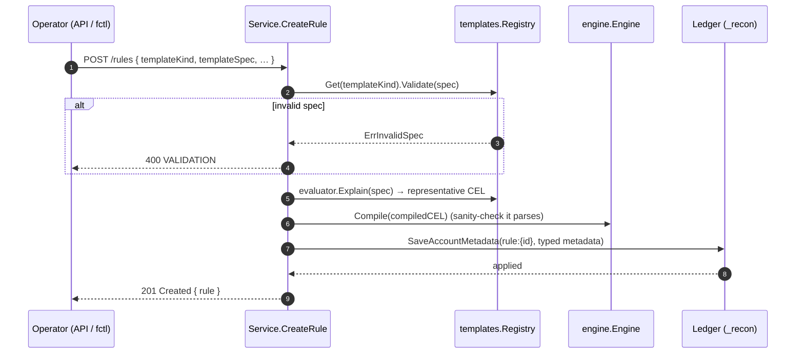
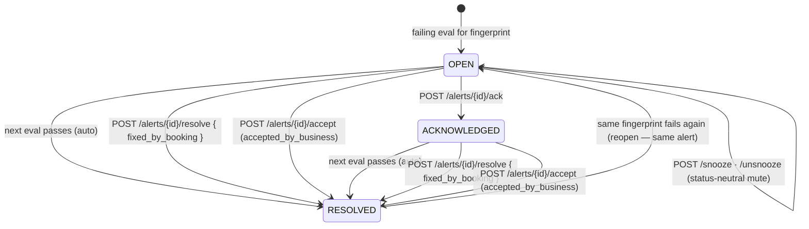
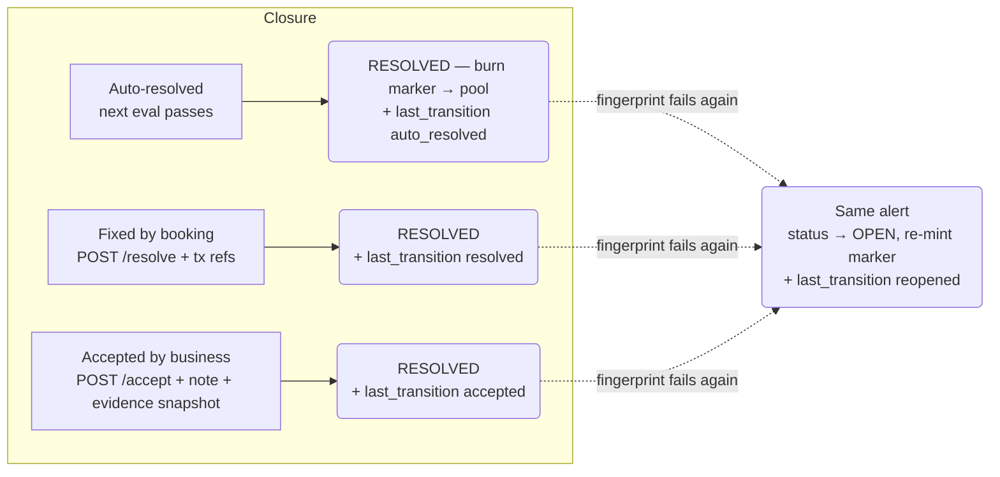
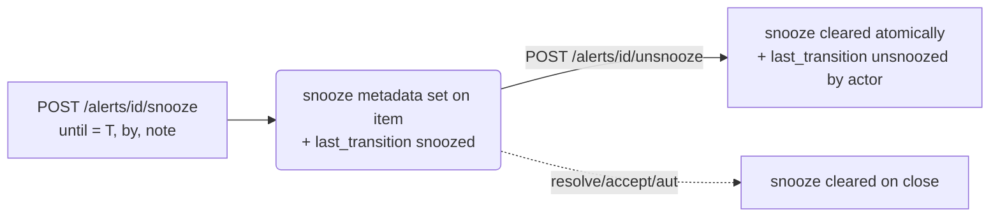
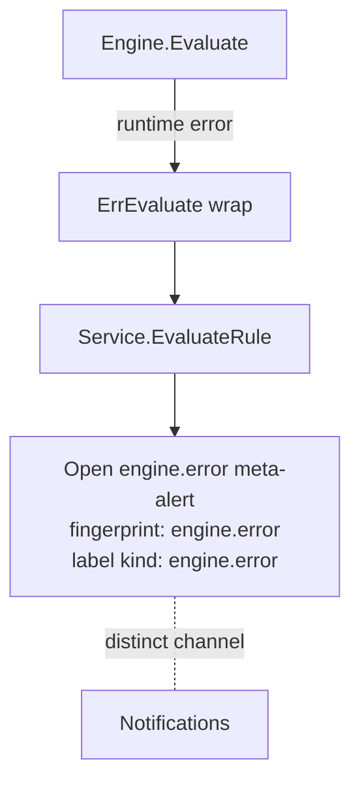
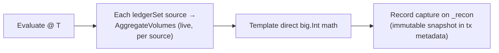

# Lifecycle Workflows

The V1 product surface is a **business lifecycle**, not a rules engine. This document is the visual reference for that lifecycle:

> **Observe → Detect → Alert → Evidence → Resolve or Accept**

Each diagram shows one flow. Since the ledger-native migration, all state lives on the
control-ledger `_recon`; the ledgers being reconciled are read **live** (no query checkpoints) and
each evaluation is recorded as an immutable `_recon` **capture** transaction
(see [architecture.md](./architecture.md) and [ADR-003](../prd/adr-003-checkpoint-anchor-and-crosscheck.md),
which supersedes the checkpoint model of [ADR-002](../prd/adr-002-pit-consistency.md)).

> **Canonical reference test.** The evaluate→alert flows are exercised end-to-end in
> [`v1_orchestration_test.go`](../../internal/api/service/v1_orchestration_test.go) (unit, fakes)
> and [`evaluation_it_test.go`](../../internal/api/service/evaluation_it_test.go) (against a live
> ledger). If the diagrams and the tests diverge, the tests win.

---

## 1. Rule creation



**Notes**

- The rule is a typed-metadata account `rule:{id}` on `_recon` — no relational row.
- `Explain()` returns one representative CEL string for `compiled_cel` (explainability); real
  evaluation re-renders the per-asset CEL at run time.

---

## 2. Rule evaluation

```mermaid
sequenceDiagram
    autonumber
    participant Trig as Trigger (cron / POST evaluate)
    participant Svc  as Service.EvaluateRule
    participant Reg  as templates.Registry
    participant Data as data-ledgers A/B
    participant L    as Ledger (_recon)

    Trig->>Svc: evaluate(rule)
    Svc->>Reg: Evaluate(spec, resolvers, {PIT})
    Reg->>Data: AggregateVolumes(query)  (live, per source)
    Data-->>Reg: balances (per asset)
    Note over Reg: direct big.Int math per asset;<br/>render compiledCEL into evidence
    Reg-->>Svc: []Outcome  (one per fingerprint axis)
    Svc->>L: RecordCapture — mint 1 CAPTURE (snapshot in tx metadata)
    loop For each failing outcome
        Svc->>L: OpenOrUpdateAlert — Numscript batch (marker + metadata + last_transition)
    end
    loop For each passing / disappeared fingerprint
        Svc->>L: AutoResolveAlert — guarded burn (marker → pool)
    end
    Svc-->>Trig: evaluation { result, outcomes }
```

**Notes**

- **Live reads, no checkpoint** (ADR-003). Each `ledgerSet` source is one `AggregateVolumes` — an
  internally consistent server-side snapshot, so a **single-ledger** universe is skew-free for free.
  **Cross-ledger** rules read each side separately; the transient skew is absorbed by the template's
  `tolerance`. Built-ins evaluate in **typed `big.Int` math** — the CEL kernel is not run at
  evaluation time (it renders `compiledCEL` into `evidence` for explainability only).
- **A capture per evaluation** (ADR-003). `RecordCapture` mints one `CAPTURE` into
  `capture:rule:{id}:per:{p}`; the observed snapshot (`verdict`, `trigger`, `evidence`, …) rides the
  `COMMITTED_TRANSACTION` metadata — the durable, receipt-signed "what reconciled and when", covering
  passes as well as breaks. Its bounded evidence contains every failing outcome and only those
  passing outcomes that resolve an active alert. A mixed run can therefore retain failure evidence
  for one fingerprint and successful resolution evidence for another. It is written **before** the
  planned alert transitions.
- The `Outcome` list covers every asset the template touched — passing included — so the service
  can plan **auto-resolution** from the same observed values before persisting the capture. Passing
  outcomes with no active alert are not retained; active fingerprints that disappear still resolve
  without evidence because no outcome was observed for them.
- **The capture is the durable evaluation record** (ADR-003, revising RFC §4.4.2) — an immutable
  `_recon` transaction, not a queryable Postgres evaluation table (`CreateEvaluation` is a no-op).
  The run result is also returned; the break `evidence` is additionally durable on `alert:item`. The
  capture and every alert write run sequentially and each is individually idempotent per (rule,
  period, evaluation) — there is no cross-store transaction to roll back.
- Resolver / kernel errors short-circuit and raise an `engine.error` meta-alert (§6).

---

## 3. Alert lifecycle

An **Alert** is the stable, dedup'd entity for one `(rule, fingerprint, period)`. There is exactly
one alert per triple — re-opens flip `status` back to `OPEN` **in place**. The transition history
is the ledger log (§8).



**Invariants** — the mechanics behind this state machine are the account model in
[architecture.md](./architecture.md#the-control-ledger-data-model):

- Exactly **one** `alert:item:*` account per `(rule, fingerprint, period)`. The `ALERT` **marker**
  (`alert:st:{state}:*`, EPHEMERAL) is the status source-of-truth; a guarded Numscript move is the
  compare-and-swap that serialises transitions — no DB unique constraint.
- **Reopen** flips `status` back to `OPEN` on the same item and re-mints the marker (it was burned
  on close); the `OCC` balance (occurrence count) keeps climbing; the prior `resolution`/`ack` keys
  are cleared on the item but preserved in the log.
- Every transition writes a self-describing `last_transition` envelope in the same atomic batch, so
  the ledger log is the faithful timeline.
- **Snooze is status-neutral**: a snoozed alert stays `OPEN`/`ACK`; only the mute intent is recorded (§5).

---

## 4. Resolution paths



| Path | Author | Note | Tx refs | Evidence snapshot |
|---|---|---|---|---|
| `auto` | system | — | — | — |
| `fixed_by_booking` | operator | optional | optional | — |
| `accepted_by_business` | operator | **required** | — | frozen at acceptance |

The *current* closure is typed metadata (`resolution`) on `alert:item`; the historical record of
every prior closure across reopen cycles is the sequence of `last_transition` envelopes in the
ledger log.

---

## 5. Snooze & notification suppression

Once rules fire on a [schedule](./scheduler.md), a still-broken alert would re-emit an event on
every tick. Reconciliation **records** the signal an operator needs to suppress noise, but — since
the ledger-native migration — **it no longer gates delivery itself**. Delivery is the ledger
events sink (§8); *suppression is now a consumer concern* (the Webhooks module / a future digest),
driven by the data recon exposes:

| | What recon records | Who suppresses |
|---|---|---|
| **Repeat** (materially-identical fail on an `OPEN` alert) | an `OCC` bump + a fresh `last_transition` (`occurred`) with the current evidence | consumer (dedupe on unchanged evidence) — the write-side `notify` gate was removed with Postgres |
| **Snooze** | `snooze` metadata (until/by/at/note) on the item + `last_transition` (`snoozed`/`unsnoozed`) | consumer (honour `snooze.until`) |



**Rules**

- **Snooze** requires an active (`OPEN`/`ACK`) alert and a **future** `until`; re-snoozing
  overwrites the window; closing an alert clears any snooze (so a later reopen is never silently muted).
- **Unsnooze** lifts a snooze early, idempotently, and now **attributes the actor** (`by`) — the
  clear + the `last_transition` land in one atomic batch (`Client.ApplyMetadata`).
- `snooze`/`unsnooze` are status-neutral (`prevStatus == newStatus`).

See [notification-suppression.md](./notification-suppression.md) for why suppression matters and
what a consumer needs. Write-side repeat-suppression and delivery muting are **deferred** to the
consumer/semantic-event work (RFC §4.4).

---

## 6. Engine-error meta-alerts



A kernel/resolver failure (resolver timeout, CEL builtin throw, budget exceeded) is not a
*financial* alert, so it opens a synthetic `engine.error` meta-alert (same alert infrastructure, a
distinct `engine.error` fingerprint + `kind: engine.error` label) instead of a data alert. The
evaluation returns `ERROR` (non-durable). Translation lives in
[engine/errors.go](../../internal/engine/errors.go).

---

## 7. Read consistency — live reads + tolerance



Reconciliation reads its data ledgers **live** — there are **no query checkpoints** (ADR-003,
superseding the ADR-002 checkpoint anchor). Each `ledgerSet` source is one `AggregateVolumes`, an
internally consistent server-side snapshot, so a **single-ledger** universe is skew-free for free.
**Cross-ledger** rules read each side separately; the transient skew between the two reads is
absorbed by the template's `tolerance` — a period close reconciles settled state (stable regardless
of read instant), and continuous monitoring self-corrects on the next tick. `PIT` survives only as
the nominal instant that buckets the reconciliation period and timestamps the capture;
`min_log_sequence` (a live-read freshness floor) is available but unused.

The durable audit substrate is the per-evaluation **capture** transaction (§2) — an immutable,
receipt-signed `_recon` record of the observed numbers; the durable break `evidence` on `alert:item`
survives regardless. Provable simultaneous multi-ledger atomicity — the one thing a checkpoint
uniquely offered, and discarded anyway — is deferred to a future ledger primitive
([EN-1480](https://formance-team.atlassian.net/browse/EN-1480)).

---

## 8. Audit history & delivery — the ledger log

There is **no `alert_event` table**. The control-ledger's ordered, append-only log *is* the audit
history: every transition is a `COMMITTED_TRANSACTION` (marker move + `account_metadata`) or, for
snooze/unsnooze, a `SAVED_METADATA`/`DELETED_METADATA` entry — each carrying the self-describing
`last_transition` envelope. The ledger already gives the cryptographic transaction-log guarantees
recon used to aspire to.

- **Delivery** rides the ledger's native **events sink** ([architecture.md](./architecture.md#event-delivery)):
  when `--events-sink-url` is set, recon provisions an HTTP webhook sink for
  `[COMMITTED_TRANSACTION, SAVED_METADATA, DELETED_METADATA]`; consumers filter on
  `event.ledger == _recon`.
- **`GET /alerts/{id}/events` (`ListAlertEvents`) returns empty today** — paginated per-alert
  history needs a downstream queryable sink (ClickHouse/Databricks), because the ledger log has no
  per-account filter (RFC §10). Deferred.
