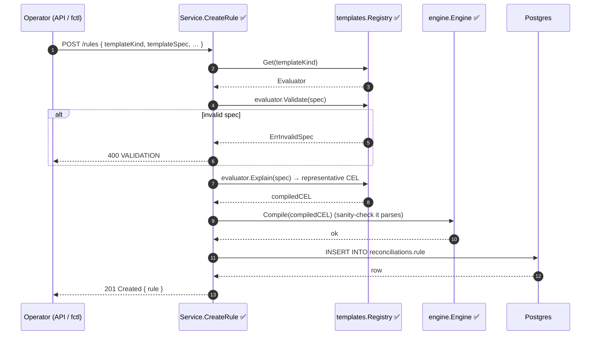
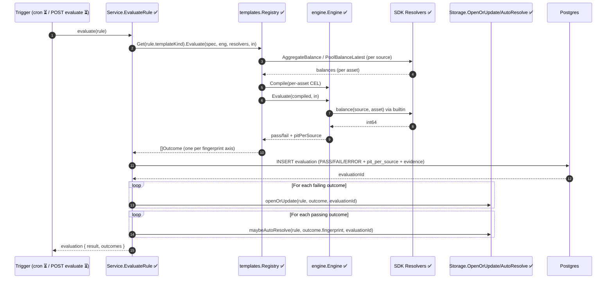
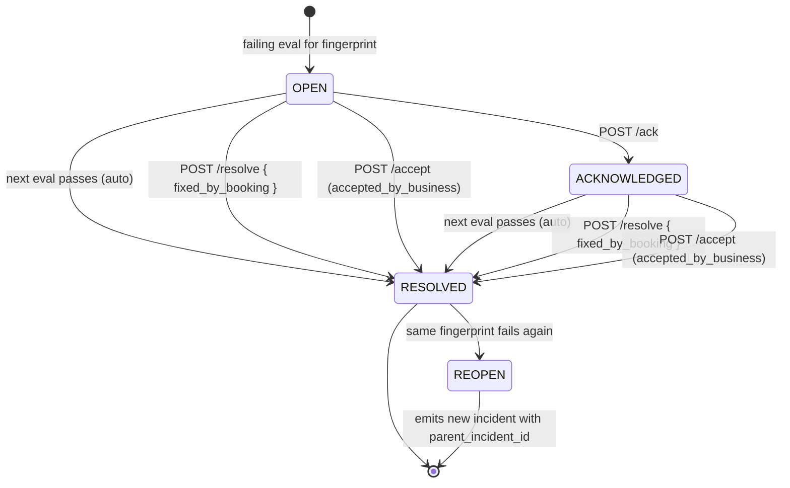
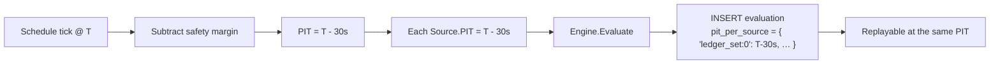

# Lifecycle Workflows

The V1 product surface is a **business lifecycle**, not a rules engine. This document is the visual reference for that lifecycle:

> **Observe → Detect → Incident → Evidence → Resolve or Accept**

Each diagram below shows one flow. The status legend in [README.md](./README.md) marks what's implemented today vs planned.

> **Canonical reference test.** Every flow on this page is exercised end-to-end
> in [`v1_orchestration_test.go`](../../internal/api/service/v1_orchestration_test.go).
> If the diagrams and the test ever diverge, the test is the source of truth.

---

## 1. Rule creation



**Notes**

- `Explain()` returns one representative CEL string for the rule's `compiled_cel` column. Real evaluation re-renders the per-asset CEL at run time — `compiled_cel` is for explainability and the future `rules explain` endpoint.
- For metadata-filtered ledger templates, the service additionally calls `SDKLedgerResolver.Features(ledger)` and refuses if `ACCOUNT_METADATA_HISTORY: DISABLED` — see [ledger#1416](https://github.com/formancehq/ledger/issues/1416) and [v1-vs-legacy.md §6](./v1-vs-legacy.md#6-ledger-side-feature-flag-gotcha).

---

## 2. Rule evaluation



**Notes**

- The `Outcome` list always covers every asset the template cares about — passing assets included. The service uses that to **auto-resolve** prior incidents whose fingerprint isn't in the failing set.
- Resolver / kernel errors short-circuit the loop and raise an `engine.error` meta-incident instead of a data incident — see §5.

---

## 3. Incident lifecycle



**Invariants**

- At most **one** active (`OPEN` or `ACKNOWLEDGED`) incident per `(rule_id, fingerprint)` — enforced by the partial unique index `incident_active_per_fingerprint` ([migration #4](../../internal/storage/migrations/migrations.go)).
- Re-opens after `RESOLVED` create a **new row** with `parent_incident_id` set; they do **not** flip the closed one back. Flapping stays visible.
- `Resolution` is immutable once set. The application enforces this (schema permits update for backward-compatible additions only).

---

## 4. Resolution paths

```mermaid
flowchart LR
    subgraph "Closure paths"
        A[Auto-resolved\nnext eval passes] --> R(RESOLVED)
        F[Fixed by booking\nPOST /resolve + tx refs] --> R
        B[Accepted by business\nPOST /accept + note + evidence snapshot\n+ optional expiresAt] --> R
    end
    R -.expires.-> N(New incident\nparentIncidentId set)
    R -.fingerprint fails again.-> N
    N --> [*]
```

**Required artefacts per path**

| Path | Author | Timestamp | Note | Transaction refs | Evidence snapshot | Expires |
|---|---|---|---|---|---|---|
| `auto`               | system | now | — | — | — | — |
| `fixed_by_booking`   | operator | now | optional | optional | — | — |
| `accepted_by_business` | operator | now | **required** | — | frozen at acceptance | optional |

Stored as JSONB on `incident.resolution`:

```jsonc
{
  "kind": "accepted_by_business",
  "by":   "treasurer@buildr.com",
  "at":   "2026-06-17T12:34:56Z",
  "note": "Settlement lag on GBP corridor, confirmed by treasury.",
  "evidenceSnapshot": { "asset": "GBP/2", "drift": "50000", "tolerance": 0, … },
  "expiresAt": "2026-07-17T00:00:00Z"
}
```

---

## 5. Engine-error meta-incidents

```mermaid
flowchart TB
    Eval[Engine.Evaluate] -- runtime error --> Translate[ErrEvaluate wrap]
    Translate --> Svc[Service.EvaluateRule ✅]
    Svc --> EngEvt[INSERT evaluation\nresult = ERROR]
    Svc --> MetaInc[Open engine.error meta-incident\nlabels: { kind: 'engine.error' }\nfingerprint: 'engine.error']
    MetaInc -.distinct channel.- Notif[Notifications]
```

Why a separate path: a kernel/resolver failure (timeout, CEL builtin throw, budget exceeded) is not a *financial* incident. Routing it through the same channel as data incidents would contaminate the financial-incident feed and confuse ops. The meta-incident is what powers an "engine health" dashboard (post-V1).

The translation happens in [engine/errors.go](../../internal/engine/errors.go) via `ErrEvaluate`.

---

## 6. Evaluation idempotence & PIT propagation



Every `Evaluation` row stores the **resolved** PIT per `Source`. This means an auditor can pose the question *"what was the answer at the time the rule fired?"* and get a reproducible result by replaying each source's PIT call. See [ADR-002](../prd/adr-002-pit-consistency.md).
