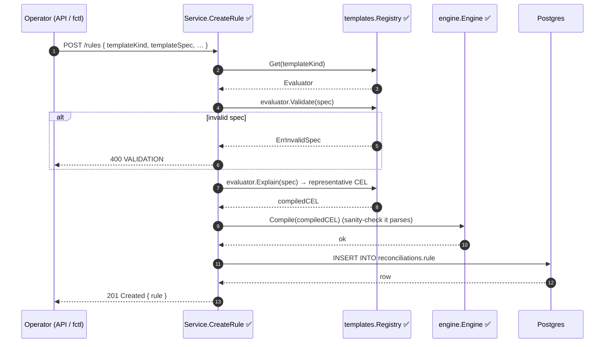
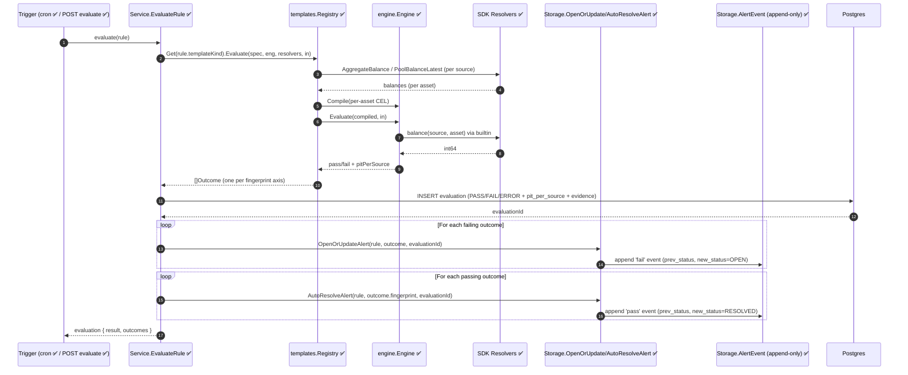
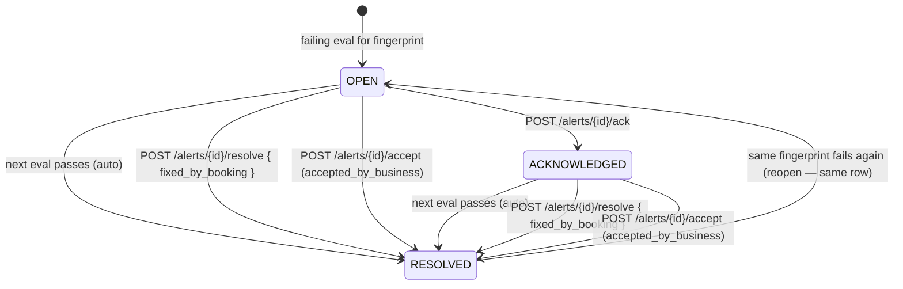
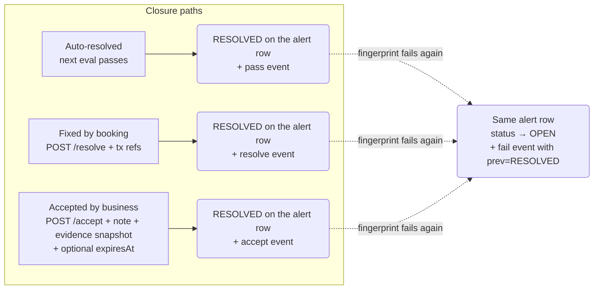
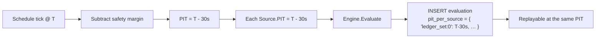

# Lifecycle Workflows

The V1 product surface is a **business lifecycle**, not a rules engine. This document is the visual reference for that lifecycle:

> **Observe → Detect → Alert → Evidence → Resolve or Accept**

Each diagram below shows one flow. The status legend in [README.md](./README.md) marks what's implemented today vs planned.

> **Canonical reference test.** Every flow on this page is exercised end-to-end
> in [`v1_orchestration_test.go`](../../internal/api/service/v1_orchestration_test.go).
> If the diagrams and the test ever diverge, the test is the source of truth.

---

## 1. Rule creation



**Notes**

- `Explain()` returns one representative CEL string for the rule's `compiled_cel` column. Real evaluation re-renders the per-asset CEL at run time — `compiled_cel` is for explainability and the future `rules explain` endpoint.
- For metadata-filtered ledger templates, the service additionally calls `SDKLedgerResolver.Features(ledger)` and refuses if `ACCOUNT_METADATA_HISTORY: DISABLED` — see [ledger#1416](https://github.com/formancehq/ledger/issues/1416) and [v1-vs-legacy.md §6](./v1-vs-legacy.md#6-ledger-side-feature-flag-gotcha).

---

## 2. Rule evaluation



**Notes**

- The `Outcome` list always covers every asset the template cares about — passing assets included. The service uses that to **auto-resolve** prior alerts whose fingerprint isn't in the failing set.
- Resolver / kernel errors short-circuit the loop and raise an `engine.error` meta-alert instead of a data alert — see §5.
- `CreateEvaluation` + every alert/event write happen inside one transaction, so a mid-loop failure rolls everything back.

---

## 3. Alert lifecycle

An **Alert** is the stable, dedup'd entity for one `(rule, fingerprint)` pair. There is exactly one Alert per pair for the lifetime of the rule — re-opens flip `status` back to `OPEN` **in place**, they do not create new rows. The full transition history lives in the `alert_event` log.



**Invariants**

- Exactly **one** alert row per `(rule_id, fingerprint)` — enforced by the UNIQUE constraint on the `alert` table (see [migration #6](../../internal/storage/migrations/migrations.go)).
- Reopen after `RESOLVED` flips status back to `OPEN` on the **same row**. The lifetime `occurrence_count` keeps incrementing. The prior `resolution` and `ack` are cleared on the alert row but **preserved** as `alert_event` rows.
- Every transition (fail, pass, ack, resolve, accept) appends one row to `alert_event`. That log is append-only by convention — code paths never UPDATE or DELETE.

### Reading the history

The alert row carries the *current* state (status, current evidence, current resolution if RESOLVED). For the **timeline** of the alert — every evaluation that touched it, every manual transition, every prior resolution across reopen cycles — query `alert_event` via `GET /alerts/{id}/events`. That endpoint is the single source of truth for audit reconstruction.

A `fail` event with `prev_status = RESOLVED` IS a reopen. The API surfaces this as a derived `isReopen` flag on each event response.

---

## 4. Resolution paths



**Required artefacts per path**

| Path | Author | Timestamp | Note | Transaction refs | Evidence snapshot | Expires |
|---|---|---|---|---|---|---|
| `auto`               | system | now | — | — | — | — |
| `fixed_by_booking`   | operator | now | optional | optional | — | — |
| `accepted_by_business` | operator | now | **required** | — | frozen at acceptance | optional |

Stored on the alert row as `resolution` (JSONB) for the *current* closure, and in `alert_event.payload` for the historical record of every prior resolution across reopen cycles.

```jsonc
{
  "kind": "accepted_by_business",
  "by":   "treasurer@buildr.com",
  "at":   "2026-06-17T12:34:56Z",
  "note": "Settlement lag on GBP corridor, confirmed by treasury.",
  "evidenceSnapshot": { "asset": "GBP/2", "drift": "50000", "tolerance": 0, … },
  "expiresAt": "2026-07-17T00:00:00Z"
}
```

---

## 5. Engine-error meta-alerts

```mermaid
flowchart TB
    Eval[Engine.Evaluate] -- runtime error --> Translate[ErrEvaluate wrap]
    Translate --> Svc[Service.EvaluateRule ✅]
    Svc --> EngEvt[INSERT evaluation<br/>result = ERROR]
    Svc --> MetaAlr[Open engine.error meta-alert<br/>labels: { kind: 'engine.error' }<br/>fingerprint: 'engine.error']
    MetaAlr -.distinct channel.- Notif[Notifications]
```

Why a separate path: a kernel/resolver failure (timeout, CEL builtin throw, budget exceeded) is not a *financial* alert. Routing it through the same channel as data alerts would contaminate the financial-alert feed and confuse ops. The meta-alert uses the same alert + event infrastructure as data alerts — only the `engine.error` fingerprint and the `kind: engine.error` label distinguish it.

The translation happens in [engine/errors.go](../../internal/engine/errors.go) via `ErrEvaluate`.

---

## 6. Evaluation idempotence & PIT propagation



Every `Evaluation` row stores the **resolved** PIT per `Source`. This means an auditor can pose the question *"what was the answer at the time the rule fired?"* and get a reproducible result by replaying each source's PIT call. See [ADR-002](../prd/adr-002-pit-consistency.md).

---

## 7. Audit log evolution — alert_event as the seed

The `alert_event` table is structured as append-only today: every transition is written via a single helper (`appendAlertEvent`), and no code path issues UPDATE or DELETE against it. That's enough for V1 GA — operators get a faithful timeline for every alert.

The longer-term direction is the same kind of cryptographic audit chain the Ledger uses for transactions. The table is shaped so that evolution is additive:

- A per-alert `seq` column can be added later for strict ordering inside one alert's timeline (without breaking existing reads, which order by `(at, id)`).
- A `prev_hash` / `hash` pair can chain events into a Merkle-style log, so a single root hash per alert proves the entire history is intact.

None of that is in V1 GA — flagging it here so the alert_event shape stays compatible with that direction. The instrumentation point for any of it is `appendAlertEvent` in [internal/storage/alert.go](../../internal/storage/alert.go).
